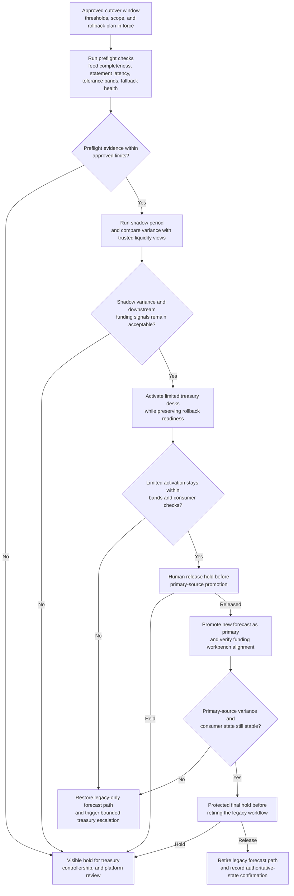

# Approved cash forecast primary cutover staged execution

## Linked pattern(s)

- `staged-change-execution-with-rollback-holds`

## Domain

Finance.

## Scenario summary

After treasury leadership, controllership, and platform operations approve promotion of a new cash forecasting workflow to become the authoritative source for same-day liquidity decisions, treasury operations must execute the cutover during quarter-close week. The workflow should enter from that prior approval and carry the change through explicit preflight on feed completeness, statement latency, tolerance bands, and legacy fallback health; then progress through a shadow period, limited desk activation, primary-source promotion, and a final hold before the old forecast path is retired. At each stage it should verify variance and downstream funding signals, preserve rollback readiness, and stop visibly if the new forecast begins to diverge from trusted liquidity views.

## Target systems / source systems

- Treasury change-control record containing the approved cutover window, variance thresholds, protected business-unit scope, and rollback plan
- New cash forecasting engine, legacy forecast workflow, and upstream bank-statement or ERP cash-position feeds
- Funding workbench, liquidity dashboard, and downstream approval tooling that consume the authoritative morning forecast
- Monitoring and reconciliation systems used to compare forecast variance, feed latency, and operator overrides during the cutover window
- Audit store preserving stage evidence, hold releases, fallback-restoration steps, and final authoritative-state confirmation

## Why this instance matters

This grounds the pattern in a finance workflow where the high-stakes action is not a browser filing or a recommendation package; it is promotion of a live treasury workflow that can influence borrowing, investment, and funding decisions the same day. The pattern matters because treasury teams need more than an approval record. They need staged execution that can prove forecast integrity, expose divergence early, and preserve a viable path back to the prior trusted process before liquidity decisions depend entirely on the new state.

## Likely architecture choices

- Orchestrated multi-agent coordination fits because preflight validation, feed-quality checking, variance verification, and authoritative-source promotion often belong to distinct treasury or platform roles.
- Human-in-the-loop holds should remain standard before the new forecast becomes authoritative for downstream funding actions and again before the legacy process is retired from the morning cycle.
- Exception-gated autonomy keeps the workflow bounded: it may move from shadow mode to limited activation automatically when tolerance bands remain healthy, but desk-level overrides, missing statements, or widening forecast variance should force a visible hold.
- The execution record should show which treasury authority released each protected hold and which variance snapshot justified that decision.

## Governance notes

- The workflow should confirm that upstream statement feeds, protected legal-entity scope, materiality thresholds, and fallback workbook or batch path remain intact before the first activation stage.
- Checkpoint evidence should preserve forecast variance by entity or currency cluster, feed-latency state, and any human overrides that indicate trust in the new source is not yet stable.
- Logs and evidence should minimize unnecessary exposure of bank-account detail, funding strategy notes, and other sensitive treasury data outside approved review stores.
- If variance exceeds tolerated bands, a critical feed arrives late, or downstream consumers receive conflicting source-of-truth indicators, the workflow should hold or restore the legacy path before promoting the new forecast broadly.
- Retirement of the prior workflow should remain a protected hold because it reduces operational reversibility even if earlier shadow and limited-activation stages appeared healthy.

## Evaluation considerations

- Percentage of approved treasury forecast cutovers completed without same-day funding error, manual emergency reversion, or material post-cutover variance correction
- Rate of feed-quality issues, divergence, or rollback-readiness loss caught before the new forecast becomes the sole authoritative source
- Completeness of the execution trail linking approvals, stage transitions, variance evidence, hold releases, and fallback actions
- Time required to restore the legacy forecast path when the new primary workflow degrades after limited activation or full promotion
