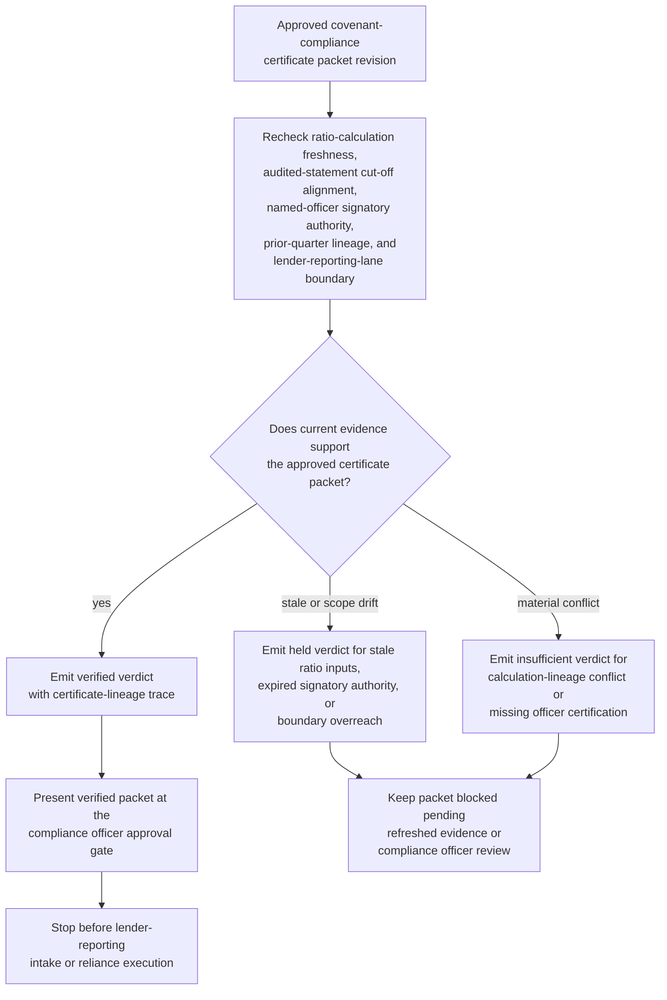

# Approved covenant compliance certificate packet evidence gate verification

## Linked pattern(s)

- `evidence-gated-verification-for-release`

## Domain

Finance.

## Scenario summary

A debt-capital-markets compliance team holds one approved revision of a covenant-compliance certificate packet prepared after the quarterly covenant-measurement date for a syndicated credit facility. The packet may become the input record for the restricted lender-reporting review lane, but it cannot enter that lane until current evidence still supports reliance on it. The workflow rechecks financial-ratio calculation freshness, underlying audited-statement cut-off alignment, named-officer signatory authority, prior-quarter comparison lineage, and lender-reporting-lane boundary controls against the approved packet revision, then emits a verified, held, or insufficient verdict with explicit certificate-lineage evidence and signatory-boundary trace for the compliance officer approval gate. It must not interpret whether any ratio is acceptable, communicate findings to lenders, initiate a waiver request, prepare a filing, or start downstream reliance execution.

## Target systems / source systems

- Restricted covenant-compliance workspace holding the approved packet revision, prior quarterly certificate versions, named-officer signatory roster, and open hold history
- Financial-ratio calculation ledger and underlying audited or reviewed financial statement repository used to confirm ratio inputs, measurement-date cut-off, and quarter-over-quarter comparison lineage
- Named-officer authority register and signatory-delegation records confirming which officers are currently authorized to certify the specific covenant schedule in the packet
- Lender-reporting-lane boundary manifest and credit-agreement schedule-of-covenants defining which ratios and certificate revisions are eligible for the restricted review intake
- Approval manifest service recording which compliance officers may release one exact packet revision into the protected lender-reporting review lane
- Audit store preserving evidence timestamps, verified or held verdicts, signatory-authority check outcomes, and blocked reuse of superseded certificate revisions

## Why this instance matters

This grounds the pattern in a finance workflow where the evidence problem is distinct from morning liquidity: the challenge is not statement freshness for a single-day posting but proving that a periodic compliance certificate revision is still supported by current ratio inputs, a current signatory roster, and an intact credit-agreement scope at the moment of restricted downstream release. Covenant certificates can degrade when a measurement-period restatement lands after preparation, when a named officer's delegation expires before the certificate is countersigned, or when the credit-agreement schedule of covenants is amended so that the approved packet revision no longer aligns with the required coverage. The value is a bounded verification gate anchored at one exact certificate revision so that compliance officers see an inspectable, certificate-lineage-backed trust verdict before the packet enters a lender-reporting review lane with real reliance consequences.

## Likely architecture choices

- Approval-gated execution fits because the verification packet can be assembled automatically while the restricted lender-reporting review intake remains blocked until a compliance officer explicitly releases that exact certificate revision.
- Human-in-the-loop review should remain mandatory because compliance officers must interpret held conditions such as ratio-input staleness, an amended covenant schedule, or a lapsed signatory delegation before downstream reporting reliance can proceed.
- Durable verification state should preserve superseded verdicts, repeated hold reasons, and certificate-version lineage so later approvers can distinguish genuine evidence refresh from a resubmission of a previously blocked revision.

## Governance notes

- The verification result must show the approved certificate revision identifier, ratio-calculation timestamps and source statement cut-offs, prior-quarter comparison references, named-officer signatory authority status, and the exact lender-reporting-lane boundary in the approval-ready packet.
- A packet should remain held whenever one ratio input falls outside the approved measurement-period freshness window, a named officer's signatory authority is not confirmed current, the credit-agreement schedule referenced by the packet no longer matches the active covenant schedule, or a prior-quarter comparison reference is superseded.
- Human approval is required before the verified packet is handed into the restricted lender-reporting review lane or used to justify any downstream compliance representation, filing input, or lender-facing reliance.
- Covenant interpretation, lender communication, waiver negotiation, filing submission, and any downstream reliance execution all belong in adjacent recommendation or execution workflows rather than this verification gate.

## Evaluation considerations

- Percentage of approved covenant-compliance certificate packets that receive a verdict with complete ratio-calculation, statement cut-off, signatory authority, and lane-boundary lineage
- Rate at which stale ratio inputs, expired signatory authority, or amended covenant schedules are caught before a packet enters the restricted lender-reporting review lane
- Reviewer agreement that verified versus held verdicts applied the correct measurement-period freshness and signatory-boundary rules for the specific credit facility
- Stability of repeated verification when quarter-close restatements, signatory-roster updates, or credit-agreement amendment confirmations arrive near the lender-reporting submission window
