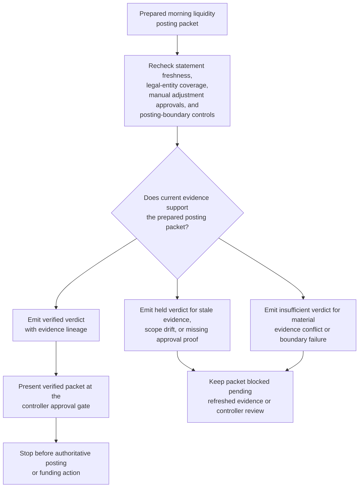
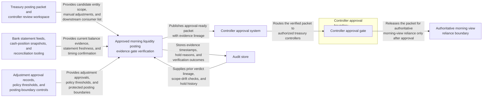

# Approved morning liquidity posting evidence gate verification

## Linked pattern(s)

- `evidence-gated-verification-for-release`

## Domain

Finance.

## Scenario summary

Treasury controllers have a prepared morning liquidity posting packet that may become the authoritative same-day view for funding and exposure decisions, but they require one last evidence gate before approving downstream reliance. The workflow rechecks statement freshness, legal-entity coverage, manual adjustment approvals, and posting-boundary controls against the packet, then emits a verified, held, or insufficient verdict with explicit evidence lineage for controller approval. It must not choose an alternate treasury plan, rewrite the packet, or publish the authoritative posting itself.

## Target systems / source systems

- Treasury posting packet and controller review workspace holding the candidate entity scope, manual adjustments, and downstream consumer list
- Bank statement feeds, cash-position snapshots, and reconciliation tooling used to confirm current balances and timing
- Adjustment approval records, policy thresholds, and protected posting-boundary controls for the morning publication
- Approval system recording which controllers may authorize use of the verified packet as the authoritative view
- Audit store preserving evidence timestamps, scope-drift checks, hold reasons, and final approval events

## Why this instance matters

This grounds the pattern in finance where the main challenge is proving that a consequential posting packet is still trustworthy at the moment of use, not recommending a funding action or performing the posting. Morning liquidity packets can degrade quickly when one bank file lands late, a manual adjustment changes, or entity scope drifts after preparation. The pattern matters because it lets controllers see an inspectable evidence-backed trust verdict before the posting becomes something desks and risk teams rely on.

## Likely architecture choices

- Approval-gated execution fits because the verified packet remains blocked from authoritative downstream use until a controller explicitly approves reliance.
- Human-in-the-loop review is mandatory because unresolved gaps, protected-entity scope changes, and high-impact posting holds require controller judgment in the normal flow.
- Shared verification history should preserve prior held verdicts and refreshed evidence so reviewers can tell whether the packet genuinely converged or merely accumulated noise.

## Governance notes

- The workflow should preserve exact statement timestamps, entity-coverage comparison, manual-adjustment approval lineage, and posting-boundary checks in the approval-ready packet.
- A packet should remain held whenever one material entity falls outside the approved freshness window or an adjustment lacks current controller evidence.
- Human approval is required before the verified packet is treated as the authoritative morning view by treasury desks, funding operations, or risk consumers.
- Any funding recommendation, entity-scope narrowing, or packet repair belongs in adjacent recommendation or reconciliation workflows rather than this verification gate.

## Evaluation considerations

- Percentage of morning liquidity packets that receive a verdict with complete statement, adjustment, and scope lineage
- Rate at which stale statements, missing approvals, or posting-boundary drift are surfaced before desks rely on the packet
- Reviewer agreement that held versus verified outcomes reflect the intended materiality and freshness thresholds
- Stability of verdicts when late bank files or adjustment corrections arrive during repeated morning verification passes
