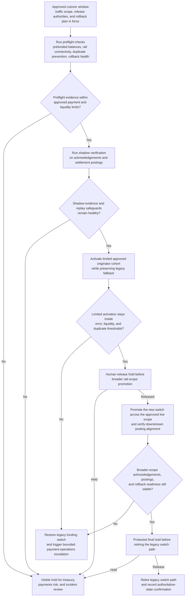
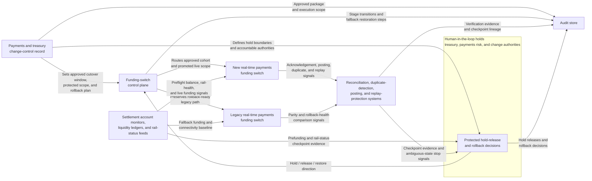

# Approved real-time payments funding switch cutover staged execution

## Linked pattern(s)

- `staged-change-execution-with-rollback-holds`

## Domain

Finance.

## Scenario summary

After treasury operations, payments risk, and production-change authorities approve promotion of a new real-time payments funding switch to become the primary live path for outbound instant disbursements, payment operations must execute the cutover during a narrow high-volume release window. The workflow should start from that approved package and carry the change through explicit preflight on prefunded settlement balances, rail connectivity, duplicate-prevention state, acknowledgement parity, and legacy rollback health; then progress through shadow verification, limited-originator activation, broader rail-scope promotion, and a final protected hold before the old switch is retired. At each stage it should verify posting, acknowledgement, liquidity, and replay signals, keep rollback readiness intact, and stop visibly if the new live path begins to create ambiguous payment state or weaker reversibility.

## Target systems / source systems

- Payments and treasury change-control record containing the approved cutover window, protected originator or rail scope, prefunding thresholds, and rollback plan
- New real-time payments funding switch, legacy funding switch, and the control plane used to move outbound instant-payment traffic between them
- Prefunded settlement account monitors, liquidity ledgers, and rail-status feeds used to confirm that the promoted path can fund and acknowledge live transactions safely
- Reconciliation, duplicate-detection, posting, and replay-protection systems used to verify each stage before the blast radius expands
- Audit store preserving checkpoint evidence, hold releases, fallback-restoration steps, and final authoritative-state confirmation

## Why this instance matters

This grounds the pattern in a finance workflow where the high-stakes action is a live payment-infrastructure cutover, not a forecasting promotion, browser submission, or recommendation packet. A real-time funding switch can look healthy at the transport layer while still creating duplicate-release risk, delayed acknowledgements, or prefunding stress that only appears after live payment traffic begins to move. The pattern matters because payment and treasury teams need disciplined staged execution that keeps release authorities, checkpoint evidence, and rollback viability explicit until the new switch proves it can carry production disbursements without creating ambiguous payment state.

## Likely architecture choices

- Orchestrated multi-agent coordination fits because preflight validation, payment-rail verification, liquidity monitoring, and rollback-readiness checking often belong to separate payments, treasury, and platform roles.
- Human-in-the-loop holds should remain standard before promotion expands from the first approved originator cohort to the broader live rail scope and again before the legacy switch path is retired.
- Exception-gated autonomy keeps the workflow bounded: it may advance automatically through shadow checks and the first limited activation when thresholds remain healthy, but acknowledgement drift, duplicate-prevention ambiguity, or prefunding deterioration should force a visible hold or rollback packet.
- The execution record should show which treasury or payments authority released each protected hold and which checkpoint snapshot justified the release.

## Governance notes

- The workflow should confirm that approved originator scope, payment-type limits, cutover window boundaries, prefunded balance floors, and rollback credentials still match the signed change package before any live traffic moves.
- Checkpoint evidence should preserve rail acknowledgements, downstream posting completeness, duplicate-detection state, replay-buffer health, and prefunding consumption rather than relying on a single aggregate success signal.
- Logs and evidence should minimize exposure of payer or beneficiary identifiers, account details, and network secrets while still preserving enough lineage to reconstruct each staged decision.
- If the limited activation cohort shows delayed acknowledgements, duplicate-suppression uncertainty, prefunding stress, or inconsistent posting state, the workflow should hold or restore the legacy switch before widening live scope.
- Retirement of the prior switch path should remain a protected hold because it narrows rollback speed and can complicate recovery if a latent payment-state problem appears after broader promotion.

## Evaluation considerations

- Percentage of approved real-time payments switch cutovers completed without duplicate-release incidents, unplanned broad rollback, or material prefunding disruption
- Rate of acknowledgement drift, posting mismatch, or rollback-readiness loss caught at a visible hold before expansion beyond the initial originator cohort
- Completeness of the execution trail linking approvals, staged traffic changes, checkpoint evidence, hold releases, and any fallback restoration
- Time required to restore the legacy switch path when the new primary route passes basic transport health checks but fails deeper posting, liquidity, or duplicate-prevention verification
