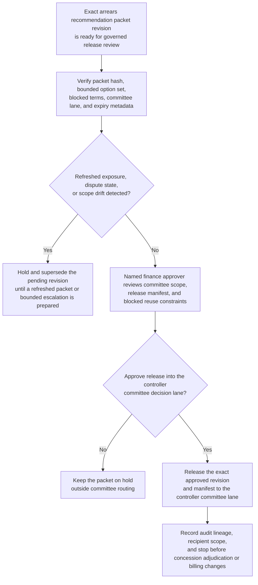
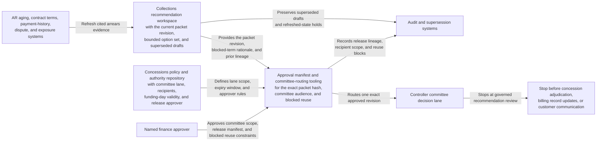

# Arrears concession recommendation packet revision approved for controller committee decision lane

## Linked pattern(s)

- `approval-gated-recommendation-release`

## Domain

Finance.

## Scenario summary

A collections strategy workflow has already prepared one exact recommendation packet revision for a high-value enterprise arrears case. The packet narrows the bounded options to a capped late-fee waiver, a short installment plan, or escalation for a larger concession, and it keeps blocked requests such as principal reduction and an extended payment holiday explicit. Before that exact packet revision can be routed into the controller concessions committee decision lane, a named finance approver must approve the committee scope, expiry window, and release manifest so reviewers receive the governed recommendation artifact rather than a stale or redistributed copy. The workflow stops at governed release of that packet revision; it does not decide which concession is granted, update billing records, or execute customer communications.

## Target systems / source systems

- Collections recommendation workspace holding the current packet revision, bounded option set, blocked-term rationale, and prior superseded drafts
- AR aging, contract terms, payment-history, dispute, and exposure systems already cited by the recommendation packet
- Concessions policy and authority repository defining the named controller committee lane, permitted recipients, funding-day validity, and release approver
- Approval manifest and committee-routing tooling that records the exact packet hash, committee audience, and blocked reuse outside the approved lane
- Audit and supersession systems preserving release lineage when refreshed exposure or dispute status changes the recommendation packet before committee review

## Why this instance matters

This grounds the pattern in finance where the governance problem is not to adjudicate the concession, but to control release of one bounded recommendation artifact into one human decision lane. Material changes in exposure, prior waivers, or dispute state can make one near-final packet materially different from another, so approval must stay tied to one reviewed revision rather than to a general permission to circulate settlement advice. The example keeps the family boundary clean by ending at controller-committee handoff rather than funding adjudication, billing updates, or customer-facing execution.

## Likely architecture choices

- Approval-gated execution fits because the recommendation packet remains in a held state until a named finance approver authorizes release into the controller committee lane.
- Human-in-the-loop review is necessary because only accountable finance leadership should confirm that release scope, expiry, and blocked-option visibility are correct without treating that approval as concession adjudication.
- A governed agent can assemble the release manifest, verify packet and option-set hashes, and block stale recirculation, but it should not change receivables records or signal that the customer request has been approved.

## Governance notes

- Approval must bind to one immutable packet revision, one controller committee lane, one bounded validity window, and one explicit blocked-option register so later exposure changes cannot inherit permission implicitly.
- Material caveats about dispute status, prior waivers, principal-reduction requests, and escalated terms should remain visible in the released packet rather than being flattened into a narrow preferred answer.
- If refreshed exposure, collections history, or committee scope changes before routing, the pending revision should be held and superseded rather than released under the older manifest.
- Audit records should preserve the exact released packet, option-set hash, approver identity, committee audience, expiry timing, and any blocked forwarding or reuse outside the approved lane.

## Evaluation considerations

- Percentage of committee releases where the arrears recommendation packet revision, option-set hash, and manifest metadata align exactly without later correction
- Rate at which expired or superseded concession recommendation packets are blocked before controller committee visibility
- Time needed to move from packet-ready status to approved bounded committee release during live concession review
- Reviewer correction rate for missing blocked terms, wrong audience scope, or stale-state handling after the committee receives the released recommendation packet
