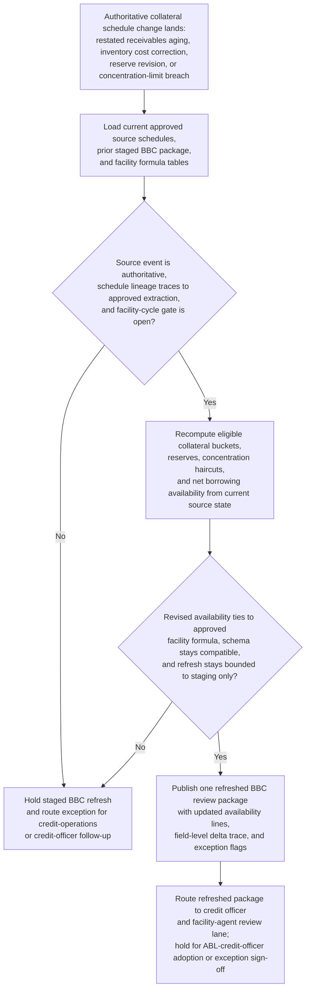
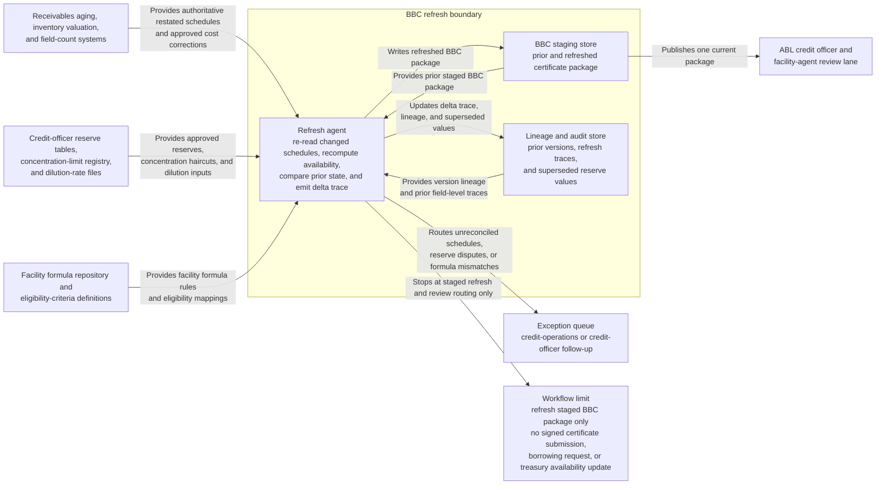

# Borrowing base certificate review package refresh after collateral schedule update

## Linked pattern(s)

- `change-triggered-representation-refresh`

## Domain

Finance.

## Scenario summary

An asset-based lending (ABL) facility requires the borrower to maintain a current Borrowing Base Certificate (BBC) that calculates eligible collateral availability from receivables aging buckets, inventory valuations, and lender-approved reserves. The credit operations team builds the staged BBC review package early in each certification cycle from authoritative source schedules, but those sources keep moving: the receivables aging extract is restated after disputed invoice resolutions, the inventory field count corrects unit costs, the lender-approved dilution reserve is revised by the credit officer, and concentration haircuts are updated after a large obligor threshold is breached. Each authoritative change to the underlying collateral schedule should trigger a refresh of the staged BBC package so eligible-collateral calculations, availability line items, borrowing capacity, and exception flags reflect current source state before the package is routed to the ABL credit officer and facility agent for lender review. The workflow preserves a field-level delta trace, carries forward unchanged source-verified values, and routes exceptions whenever revised schedules cannot be reconciled against the approved facility formula.

## Target systems / source systems

- BBC staging store holding the structured certificate package consumed by the ABL credit officer and facility agent
- Receivables aging, inventory valuation, and field-count systems publishing authoritative restated schedules and approved cost corrections
- Credit-officer reserve tables, concentration-limit registry, and approved dilution-rate files used to calculate lender-defined ineligibles and haircuts
- Facility formula repository and eligibility-criteria definitions establishing which source fields map to each availability line item in the BBC
- Lineage and audit store tracking prior staged BBC versions, field-level refresh traces, and superseded reserve values
- Exception queue for credit-operations or credit-officer follow-up before the package is submitted to the lender or used as a treasury availability reference

## Why this instance matters

This grounds the pattern in ABL credit operations where a stale or incorrectly refreshed BBC can cause a borrower to overstate available credit, breach a sublimit, or trigger a borrowing-base deficiency event. The staged certificate is the downstream-safe representation that the credit officer and facility agent work from; rebuilding it from raw schedules on demand is operationally expensive and error-prone. The instance shows how event-triggered rematerialization keeps the staged package current without promoting every field-level schedule correction directly into a submitted certificate, and why explicit delta lineage matters when the credit officer needs to explain availability movements to the lender.

## Likely architecture choices

- Event-driven monitoring should trigger refresh only on authoritative schedule postings such as approved aging restatements, signed inventory certifications, and credit-officer reserve decisions, not on draft worksheet saves or unresolved dispute flags.
- A tool-using single agent can re-read the changed source schedules, recompute each availability tier against the approved facility formula, compare old and new availability lines, and publish an updated package with a delta trace.
- Automatic refresh is appropriate when the schedule change maps cleanly to a defined facility-formula field and the resulting availability change stays within policy thresholds; concentration-limit breaches, reserve disputes, or schema-breaking schedule restructures should route to exception review.
- The workflow should stop at the refreshed staged BBC and the credit-officer review lane; it should not generate a signed certificate submission, trigger a borrowing request, or adjust treasury's posted availability record without explicit lender-facing approval.

## Governance notes

- Every availability line item—gross eligible receivables, ineligible exclusions, reserves, concentration haircuts, and net borrowing base—should carry prior and current source references for each refresh cycle.
- Refresh should be blocked when a receivables aging extract carries unresolved dispute flags, an inventory cost correction lacks a signed field-count certification, or a reserve revision has not been approved by the credit officer.
- The delta trace should distinguish which schedule fields caused availability to move, which values were carried forward unchanged from the prior staged version, and which changes required exception routing rather than automatic incorporation.
- The credit officer and ABL facility-agent lane should hold explicit adoption or exception sign-off authority; expansion of the auto-refresh scope to cover new schedule types or formula amendments requires credit-policy approval.

## Evaluation considerations

- Percentage of authoritative collateral schedule changes reflected in one current staged BBC package with complete field-level delta trace before the credit officer review window opens
- Rate of concentration-limit breaches, reserve disputes, unresolved dispute flags, or formula mismatches correctly routed to exceptions rather than silently incorporated into the staged package
- Credit-officer and facility-agent ability to reconcile refreshed availability lines back to specific approved schedule changes without reconstructing raw eligibility calculations manually
- Stability of refresh behavior during high-churn certification periods when aging extracts, inventory counts, and reserve decisions arrive out of sequence or with overlapping effective dates
