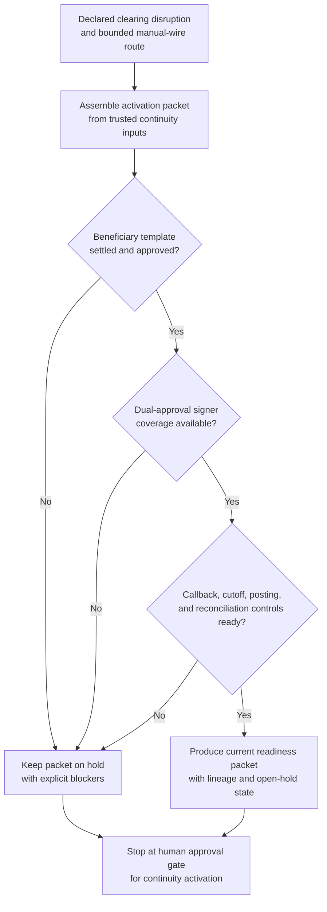
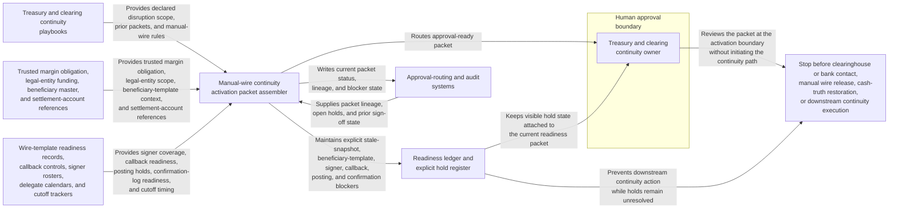

# Clearinghouse variation-margin manual wire continuity activation gate

## Linked pattern(s)

- `contingency-plan-activation-gate`

## Domain

Finance.

## Scenario summary

After a clearing connectivity disruption is declared, treasury and clearing operations have already identified the bounded fallback path and the accountable approval owner: a governed manual wire continuity route for same-day clearinghouse variation-margin settlement if the primary automated settlement path does not recover before cutoff. Upstream workflows have already restored the trusted margin obligation, designated the exact legal entity and settlement account scope, and routed the correct authority lane. The planning workflow now has to prepare one activation-ready packet showing approved beneficiary-template readiness, wire cutoff coverage, dual-approval signer availability, callback-control readiness, protected ledger-posting holds, and reconciliation-log readiness. It should keep explicit holds for any stale margin snapshot, incomplete signer coverage, missing callback script, unsettled beneficiary template, or broken confirmation-log control, and stop at the human approval gate rather than choosing whether to activate, contacting the clearinghouse or settlement bank, releasing the wire, restoring cash truth, or performing downstream contingency execution.

## Target systems / source systems

- Treasury and clearing continuity playbooks with the declared contingency scope, prior activation packets, protected settlement-account boundaries, and manual-wire fallback rules
- Trusted margin obligation, legal-entity funding, approved beneficiary master, and settlement-account reference systems already accepted as authoritative inputs for continuity preparation
- Wire-template readiness records, callback-control checklists, signer rosters, delegate calendars, and cutoff-timing trackers for treasury operations, clearing, controllership, and risk
- Approval-routing and audit systems that capture packet lineage, open holds, reserved operator coverage, and human sign-off before any manual settlement continuity mode may begin
- Restricted communication-planning and downstream settlement execution tools for clearinghouse notice timing, bank coordination, and confirmation handling that remain outside the planning gate

## Why this instance matters

This grounds the pattern in finance where the hard problem is not recalculating the variation-margin obligation, selecting the authority lane, or sending the manual wire itself. The hard problem is keeping one approval-gated readiness packet current while beneficiary-template readiness, signer coverage, callback controls, and cutoff windows can all drift during a live settlement disruption. It shows why contingency planning deserves its own slice apart from cash-truth restoration, authority recommendation, bank or clearinghouse communication, and downstream settlement execution: leaders need a disciplined activation gate artifact before any manual clearing continuity path can be approved safely.

## Likely architecture choices

- Approval-gated execution fits because the manual wire continuity path may be fully prepared while the settlement action remains blocked until named treasury and clearing leadership approve the packet.
- The readiness ledger should tie the authoritative margin snapshot, beneficiary-template status, signer coverage, callback controls, cutoff timing, and confirmation-log readiness to one current packet version.
- Explicit holds should remain visible whenever signer availability, cutoff coverage, callback discipline, or posting-control readiness is incomplete rather than being compressed into a nominally ready packet.
- The workflow should stop at the approval packet and hold register rather than recommending a different authority lane, re-establishing obligation truth, initiating bank outreach, or sending the manual wire.

## Governance notes

- Protected prerequisites such as approved beneficiary-template readiness, dual-approval signer coverage, callback-control integrity, cutoff-window coverage, confirmation-log readiness, and protected posting holds should be encoded as non-waivable holds in the packet.
- Shared packets should expose timing, readiness, and blocker state without copying full account numbers, raw payment credentials, bank callback secrets, or detailed liquidity strategy outside restricted treasury and clearing channels.
- Human treasury or clearing continuity ownership is required before the packet becomes the authoritative basis for any manual settlement continuity activation.
- Repeated packet revisions should preserve append-only lineage so audit, treasury control, and risk teams can reconstruct exactly which margin references, signer rosters, beneficiary records, and protected holds changed before approval.

## Evaluation considerations

- Time from updated clearing continuity preparation request to a human-reviewable activation packet with complete margin-reference, signer, cutoff, callback, and hold state
- Percentage of stale obligation references, signer gaps, beneficiary-template issues, or confirmation-control blockers kept explicit in the hold register rather than hidden in a partially prepared packet
- Agreement between the workflow's packet and the final human-approved activation gate used for downstream manual settlement continuity
- Stability of the readiness packet when margin-call timing, signer availability, or settlement cutoff coverage changes within the same clearing window
