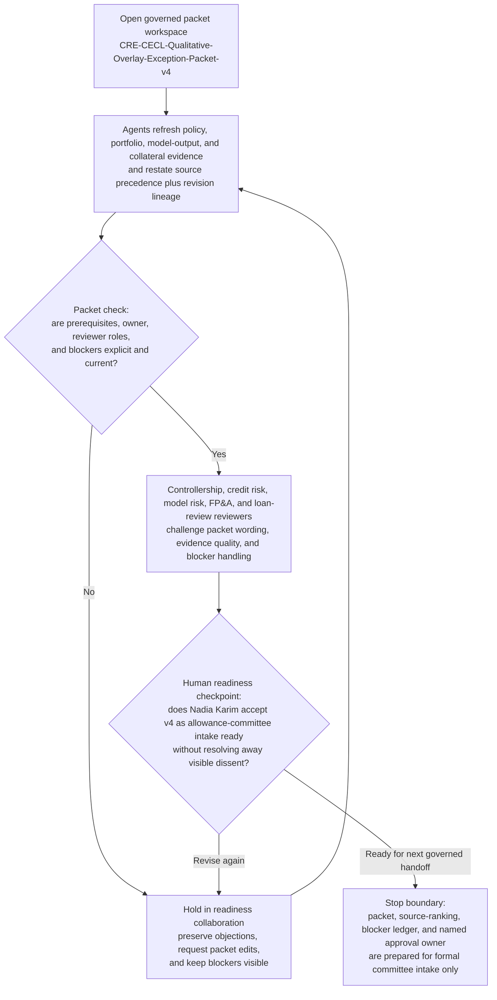
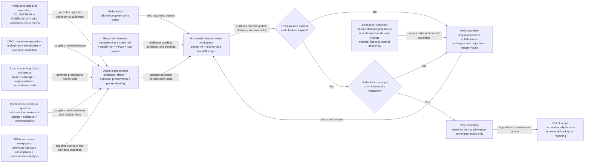

# Commercial real estate CECL qualitative overlay exception package readiness loop

## Linked pattern(s)

- `approval-centered-collaboration`

## Domain

Finance.

## Scenario summary

A finance allowance-governance manager is coordinating one exact governed approval-readiness artifact, `CRE-CECL-Qualitative-Overlay-Exception-Packet-v4`, because worsening office and hospitality credit signals suggest the quarter-end commercial real estate CECL output may need a qualitative overlay exception before the allowance committee review, yet the request cannot enter formal committee intake until controllership, commercial credit risk, model risk, FP&A, and loan-review stakeholders agree that the packet is factually complete, source-ranked, and explicit about unresolved objections. In a governed collaboration workspace, the manager and agent support iterate only on readiness: they reconcile reviewer comments, refresh evidence links, rewrite packet sections to reflect accepted edits and visible dissent, and keep the current handoff ledger synchronized with blocker state and named ownership. The workflow stops at approval-readiness collaboration and does not adjudicate the overlay, set reserve levels, post journal entries, update regulatory reports, shape investor communication, or trigger any downstream accounting action.

- **Exact governed artifact:** `CRE-CECL-Qualitative-Overlay-Exception-Packet-v4`
- **Authoritative source precedence:** signed allowance methodology standard `ACL-METH-07` and quarter-end qualitative overlay governance policy `OVERLAY-12` take precedence over the frozen `2026-Q1` commercial real estate portfolio tape, locked CECL run `cecl-cre-2026q1-r2`, approved criticized-loan review ledger, validated collateral reappraisal register, current macro downside scenario pack, and lowest-precedence reviewer annotations in the collaboration workspace.
- **Prerequisite state:** quarter-end subledger and portfolio segmentation are frozen for review; the current CECL model run is locked; borrower risk-rating refreshes are complete for the scoped portfolio; required reviewers are assigned; and the prior committee return memo on packet `v3` is attached as the starting state for `v4`.
- **Visible blockers:** stale collateral reappraisal on the largest downtown office exposure, unresolved migration mismatch between the criticized-loan ledger and CECL segmentation file, missing model-risk countersignature on the scenario-sensitivity appendix, and open disagreement from FP&A about whether the downside rent-roll narrative matches the current portfolio concentration view.
- **Revision lineage:** `CRE-CECL-Qualitative-Overlay-Exception-Packet-v2` captured the initial overlay rationale, `v3` was returned for stronger office-concentration support and clearer reviewer ownership, and `v4` is the current readiness revision with objection-preserving edits and refreshed source links.
- **Named accountable owner:** Nadia Karim, Director of Allowance Governance and Technical Accounting.
- **Named reviewers in the loop:** Jon Park, Head of Commercial Credit Risk; Elise Moreau, Model Risk Validation Director; Victor Chen, FP&A Banking Portfolio Lead; and Rina Das, Loan Review Executive.

## Target systems / source systems

- Governed finance review workspace containing `CRE-CECL-Qualitative-Overlay-Exception-Packet-v4`, reviewer comments, blocker state, readiness status, and the handoff ledger
- CECL model-run repository with the locked quarter-end run, feature inputs, scenario overlays, sensitivity outputs, and versioned model-execution metadata
- Loan accounting and general-ledger close workspace with the frozen subledger snapshot, portfolio segmentation extract, and quarter-end reconciliation status
- Commercial credit-risk systems with criticized-loan reviews, borrower rating migrations, collateral reappraisal records, covenant-watch notes, and concentration reporting
- Model risk and allowance-policy repository with `ACL-METH-07`, `OVERLAY-12`, committee return notes, reviewer authority mapping, and prior overlay challenge history
- FP&A and macro scenario workpapers with downside scenario assumptions, rent-roll stress commentary, sector concentration analysis, and current planning deltas

## Why this instance matters

This grounds the pattern in a finance workflow where the governed object is not a payment-control exception or a released accounting memo but one exact approval-readiness packet for a quarter-end CECL qualitative overlay exception before formal allowance committee intake. The scenario is materially distinct from the vendor prepayment example because the contested issues center on model-output interpretation, portfolio concentration evidence, reviewer dissent about overlay justification, and lineage of reserve-support claims rather than procurement urgency, treasury posture, or compensating payment controls. It shows how agents can accelerate packet revision, objection preservation, and source ranking without implying that the overlay is approved, that any reserve amount has been set, or that downstream accounting or disclosure action should begin.

## Likely architecture choices

- Human-in-the-loop collaboration should remain primary because allowance methodology interpretation, portfolio risk framing, and readiness for committee intake require accountable finance leadership judgment.
- An orchestrated multi-agent setup fits when separate agent roles refresh policy references, reconcile credit and model evidence, normalize reviewer objections, and maintain the approval-readiness handoff ledger across multiple packet revisions.
- Agents may draft revised packet sections, blocker summaries, and evidence-response tables, but overlay approval, reserve booking, quarter-close sign-off, regulatory reporting, and external communication must remain outside this workflow and explicitly human-controlled.

## Governance notes

- The workspace should distinguish authoritative policy text, raw model and portfolio facts, reviewer objections, agent-authored revision proposals, and human-accepted packet language so downstream reviewers can see exactly what remains contested.
- Every material claim about credit deterioration, concentration risk, collateral support, macro sensitivity, or committee-return remediation should link to inspectable evidence; stale or contradictory support should block readiness rather than be summarized away.
- Source precedence should remain visible on the face of `CRE-CECL-Qualitative-Overlay-Exception-Packet-v4` so reviewer commentary cannot outrank signed allowance policy, the locked CECL run, or validated credit-review evidence.
- The handoff ledger should record Nadia Karim as the current accountable owner, the mandatory reviewers, open blockers, and the precise stop boundary where approval-readiness collaboration ends before overlay adjudication, reserve booking, or any downstream reporting action begins.
- If refreshed evidence indicates source-data integrity failure, unauthorized model-use changes, or a material financial-control deficiency, the workflow should pause and escalate into model governance or close-control investigation rather than continue polishing the readiness packet.

## Evaluation considerations

- Time to produce an internal-review-ready `CRE-CECL-Qualitative-Overlay-Exception-Packet-v4` that preserves blocker visibility, source precedence, and named ownership without erasing reviewer disagreement
- Reviewer correction rate for sections where agent-assisted edits overstate overlay support, understate portfolio concentration concerns, or imply that the packet is already approved rather than merely ready for formal intake
- Reliability of the blocker-and-handoff ledger, including whether prerequisite state, source ranking, unresolved objections, and the accountable owner remain synchronized with the latest packet revision
- Rate at which allowance committee intake returns the packet because collaboration masked evidence conflicts, lost revision lineage, or blurred the boundary between readiness work and actual reserve judgment
