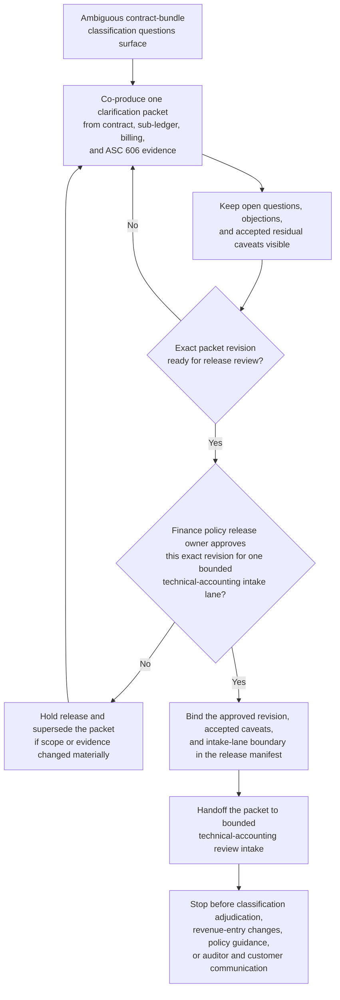

# Contract-bundle revenue recognition classification clarification packet approved for technical accounting review intake

## Linked pattern(s)

- `approval-gated-collaborative-artifact-release`

## Domain

Finance.

## Scenario summary

Accounting operations, revenue systems, and finance policy and technical accounting partners are co-producing one governed contract-bundle revenue recognition classification clarification packet because a portfolio of multi-element enterprise contracts has accumulated ambiguous performance-obligation splits, variable-consideration estimates, and disputed standalone-selling-price allocations that downstream reviewers cannot safely adjudicate without a single authoritative, evidence-linked artifact. The ambiguity surfaced when a contract modification retroactively changed the bundle structure mid-arrangement and the existing revenue sub-ledger entries no longer align with the updated allocation model held in the revenue systems team's working files. Agents help reconcile contract terms, modification memos, revenue sub-ledger evidence, billing-schedule excerpts, ASC 606 policy references, and reviewer objections into the shared clarification packet while keeping which classification questions remain open and which residual caveats the human artifact owner accepted explicitly both visible and linked to inspectable evidence. The workflow ends only when the named finance policy release owner approves that exact packet revision for one bounded technical-accounting review intake lane, where downstream technical-accounting reviewers may decide whether the classification packet is sufficient for formal accounting-position review or needs narrower scope and fresher contract evidence. It does not adjudicate the revenue recognition treatment, post or reverse revenue entries, change contract terms, issue accounting-policy guidance memos, or notify customers or auditors.

## Target systems / source systems

- Governed finance collaboration workspace holding the contract-bundle classification clarification packet, revision history, objection ledger, and release-manifest state
- Revenue sub-ledger, contract management, and order management systems providing authoritative contract terms, modification history, performance-obligation schedules, standalone-selling-price tables, and variable-consideration estimates
- ASC 606 policy repository, revenue-recognition playbook, and finance-policy precedent register supplying applicable recognition criteria, classification rules, modification-accounting guidance, and prior technical-accounting rulings
- Billing-schedule, deferred-revenue, and financial-close systems providing recognition timing evidence, deferred-balance snapshots, and period-cut traceability for cited contract bundles
- Approval-routing, audit, and retention systems preserving superseded packet revisions, accepted residual objections, blocked-release reasons, and downstream handoff traceability into the technical-accounting review intake lane

## Why this instance matters

This grounds the pattern in a finance workflow where the governance problem is collaborative stewardship of one revenue recognition classification artifact whose exact revision must be approved before it can cross into a bounded technical-accounting review lane, while visible disagreements about performance-obligation splits, standalone-selling-price allocations, modification-accounting scope, and variable-consideration estimates remain inspectable rather than polished away. The reusable challenge is that multiple teams hold partial but authoritative views of the same contract-bundle facts, so the collaborative packet is the only artifact that can bring those views into a single inspectable state without one team unilaterally imposing a classification answer. The example stays inside the pattern boundary because technical-accounting adjudication, revenue entry changes, policy guidance issuance, and auditor or customer communication remain separate downstream workflows.

## Likely architecture choices

- Approval-gated execution fits because the clarification packet can be collaboration-ready while still blocked from technical-accounting review intake until the human release owner approves the exact revision with its accepted residual caveats.
- Human-in-the-loop control is required because only accountable finance policy and technical-accounting leaders may accept residual classification uncertainty, confirm audience scope, and authorize the packet's release boundary without that approval being treated as a revenue recognition determination.
- Agents may reconcile contract modification evidence, compare performance-obligation split alternatives, normalize objection wording across reviewer comments, and maintain the release trace, but they must not resolve classification disputes, adjust sub-ledger entries, or trigger any downstream revenue action.

## Governance notes

- The release manifest should bind one exact packet revision, the named technical-accounting review intake lane, signer identities, the affected contract-bundle scope, and any residual classification objections the human release owner accepted explicitly.
- Conflicting performance-obligation interpretations, unresolved standalone-selling-price allocation disputes, contested modification-accounting treatment, and stale billing-schedule evidence should remain visible in the packet or boundary ledger rather than being normalized into a single preferred answer before release.
- Audience scope should stay limited to the approved technical-accounting review intake lane; reuse of the packet for auditor communications, revenue-guidance memos, external reporting inputs, or sub-ledger adjustment instructions should require separate downstream approval.
- If new contract modification evidence, revised ASC 606 policy guidance, or a change in the affected contract-bundle scope alters the classification picture materially during approval review, the workflow should hold release and supersede the prior packet revision rather than carrying stale approval forward.

## Evaluation considerations

- Rate at which technical-accounting intake accepts the released packet without discovering hidden classification scope drift, stale contract evidence, or audience-boundary mistakes
- Time required to keep one collaborative clarification packet synchronized as contract modification records, standalone-selling-price tables, and signer state evolve across accounting-close and revenue-systems teams
- Reliability of binding between the released artifact revision, accepted residual classification disagreement, affected contract-bundle scope, and the bounded technical-accounting review intake lane
- Frequency with which humans reject agent-assisted edits because they drifted into classification adjudication, sub-ledger adjustment, policy guidance issuance, or auditor and customer communication
