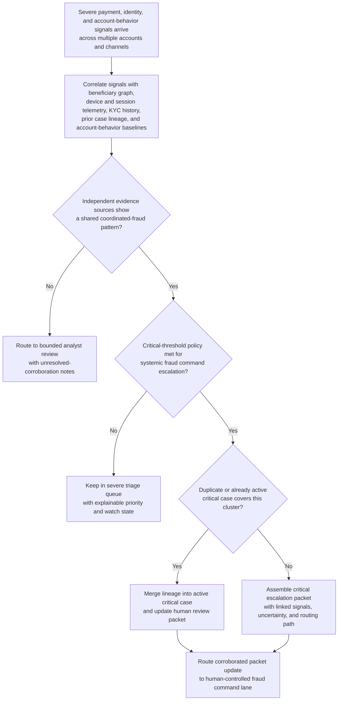
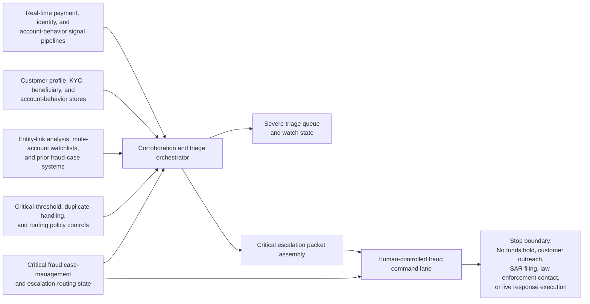

# Coordinated account-takeover payment ring critical corroboration triage

## Linked pattern(s)

- `critical-signal-corroboration-triage`

## Domain

Finance.

## Scenario summary

A bank's fraud command workflow sees several severe signals arrive within minutes across commercial and affluent-retail payment channels: high-value outbound payments to newly linked beneficiaries, identity-verification resets from unusual devices, rapid beneficiary-add activity, shared mule-account destinations, and synchronized deviations from normal account-behavior baselines. The workflow must determine whether these signals corroborate a potentially systemic or coordinated account-takeover fraud event, merge the evidence into a critical triage packet, and route that packet into a human-controlled fraud command lane. It stops before deciding any funds hold, customer outreach, suspicious-activity filing, law-enforcement contact, or live response execution.

## Target systems / source systems

- Real-time fraud alerting, payment-monitoring, and anomaly-scoring pipelines across wire, ACH, and card-to-account transfer channels
- Identity, authentication, device-fingerprint, and session-risk systems capturing step-up failures, credential resets, impossible travel, and unusual access patterns
- Customer profile, KYC, beneficiary-management, and historical account-behavior stores used to compare current activity with known benign patterns
- Entity-link analysis, mule-account watchlists, and prior fraud-case systems that expose shared destinations, repeated devices, or coordinated beneficiary clusters
- Critical fraud case-management and escalation-routing tooling used to hold the corroborated packet, duplicate lineage, and human-controlled command handoff

## Why this instance matters

This instance grounds the pattern in a finance setting where the highest-risk problem is not one suspicious payment in isolation but a fast-moving cluster of independently severe indicators that may signal organized fraud across multiple customers or channels. It makes the family boundary concrete by focusing on corroboration, case aggregation, and governed routing into fraud command rather than on operational interventions such as payment blocking, outreach, filing, or investigative takedown steps.

## Likely architecture choices

- Event-driven monitoring fits because severe payment, identity, and behavior signals can arrive asynchronously and need re-correlation as new evidence lands.
- Orchestrated multi-agent or staged service roles fit because payment analysis, identity corroboration, entity-link review, duplicate handling, and escalation-packet assembly are specialized but must converge on one shared case state.
- Human-in-the-loop review remains necessary because a critical fraud-command escalation can rapidly influence consequential downstream decisions even though this workflow itself stays bounded at recommendation-only triage.

## Governance notes

- The escalation packet should show exactly which payment, identity, and account-behavior signals were fused, what independent evidence corroborated them, and where uncertainty still remains.
- Duplicate handling must preserve lineage between account clusters, shared mule destinations, and active command cases so humans can tell whether a new burst is extension, overlap, or a distinct coordinated campaign.
- Policy thresholds for critical escalation, cluster fusion, and watch-state retention require controlled review because overtuned logic can either miss systemic fraud or overwhelm fraud command with false criticals.
- Customer identifiers, account numbers, and sensitive identity evidence should be minimized in broad queue views while preserved in access-controlled references for audit and human follow-up.
- The workflow must end at corroborated triage, packet assembly, and human-controlled routing rather than implicitly recommending funds freezes, customer messaging, SAR filing, or law-enforcement action.

## Evaluation considerations

- Recall of historically coordinated fraud bursts that should have reached human-controlled critical escalation
- Median time from first severe cross-signal burst to a corroborated fraud-command packet ready for review
- Accuracy of duplicate merging and cluster lineage preservation when overlapping account-takeover campaigns are active
- Reviewer agreement that the packet distinguishes true multi-source corroboration from coincidental co-occurrence across noisy payment and identity alerts
