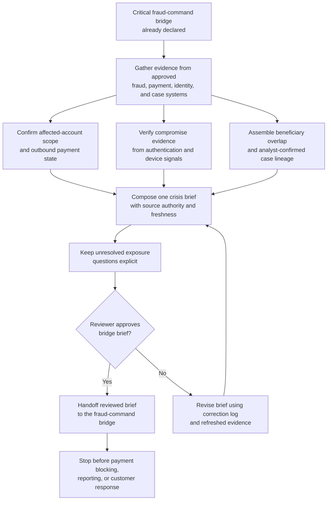
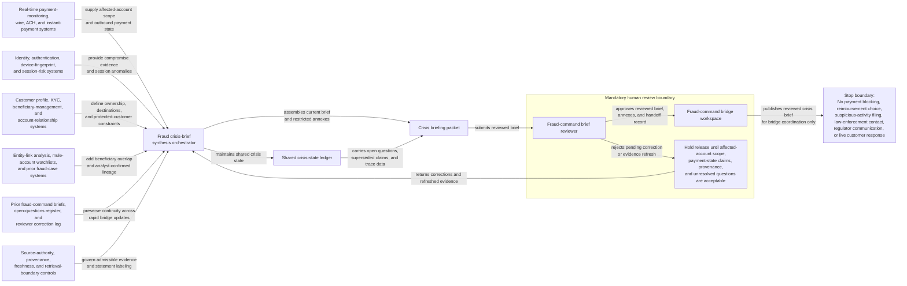

# Coordinated account-takeover payment ring fraud-command bridge crisis briefing evidence synthesis

## Linked pattern(s)

- `crisis-briefing-evidence-synthesis`

## Domain

Finance.

## Scenario summary

A bank's fraud command function has already declared a critical bridge after corroborated evidence shows a coordinated account-takeover payment ring moving across commercial and affluent-retail accounts, newly added beneficiaries, and multiple outbound payment rails. Before anyone decides whether to block payments, reimburse losses, file suspicious-activity reports, contact law enforcement, brief regulators, or direct live customer response, the workflow must assemble one provenance-preserving crisis brief for the fraud-command bridge. The brief needs to compress verified affected-account scope, outbound-payment state, beneficiary-cluster overlap, authentication-compromise evidence, analyst-confirmed case lineage, and unresolved exposure questions into one inspectable situation picture that distinguishes authoritative current facts from lower-authority bridge notes and stale case commentary so human fraud leaders can coordinate from grounded context rather than fragmented queue updates.

## Target systems / source systems

- Fraud-command bridge workspace where reviewed crisis briefs, restricted annexes, and superseded updates are stored
- Real-time payment-monitoring, wire, ACH, and instant-payment systems showing initiated, queued, released, returned, or already-settled transaction state for the affected cluster
- Identity, authentication, device-fingerprint, and session-risk systems capturing credential resets, step-up failures, unusual device changes, and access anomalies linked to the suspected takeover accounts
- Customer profile, KYC, beneficiary-management, and account-relationship systems defining account ownership, newly linked destinations, account hierarchies, and protected-customer handling constraints
- Entity-link analysis, mule-account watchlists, and prior fraud-case systems exposing shared beneficiary endpoints, repeated devices, and overlap with active coordinated-fraud investigations
- Prior fraud-command briefs, open-questions register, and reviewer correction log used to preserve continuity across rapid successive bridge updates

## Why this instance matters

This grounds the pattern in a finance crisis where the immediate need is not another alert score or action recommendation, but one disciplined fraud-command briefing package that compresses fast-changing payment, identity, and case evidence into a shared picture. Coordinated account-takeover events quickly generate partially authoritative narratives across monitoring queues, analyst notes, customer records, and link-analysis tools, while the downstream decisions carry legal, operational, and customer-harm consequences. The instance shows why critical-risk gather/synthesize work should remain bounded at crisis briefing synthesis and human handoff: fraud leaders need cross-source compression with explicit provenance and uncertainty before they decide what intervention or reporting path to take.

## Likely architecture choices

- An orchestrated multi-agent workflow can separate payment-state retrieval, identity-compromise verification, beneficiary-link assembly, and final fraud-bridge brief composition while maintaining one shared crisis-state ledger.
- Human-in-the-loop review should remain mandatory for each fraud-command brief because affected-account counts, payment-state claims, and beneficiary-cluster descriptions can materially influence downstream fraud, legal, and customer-response decisions.
- The workflow should preserve a provenance and freshness trace that distinguishes authoritative payment and authentication records, governed customer-reference data, analyst-reviewed case lineage, and lower-authority bridge observations awaiting confirmation.
- Retrieval should stay inside approved fraud, payment, identity, and case-management systems, and the synthesis should stop at reviewer-approved briefing handoff instead of proposing payment blocking, reimbursement choice, suspicious-activity filing, law-enforcement contact, regulator communication, or downstream execution.

## Governance notes

- Authoritative payment-event records, authentication telemetry, and approved case-management updates should outrank copied bridge chat, manually maintained spreadsheets, or speculative analyst commentary when the event picture conflicts.
- Customer identifiers, account numbers, beneficiary details, and sensitive identity evidence should be minimized in broad bridge summaries, with restricted annexes used only for the narrowly scoped fraud reviewers who need them.
- Each brief revision should make freshness visible for payment-state and account-compromise claims so fraud leaders do not act on already superseded queue conditions or stale linkage assumptions.
- Open questions such as uncertain beneficiary ownership, incomplete account compromise confirmation, or unresolved overlap with other active fraud cases should remain explicit rather than being collapsed into confident exposure or attribution statements.

## Evaluation considerations

- Median time from fraud-command bridge activation to reviewer-approved crisis brief with complete source and freshness trace
- Percentage of material affected-account, payment-state, beneficiary-link, and authentication-compromise statements backed by inspectable authoritative sources
- Reviewer correction rate for source-authority handling, cluster scoping, or stale-state reuse across successive fraud-command bridge briefs
- Rate at which unresolved exposure, overlap, or evidence-gap questions are surfaced explicitly before downstream fraud-response, reimbursement, reporting, or communication decisions are made
