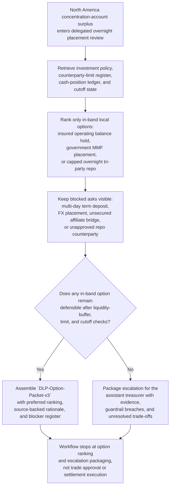

# Daily liquidity surplus placement-band option recommendation

## Linked pattern(s)

- `delegated-authority-option-ranking`

## Domain

Finance.

## Scenario summary

At the end of a normal funding day, Rina Patel, Director of Global Liquidity Operations, must prepare one inspectable delegated-authority recommendation artifact, `DLP-Option-Packet-v3`, for a corporate treasury surplus sitting in the North America concentration account after payroll prefunding settles lighter than forecast. Her local authority band allows only a narrow menu of in-band placement paths for the overnight surplus: leave the cash in the insured operating concentration account up to a documented balance cap, place a capped amount into a preapproved government money market fund already enabled for the entity, or recommend a capped overnight tri-party repo with one of the approved counterparties already inside same-day cutoff. The workflow must keep source precedence explicit by favoring the signed short-term investment policy, the current counterparty and concentration-limit register, and the same-day cash-position ledger ahead of trader chat, indicative dealer runs, or informal forecast commentary; it must preserve blocked asks such as a multi-day term deposit, an FX conversion into a non-base-currency placement, an unsecured affiliate bridge, or a repo with an unapproved counterparty; and it must package escalation for the assistant treasurer only if no in-band overnight recommendation remains defensible. The artifact stops at option ranking and escalation packaging rather than authorizing a trade, changing account sweeps, rewriting policy, notifying banks, or executing downstream settlement instructions.

## Target systems / source systems

- Treasury management system cash-position dashboard, concentration-account balances, intraday funding ledger, and same-day liquidity buffer view for the legal entity under review
- Approved short-term investment policy, delegated placement matrix, concentration-limit register, and blocked-instrument list covering tenor, counterparty, and currency guardrails
- Money market fund entitlement register, tri-party repo counterparty roster, collateral eligibility notes, and bank cutoff calendar for same-day overnight windows
- Forecast workspace containing payroll, tax, debt-service, and intercompany funding projections that explain whether the apparent surplus is durable enough for local recommendation
- Recommendation audit trail, prior override ledger, and exception-packet templates used when local authority is exhausted or source evidence is stale

## Why this instance matters

This grounds the pattern in corporate treasury rather than collections or customer concession work. The reusable challenge is narrowing a live surplus-placement question to the overnight options that genuinely remain inside delegated authority while keeping blocked asks, cutoff pressure, and liquidity-buffer uncertainty explicit. That makes the workflow valuable without letting it drift into trade authorization, funding execution, or broader investment-policy interpretation.

## Likely architecture choices

- A tool-using single agent can retrieve the investment policy, current limit usage, concentration-account position, eligible placement roster, and forecast assumptions and turn them into one bounded overnight option ranking.
- Human-in-the-loop review remains necessary because Rina Patel or another delegated treasury owner decides whether the ranked in-band recommendation is acceptable locally or whether the packet should escalate when all safe options are exhausted.
- Read-only integration with treasury, bank-connectivity, policy, and limit systems is preferable so the workflow cannot silently book a placement, alter sweep rules, release settlement instructions, or expand delegated tenor limits.

## Governance notes

- Source precedence should remain explicit: the signed short-term investment policy and delegated placement matrix outrank the current counterparty-limit register and same-day cash-position ledger, which outrank forecast commentary, dealer color, or informal chat when the workflow compares allowed overnight options.
- Prerequisite policy, account, and operating state should remain visible before any local recommendation is treated as complete, including confirmation that the entity's minimum liquidity buffer is current, the North America concentration account is reconciled, approved fund and repo entitlements are active, and the overnight cutoff window has not already closed for the candidate path.
- The output should distinguish allowed in-band placements, conditionally allowed paths that depend on refreshed forecast durability or entitlement confirmation, blocked requests such as multi-day deposits or non-base-currency placements, and escalation-only asks such as unsecured affiliate lending or new-counterparty onboarding.
- Visible blockers and unresolved items should stay attached to the packet, including an unrefreshed West Coast payroll outflow forecast, a pending legal-entity rename on one repo counterparty, and incomplete same-day subscription-capacity confirmation from the government MMF administrator.
- Revision lineage should preserve why `DLP-Option-Packet-v1` was superseded after forecast refresh, why `v2` demoted the repo option after the counterparty-rename mismatch appeared, and how `v3` narrowed the preferred ranking without erasing the blocked asks.
- Audit records should preserve Rina Patel as the named local owner, the compared option set, source references used, limit and cutoff checks, blocked-option rationale, and the exact escalation packet contents if delegated placement scope is exhausted.
- The boundary must stay explicit: approving a placement, booking the trade, updating sweep instructions, notifying banking partners, or changing investment policy remains outside this workflow.

## Evaluation considerations

- Rate at which accepted local overnight-placement recommendations stay inside delegated treasury authority without later assistant-treasurer correction
- Frequency with which blocked tenor, currency, affiliate-lending, or counterparty requests are surfaced before anyone implies a trade commitment or opens downstream settlement work
- Time required to produce a complete bounded recommendation packet after the surplus enters delegated overnight review
- Stability of option ranking when forecast durability, cutoff timing, entitlement state, or counterparty-limit usage changes during the same review cycle
