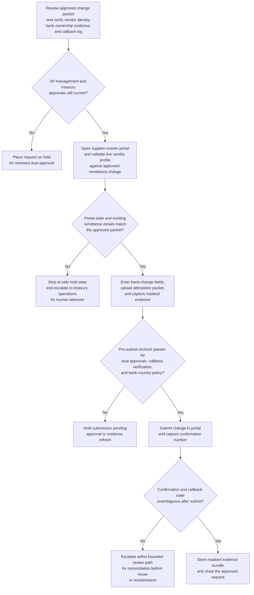

# Dual-approved vendor bank account change submission

## Linked pattern(s)

- `browser-based-form-completion-with-approval-gates`

## Domain

Finance.

## Scenario summary

An accounts payable controls specialist needs to submit an approved vendor remittance bank account change for a strategic raw-material supplier after the supplier completes an ownership-backed treasury migration. The target supplier-master portal is browser-only, spreads the change across vendor identity, payment method, bank routing, account ownership attestation, and callback-verification tabs, and final submission may proceed only after AP management and treasury controls have both approved the request in the finance case system. Because an incorrect commit could redirect future payments, the workflow must recheck approvals, verify that supporting evidence still matches the requested account, and halt safely if the live portal or callback-verification state becomes ambiguous.

## Target systems / source systems

- Finance case-management system holding the change request, dual approvals, and segregation-of-duties record
- Browser-only ERP or supplier-master portal for vendor payment profile maintenance
- Vendor master record, approved bank-change packet, and callback-verification log
- Treasury reference data for bank-country rules, payment-method policy, and sanctioned-jurisdiction checks
- Evidence store for masked screenshots, confirmation numbers, and exception or takeover notes

## Why this instance matters

This grounds the execution pattern in a finance workflow where the browser action can directly change where real cash leaves the company. The point is not just to automate repetitive field entry. It is to show how approval gating, evidence capture, and safe halt behavior protect against fraud, stale documentation, and portal drift before a sensitive payment instruction becomes live in the ERP.

## Likely architecture choices

- Approval-gated execution should assemble the submission packet, verify that AP and treasury approvals are still current, and block final commit until the dual-approval state is rechecked immediately before save or submit.
- A tool-using single agent can navigate the supplier-master portal, populate bank and remittance fields, upload the approved attestation packet, and capture masked evidence at each gated checkpoint.
- Human-in-the-loop control should remain standard for mismatched vendor identity data, unexpected edits to existing remittance details, callback-verification gaps, or any portal warning that suggests the change may affect pending payments already in flight.

## Governance notes

- The workflow should confirm that the approved vendor name, tax identifier, bank-account ownership evidence, and callback-verification record all align before any browser entry begins.
- Screenshots and logs should mask account and routing numbers while still preserving enough evidence to prove which fields were changed, which approvals unlocked the step, and which portal confirmation was received.
- If the portal shows additional editable payment fields, a changed bank-country rule, or an unrecognized existing remittance profile, the workflow should stop at a saved draft or abandon the session rather than guessing and committing a risky change.
- Human takeover steps should preserve the current page state, entered-versus-unsubmitted values, and reasons for the halt so treasury operations can resume safely without duplicating or partially overwriting the request.

## Evaluation considerations

- Percentage of dual-approved vendor bank changes submitted without downstream payment recall, supplier complaint, or post-change correction
- Rate of stale approvals, mismatched callback evidence, or portal anomalies caught before final submission
- Completeness of masked evidence bundles for internal audit, fraud-control testing, and payment-trace review
- Reliability of safe halt and human takeover when portal layouts shift, confirmation is ambiguous, or finance policy checks change mid-execution
