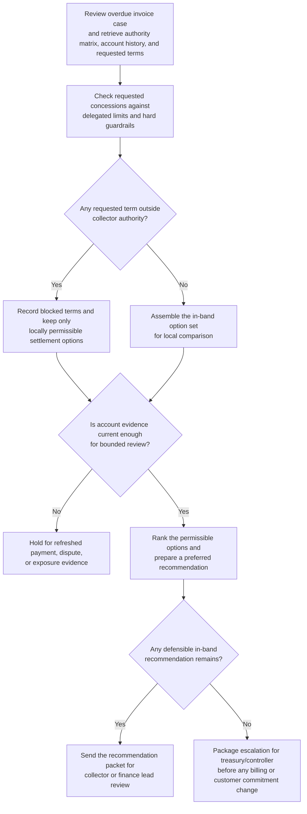
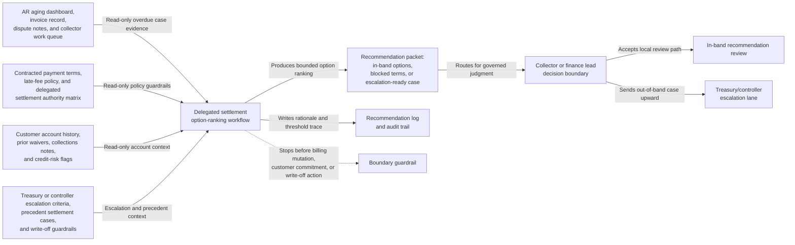

# Enterprise arrears settlement-band option recommendation

## Linked pattern(s)

- `delegated-authority-option-ranking`

## Domain

Finance.

## Scenario summary

An accounts-receivable operations team is reviewing a ninety-day-overdue enterprise invoice for a strategic customer that wants temporary relief while it completes an internal budget transfer. The collector can recommend only a narrow set of local options that sit inside a documented authority band, such as a capped late-fee waiver, a short installment plan, or a continued standard collections posture, but the customer is also asking for principal reduction and an extended payment holiday that would exceed delegated limits. The workflow must rank the in-band settlement options, show which requested terms are blocked by the collector authority matrix, and package escalation only if no locally permissible path remains appropriate before anyone changes billing records or sends a customer commitment.

## Target systems / source systems

- AR aging dashboard, invoice record, dispute notes, and collector work queue
- Contracted payment terms, late-fee policy, and delegated settlement authority matrix
- Customer account history, prior waivers, collections notes, and credit-risk flags
- Treasury or controller escalation criteria, precedent settlement cases, and write-off guardrails
- Recommendation log and audit trail for prior overrides or exception requests

## Why this instance matters

This grounds the pattern in finance where the hard problem is not adjudicating a write-off or editing the receivables system. The value is narrowing the recommendation to the safe local settlement options that remain inside collector authority, keeping blocked concession paths explicit, and escalating only when the request truly moves beyond the delegated envelope.

## Likely architecture choices

- A tool-using single agent can retrieve the authority bands, payment history, precedent cases, and current exposure values and turn them into one bounded settlement option ranking.
- Human-in-the-loop review still matters because the collector or finance lead chooses whether to accept the in-band recommendation locally or send the case upward for a larger concession review.
- Read-only integration with billing, contract, and collections systems is preferable so the recommendation workflow cannot silently waive fees, change payment dates, or post write-offs.

## Governance notes

- The output should distinguish locally permissible options, conditionally permissible options that depend on refreshed account evidence, and blocked requests such as principal forgiveness or payment holidays outside delegated caps.
- Prior waivers, disputed charges, and strategic-account notes should inform ranking inside the band but should never erase hard authority limits or write-off controls.
- Customer financial stress signals, contractual terms, and exception history should remain visible only to authorized collections, controller, treasury, and account reviewers.
- Recommendation packets should preserve threshold inputs, evidence freshness, blocked-option rationale, and any override requests so later audit can reconstruct why a local path was recommended or escalated.

## Evaluation considerations

- Rate at which accepted recommendations stay inside collector authority without later controller correction
- Time to produce a bounded settlement option packet after the overdue case enters delegated review
- Frequency with which blocked concession requests are surfaced before billing or customer-communication commitments are made
- Stability of option ranking when payment history, dispute status, or credit exposure changes during review
