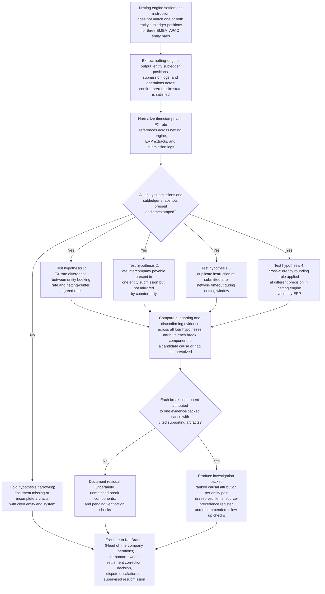
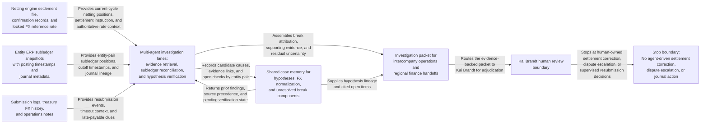

# Intercompany netting settlement mismatch investigation

## Linked pattern(s)

- `incident-root-cause-analysis`

## Domain

Finance.

## Scenario summary

At monthly close, the corporate netting center for a multinational industrial group reports that three entity pairs in the EMEA–APAC cross-currency netting pool have unresolved settlement mismatches totalling €2.1 million equivalent. Each pair submitted netting confirmations on time, but the netting engine's consolidated settlement instruction does not match the position that one or both entities carry in their ERP subledger. The discrepancy could stem from an FX-rate divergence between the netting center's agreed interday rate and the entity booking rates, a late intercompany payable captured in one entity's final submission but not yet mirrored in the counterparty's system, a duplicate instruction that was re-submitted after a network timeout during the netting window, or a rounding difference introduced when the netting engine applied a cross-currency conversion rule that one entity's ERP applies at a different precision. The investigation reconciles netting-engine output, entity subledger positions, submission logs, and operations notes into an evidence-backed explanation of which entity pair contributed each component of the break, what each candidate cause predicts, and which checks remain open before a human-owned decision on settlement instruction correction or dispute escalation can proceed. Kai Brandt, Head of Intercompany Operations, is the named human owner of this investigation packet.

**Prerequisite state that must be confirmed before narrowing hypotheses:**
- Netting cycle has reached final-submission cutoff and no further entity resubmissions are pending.
- FX reference-rate publication for the netting window is complete and the authoritative interday rate is locked in the netting engine.
- Entity ERP subledger snapshots for the netting date have been extracted and timestamped; no retroactive journal postings to the intercompany accounts are in progress.
- Any prior-cycle carry-over disputes or unmatched credits from the preceding netting run have been documented as in-scope or explicitly excluded.

## Target systems / source systems

**Authoritative (highest precedence):**
- Netting engine settlement file and confirmation records for the current cycle, including the locked FX reference rate, netted position per entity pair, and the final settlement instruction
- Entity ERP intercompany subledger snapshots extracted at netting-date cutoff, with posting timestamps and journal-header metadata

**Operational and contextual (secondary precedence):**
- Netting submission logs, including entity submission timestamps, resubmission events, network-timeout acknowledgements, and any override or manual-correction records
- FX rate history from the treasury system for the netting window, including intraday-rate updates and any rate-lock confirmation messages
- Operations desk notes and intercompany team communications documenting late payable notifications, disputed balances, or entity-reported anomalies during the netting window

**Excluded from authoritative use without explicit promotion:**
- Informal email exchanges or chat messages not attached to a submission log or netting-engine event
- Prior-cycle residuals or forecast positions not confirmed as part of the current cycle's scope

## Why this instance matters

Intercompany netting breaks at month-end are high-stakes because an unresolved settlement instruction error can propagate into cash-pool funding, drive incorrect elimination entries in the consolidation ledger, and distort intercompany receivable and payable balances across multiple reporting entities. Unlike a simple cash-position discrepancy, a netting mismatch requires reconciling submissions from independent legal entities that each maintain their own books at potentially different FX rates, precision settings, and cutoff conventions. The investigation must attribute each break component to a specific candidate cause without declaring which entity is wrong or approving any correcting instruction — both of which require human judgment and governance controls that sit outside the agent's authority. This instance grounds `incident-root-cause-analysis` in an audit-sensitive, multi-entity finance workflow where evidence provenance, source precedence, and explicit uncertainty are essential for the downstream decision to be defensible.

## Likely architecture choices

- An orchestrated multi-agent flow can separate netting-engine evidence retrieval, cross-entity subledger reconciliation, and hypothesis verification so each reasoning step remains attributable and inspectable.
- Shared case memory should preserve candidate causes, confirming and disconfirming evidence per entity pair, FX-rate normalization choices, and open break components across handoffs between intercompany operations, regional finance teams, and the netting center.
- Human-in-the-loop review must remain mandatory before any settlement instruction is corrected, any entity is notified of a disputed balance, or any consolidation journal is adjusted as a result of the investigation's findings.
- Source-precedence rules must be declared explicitly in the investigation record so the netting-engine file and ERP subledger snapshots are treated as authoritative and submission logs are treated as contextual rather than equivalent.

## Governance notes

- Preserve the original netting-engine settlement file, entity subledger snapshots, and submission logs as immutable evidence links; do not overwrite or restate values in the investigation record without citing the source artifact and timestamp.
- Distinguish observed position mismatches from inferred causal attribution; an FX-rate divergence that explains 80 percent of a break is not evidence that the remaining 20 percent has the same root cause.
- Settlement instruction corrections, entity notifications, and consolidation journal adjustments must remain explicitly human-owned; the investigation packet ends at a ranked attribution with cited evidence and open checks, not at an approved corrective action.
- Record revision lineage for the investigation packet, including which hypotheses were added, demoted, or closed as new evidence arrived, so that any later audit or dispute review can trace the reasoning history.
- If submission-log gaps, missing ERP snapshots, or conflicting FX references prevent full attribution for one or more entity pairs, the investigation must surface that uncertainty explicitly rather than forcing a single-cause conclusion; Kai Brandt must be informed before any close deadline is allowed to pass with unresolved components.
- Restrict access to entity-level position detail and intercompany balance data to the intercompany operations team and the consolidation controller; do not share raw subledger extracts outside that group during the investigation.

## Evaluation considerations

- Time to first evidence-backed causal attribution for the largest break component, with cited netting-engine and subledger artifacts
- Proportion of total break volume attributed to a single evidence-backed cause before a human decision on settlement correction is required
- Whether FX-rate divergence, late payable, duplicate submission, and rounding-rule hypotheses are each tested and closed or explicitly held open rather than collapsed into a single undifferentiated explanation
- Rate at which missing subledger snapshots, unacknowledged submission timeouts, or conflicting FX references produce explicit uncertainty flags rather than forced reconciliation
- Whether the final investigation packet allows Kai Brandt to understand which entity pair contributed each break component and which open checks remain before a settlement correction decision can be made
