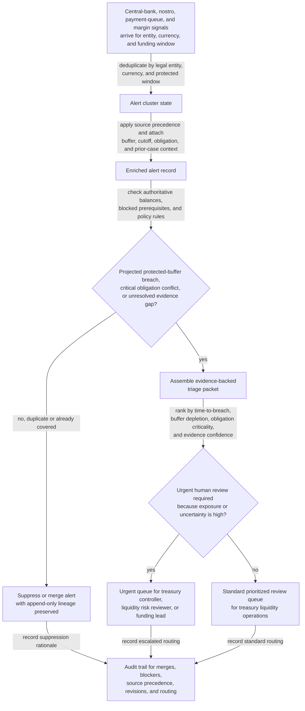

# Intraday liquidity buffer depletion alert triage

## Linked pattern(s)

- `risk-alert-triage`

## Domain

Finance.

## Scenario summary

A treasury liquidity risk operations team monitors a continuous stream of intraday cash-position risk signals across central-bank settlement statements, nostro bank balance updates, payment-hub queue telemetry, CCP and CLS funding notices, treasury workbench projections, and manually confirmed exception flags from regional cash managers. The workflow must collapse duplicate alerts tied to the same legal entity, currency, and protected funding window; enrich each case with committed buffer thresholds, known incoming receipts, queued high-priority obligations, prior triage history, and whether the entity is already under a governed liquidity watch; and then prioritize which alerts need immediate human review. Evidence posture is explicit for one exact governed triage case, `ILB-NA-USD-2026-03-22-1115Z-r3`: authoritative central-bank and nostro balance statements outrank internal treasury workbench projections, payment-queue estimates, and desk chat, while provisional CCP margin estimates or unconfirmed business-line receipts can raise concern but cannot by themselves close or down-rank the alert. The case starts only after prerequisite state is present for the active policy version, current cutoff calendar, approved committed-facility register, entity and account mapping snapshot, and prior open-alert lineage; visible blockers such as stale nostro timestamps, unresolved payment-purpose classification, delayed margin-call acknowledgment, or facility-limit snapshot lag remain attached to the triage packet. Priority logic must stay explainable by showing minutes to projected protected-buffer breach, percentage of committed buffer already consumed, count of policy-protected obligations crossing the window, and confidence penalties when authoritative sources lag. The goal is to produce an evidence-backed triage queue for treasury controllers, liquidity risk reviewers, or the regional funding lead before a daylight liquidity shortfall becomes consequential, but not to draw on facilities, block payments, notify counterparties, trigger settlement action, or decide contingency funding automatically. Named human owner: Elena Kovacs, Director of Intraday Liquidity Risk Operations.

## Target systems / source systems

- Central-bank settlement account statements and intraday liquidity monitor with authoritative opening balances, debit and credit postings, and timestamped position confirmations
- Nostro and concentration-bank balance feeds with account-level cash positions, overdraft indicators, intraday credit usage, and statement freshness metadata
- Payment-hub and treasury queue systems with queued payment priorities, cutoff windows, payment-purpose codes, settlement channels, and cancellation or release state
- CCP, CLS, and other market-infrastructure notice feeds with confirmed margin calls, pay-in schedules, expected return flows, and acknowledgment timestamps
- Treasury management workbench with liquidity projections, committed facility availability, account hierarchy mappings, prior triage packets, and watch-status indicators
- Audit-grade evidence store and case queue preserving raw alert lineage, blocker flags, source-precedence decisions, priority-factor calculations, routing rationale, and human overrides

## Why this instance matters

This grounds `risk-alert-triage` in a finance setting where the hard problem is not merely spotting a low balance, but deciding whether a projected intraday shortfall is real, time-critical, and governance-relevant once authoritative cash evidence, protected payment obligations, and source latency are weighed together. A weak workflow would either flood treasury reviewers with repetitive low-balance chatter already covered by confirmed incoming funds or under-rank the one case where unofficial projections look manageable while authoritative balance statements and obligation timing show a genuine protected-buffer breach risk. The instance stays inside monitor/detect/triage because the agentic work is continuous watching, evidence-weighted enrichment, blocker visibility, explainable prioritization, and governed routing into human review rather than facility activation, payment holds, counterparty communication, settlement execution, or downstream treasury action.

## Likely architecture choices

- Event-driven monitoring should continuously ingest settlement postings, bank-balance updates, queue changes, market-infrastructure notices, and cutoff-calendar transitions, then reopen, merge, or reprioritize alert clusters as evidence changes.
- A tool-using single agent can correlate entity and account identifiers across bank, payment, and treasury systems; suppress duplicate low-value liquidity chatter; apply explicit source precedence; and publish a prioritized queue with urgency drivers and blocker visibility.
- Human-in-the-loop review should remain mandatory for any alert involving an authoritative protected-buffer breach, material uncertainty about incoming funding, conflicts between authoritative and internal records, or blocker conditions such as stale bank statements, missing margin acknowledgments, or facility-limit ambiguity.
- Approval-gated escalation is the right boundary because the workflow can recommend urgent routing to treasury controllers, liquidity risk, or regional funding leads, but it should not independently draw on facilities, delay outgoing payments, declare a liquidity event, or contact banks or counterparties.

## Governance notes

- Triage packets should show which liquidity thresholds, cutoff protections, obligation-priority rules, and evidence-confidence checks fired; which raw alerts were merged; which sources were treated as authoritative versus provisional; and why the case entered a given urgency tier.
- Source precedence should be explicit and reviewable: central-bank and nostro statements outrank internal projections and queue estimates for current cash truth; confirmed market-infrastructure notices outrank unacknowledged margin estimates; and desk chat or unverified business-line receipts may inform context but cannot close or materially down-rank the alert on their own.
- Visible blockers and unresolved items should travel with the alert, including stale balance timestamps, unresolved entity-account mapping mismatches, missing payment-purpose classification, delayed CCP or CLS acknowledgments, and facility-register lag that prevents confident urgency scoring.
- Append-only lineage should be preserved across every evidence update so reviewers can reconstruct how `ILB-NA-USD-2026-03-22-1115Z` moved from `r1` through `r3` as new statements posted, obligations repriced, or blocker states changed after the original signal arrived.
- Confidentiality controls should minimize account numbers, counterparty names, payment references, and market-sensitive funding commentary in broad queue views while retaining traceable evidence in restricted treasury systems for authorized reviewers.
- Approval boundaries must remain firm: only authorized treasury controllers, liquidity risk leaders, assistant treasurers, or designated funding delegates may decide whether liquidity actions occur, whether any payment is delayed, whether counterparties are contacted, or whether a case can be closed as benign.

## Evaluation considerations

- Recall of historically material intraday liquidity pressure cases that should have reached urgent human review before a protected funding window or cutoff closed
- Reduction in duplicate reviewer work from merged low-balance, queue-pressure, and margin-notice alerts without lowering capture of genuine protected-buffer breach risk
- Median time from first authoritative balance deterioration or obligation conflict signal to a triage packet containing source-ranked evidence, blocker visibility, revision lineage, and routing rationale
- Reviewer override rate for alerts that were over-ranked because provisional estimates looked authoritative or under-ranked because protected obligations or statement freshness were not surfaced clearly enough
- Auditability of suppression, merge, source-precedence, priority-factor, policy-version, and escalation decisions during treasury control review, liquidity risk testing, or post-event reconstruction
