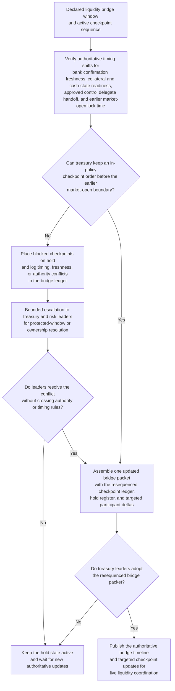
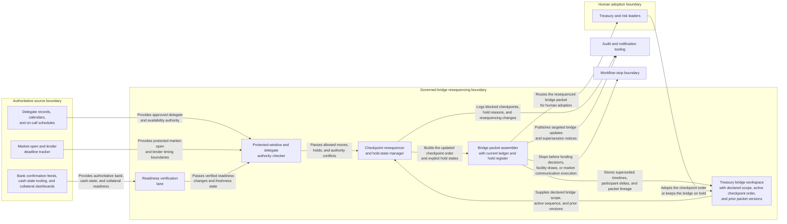

# Intraday liquidity command-window checkpoint resequencing

## Linked pattern(s)

- `critical-command-window-resequencing`

## Domain

Finance.

## Scenario summary

During a severe payment-rail disruption, treasury has declared a critical liquidity bridge window with a current sequence for bank confirmation review, collateral availability challenge, cash-state control sign-off, executive coordination, and market-open communication preparation. Then authoritative timing shifts land inside the same bridge: one bank confirmation arrives late, a control reviewer becomes unavailable and hands off to an approved delegate, and the market-open communication lock time moves earlier because of exchange and lender coordination pressure. The workflow must resequence the live bridge checkpoints, preserve explicit holds where prerequisite confirmation or authority is still missing, and produce one current bridge packet that leaders can adopt before any funding, payment-freeze, or disclosure action is considered.

## Target systems / source systems

- Treasury bridge workspace containing the declared critical scope, active checkpoint order, and prior packet versions
- Bank confirmation feeds, treasury cash-state tooling, and collateral dashboards publishing authoritative readiness changes
- Delegate records, calendars, and on-call schedules for treasury control, funding desk, risk review, and executive coordination roles
- Market-open and lender-communication deadline tracker showing protected external timing boundaries
- Audit and notification tooling used to log superseded timelines, held checkpoints, and targeted bridge updates

## Why this instance matters

This grounds the pattern in a finance coordination workflow where the main challenge is keeping the bridge timeline itself trustworthy while severe conditions change quickly. The workflow is not restoring the authoritative cash truth, choosing a funding strategy, or pushing any external communication. Instead, it keeps one current ordered set of bridge checkpoints, makes blocked sequencing visible, and protects human ownership over the live command timeline that downstream decisions depend on.

## Likely architecture choices

- An orchestrated multi-agent workflow can split readiness verification, protected-window checking, checkpoint resequencing, and bridge-packet assembly while preserving one shared timeline.
- Human-directed control fits because treasury and risk leaders must adopt any changed checkpoint order before the new sequence can govern market-open coordination.
- The workflow should preserve explicit hold states when bank-confirmation freshness, delegate authority, or communication-boundary timing remains unresolved.
- The workflow should stop at the resequenced bridge ledger and hold register rather than recommending payment restrictions, facility draws, or lender messaging.

## Governance notes

- Protected checkpoints such as cash-state review, control challenge, executive coordination, and communication-preparation windows should be encoded separately from flexible timing preferences.
- Only approved delegate mappings for treasury control, risk, and executive coordination should be allowed to change live checkpoint ownership.
- Bridge packets should expose role-relevant timing and checkpoint state without copying full account, counterparty, or strategy detail into broad coordination channels.
- Human treasury ownership is required before the updated sequence becomes authoritative for consequential market-open, payment, or disclosure coordination.

## Evaluation considerations

- Time from authoritative timing shift to an adopted bridge packet with explicit checkpoint lineage and holds
- Percentage of blocked or cross-boundary bridge checkpoints kept visible in the hold register rather than hidden in the main timeline
- Agreement between the workflow's resequenced bridge ledger and the final human-adopted timeline for the disruption window
- Reliability of the workflow when multiple bank, control, and communication constraints change within one market-open cycle
