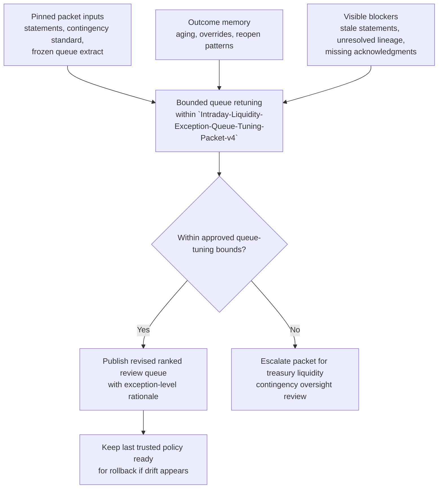

# Intraday liquidity contingency exception review queue reprioritization

## Linked pattern(s)

- `queue-prioritization-optimization`

## Domain

Finance.

## Scenario summary

A treasury liquidity controls team is managing an intraday backlog of contingency exceptions that already require review inside one governed artifact, `Intraday-Liquidity-Exception-Queue-Tuning-Packet-v4`, before the team decides which exceptions should be surfaced first to scarce senior reviewers during a stressed funding day. The backlog mixes concentration-limit warning exceptions, incoming-funding confidence breaks, prefunded-payment sequencing exceptions, nostro balance reconciliation gaps, and intraday collateral-mobility dependency flags that were opened earlier in the day and kept in review rather than actioned. Source precedence is explicit inside the packet: signed central-bank account statements and nostro ledger snapshots outrank the approved intraday liquidity contingency standard and protected-priority taxonomy; those in turn outrank the frozen queue-state extract, historical override and aging outcomes, and lowest-precedence desk annotations. The optimization scope is narrow: retune queue order only so exceptions with imminent liquidity-buffer erosion risk, protected market-infrastructure dependencies, repeated reviewer pull-forward history, or aging near contingency-review thresholds rise appropriately, while the workflow stays out of payment blocking, liquidity facility drawdown, counterparty communication, settlement action, treasury policy rewrite, or broader contingency execution.

## Target systems / source systems

- Treasury exception management queue containing current intraday liquidity contingency exceptions, aging, present queue order, reviewer assignments, and manual pin or override history
- Central-bank account reporting and nostro position views providing the highest-precedence balance and incoming-funding evidence referenced by `Intraday-Liquidity-Exception-Queue-Tuning-Packet-v4`
- Approved intraday liquidity contingency standard, threshold schedule, and protected-priority taxonomy that bound what the queue optimizer may change
- Historical outcome store with prior tuning packets, supervisor overrides, aging breaches, reopen history, and rollback decisions across packet versions `v2` through `v4`
- Treasury governance dashboard used to inspect the proposed reprioritization packet, freeze tuning, and restore the last trusted ranking policy

## Why this instance matters

This grounds the optimization pattern in a treasury control setting where queue order affects which liquidity exceptions are reviewed first under time pressure, without letting the optimizer cross into actual contingency execution. A naive reprioritization loop could keep favoring exceptions that are easiest to clear, leaving buffer-sensitive or market-infrastructure-linked items to age until senior reviewers lose reversibility and confidence in the queue. The instance is structurally distinct from quarter-close finance work because the pressure comes from intraday liquidity contingency monitoring, frozen evidence freshness, and reviewer scarcity during a live treasury day rather than reporting close checkpoints, accounting materiality, or consolidation sign-off.

## Likely architecture choices

- Event-driven monitoring should trigger queue reevaluation when new contingency exceptions enter the backlog, statement refreshes materially change evidence confidence, aging bands are crossed, or reviewers repeatedly override the current order.
- A tool-using single agent can recompute bounded prioritization weights, generate exception-level rationale, and publish the revised queue recommendation inside `Intraday-Liquidity-Exception-Queue-Tuning-Packet-v4` without changing treasury policy or executing downstream liquidity actions.
- Exception-gated autonomy fits because in-policy ranking changes can be applied within preapproved bounds, but any tuning change that would alter protected-priority handling, contingency-review thresholds, or evidence-confidence tolerances should require explicit treasury oversight review.
- The queue should remain revision-aware: packet `v4` inherits trusted lineage from `v2` and `v3`, and supervisors should be able to compare current tuning assumptions against those earlier packet versions before accepting a materially different ranking.

## Governance notes

- Source precedence must stay inspectable in every reprioritization: signed central-bank and nostro records outrank the contingency standard and threshold schedule, which outrank the frozen queue extract and historical outcome memory, while analyst notes or desk chat remain lowest-precedence context and cannot justify a protected-priority promotion on their own.
- Prerequisite pinned state should be explicit before `Intraday-Liquidity-Exception-Queue-Tuning-Packet-v4` is considered usable: frozen 10:30 UTC exception snapshot, pinned contingency-threshold baseline, pinned central-bank cutoff calendar, sealed reviewer roster for the current control window, and the last trusted queue policy held available for rollback.
- Visible blockers should remain on the face of the packet rather than being silently absorbed into ranking logic, including stale EMEA nostro statement refresh, unresolved lineage between two earlier packeted concentration exceptions, missing custodian acknowledgment for a collateral-mobility dependency flag, and an unmatched incoming-funding confidence tag for one high-aging exception.
- Protected classes such as payment-system dependency exceptions, near-threshold buffer erosion exceptions, and controller-escalated contingency items cannot be demoted for easier cycle-time wins.
- One named owner, Marisol Vega, Head of Intraday Liquidity Contingency Oversight, is accountable for packet integrity, queue-governance quality, and rollback escalation rather than payment blocking, facility usage decisions, counterparty outreach, settlement intervention, or policy rewrite.

## Evaluation considerations

- Reduction in high-risk exception aging past contingency-review thresholds after the tuned queue order from packet `v4` is applied
- Frequency and pattern of senior-reviewer overrides indicating that the optimized ranking still conflicted with protected-priority handling, evidence-confidence rules, or reviewer-capacity expectations
- Stability of rollback behavior when stale source evidence, blocker accumulation, or contradictory outcome memory makes the new tuning less trustworthy than the last trusted policy
- Consistency of ranking rationale across packet lineage `v2` to `v4`, including whether the queue remains explainable when similar intraday liquidity exceptions recur under different funding conditions
