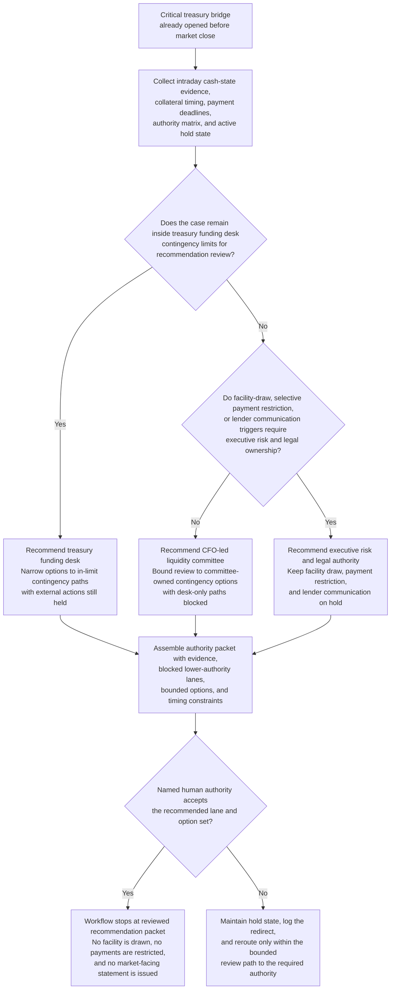

# Intraday liquidity facility-draw authority recommendation

## Linked pattern(s)

- `critical-escalation-authority-recommendation`

## Domain

Finance.

## Scenario summary

During a severe payment-rail disruption, treasury has already opened a critical bridge after incoming settlement delays, collateral timing drift, and one counterparty funding shortfall compress the firm's liquidity runway before market close. The workflow must recommend whether the next decision belongs with the treasury funding desk under existing contingency limits, the CFO-led liquidity committee, or an executive risk and legal authority because a central-bank facility draw, selective payment restriction, or lender communication posture may be required. It must narrow the governed option set and assemble a decision packet without drawing facilities, restricting payments, or issuing any market-facing statement.

## Target systems / source systems

- Treasury bridge workspace with declared severity, prior decision packets, and active hold state
- Intraday cash-state tooling, settlement-status feeds, collateral dashboards, and contingency-funding prerequisites
- Authority matrix covering desk limits, CFO committee triggers, executive risk review, and legal sign-off thresholds
- Payment-obligation calendar, market-close deadlines, and lender or central-bank communication constraints
- Prior contingency-funding cases, audit records, and restricted-review channel controls for market-sensitive material

## Why this instance matters

This grounds the pattern in finance where the key challenge is not restoring the authoritative cash picture or resequencing the bridge timeline. The value is selecting the correct human decision lane and exposing only the bounded options that remain policy- and market-safe before anyone commits the organization to a facility draw, payment restriction, or external communication.

## Likely architecture choices

- An orchestrated multi-agent workflow can split cash and collateral evidence retrieval, delegation checking, option narrowing, and packet assembly while preserving one critical-case ledger.
- Human-in-the-loop review is mandatory because the workflow should advise on authority ownership and allowable decision paths, not trigger funding, hold payments, or contact lenders.
- Human-directed autonomy fits because treasury, finance, risk, and legal authorities must explicitly adopt the decision lane before a market-sensitive action is even considered.

## Governance notes

- The output should distinguish options that remain inside desk or committee limits from options that require executive risk and legal ownership because of market, disclosure, or capital consequences.
- Any narrowed option set should preserve reversibility boundaries around payment restrictions, central-bank facility use, and lender communication timing rather than treating them as interchangeable tactical choices.
- Market-sensitive exposure detail, counterparty information, and privileged funding assumptions should remain confined to authorized treasury, risk, legal, and executive reviewers.
- Recommendation packets should preserve policy citations, timing constraints, prior redirects, and evidence freshness so later review can reconstruct why a particular authority lane was recommended.

## Evaluation considerations

- Time from critical bridge activation to a reviewed authority packet with bounded contingency options
- Agreement between the workflow's recommended authority lane and the final human-accepted decision owner for the liquidity event
- Rate at which blocked lower-authority paths and disclosure-sensitive constraints are surfaced before any facility or payment action is approved
- Reliability of authority recommendations when cash-state, collateral, or deadline assumptions change rapidly before market close
