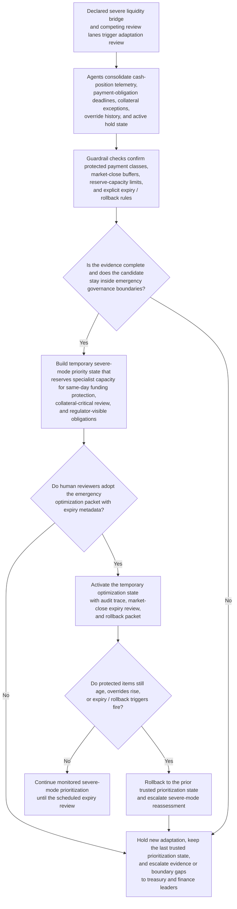

# Intraday liquidity protection priority adaptation

## Linked pattern(s)

- `critical-protected-priority-adaptation`

## Domain

Finance.

## Scenario summary

Treasury has already opened a severe liquidity bridge after settlement delays, collateral timing drift, and one counterparty funding shortfall sharply compress the firm's intraday runway before market close. Several existing review and routing surfaces now compete for the same limited specialist attention: same-day payment protection review, collateral exception analysis, facility-readiness evidence review, and lower-value operational exception handling. The normal prioritization state still favors routine exception cleanup and easy-to-clear reconciliation items while manual overrides keep pulling forward same-day funding-protection work and regulator-visible obligations. The workflow must recommend a temporary emergency optimization state that protects the highest-consequence liquidity-review lanes, reserves attention for market-close critical items, and includes explicit expiry and rollback rules without deciding whether a facility should be drawn, selecting the authority lane, restricting payments, or executing any funding action.

## Target systems / source systems

- Treasury bridge workspace with declared severe status, current queue state, and active payment or collateral holds
- Intraday cash-position tooling, payment-obligation calendar, collateral dashboards, and same-day settlement exception feeds
- Manual override and escalation history from treasury supervisors, controller reviewers, and prior stress events
- Emergency liquidity-governance rules covering protected payment classes, market-close buffers, reserve-capacity limits, and rollback triggers
- Versioned prioritization and audit systems used by treasury and finance leadership to adopt, extend, or restore optimization states during a stress window

## Why this instance matters

This grounds the pattern in finance where the main challenge is adapting existing review priority logic during a declared severe liquidity event, not restoring authoritative state, choosing the deciding executive, or executing funding steps. A poor critical adaptation could let lower-consequence exception work consume scarce specialist capacity while same-day funding-protection items and regulator-visible obligations age toward irreversible harm. The example remains cleanly in optimize/adapt because the workflow stops at a governed temporary optimization-state recommendation with expiry and rollback discipline.

## Likely architecture choices

- Orchestrated multi-agent coordination fits because cash-state telemetry review, protected payment-class validation, severe-mode simulation, and rollback packaging benefit from distinct roles over one shared bridge state.
- Human-in-the-loop review is required because treasury and finance leaders must explicitly adopt or reject any temporary reprioritization that changes how scarce review capacity is reserved during the stress period.
- Human-directed autonomy fits because the workflow should recommend temporary buffers, lane protections, and low-consequence deferrals without deciding whether to draw facilities, restrict payments, or escalate authority.

## Governance notes

- Same-day funding-protection obligations, regulator-visible commitments, and protected payment classes should remain hard constraints rather than soft preferences inside the emergency adaptation.
- Every package should show the temporary trade-off between urgent liquidity-protection work and less consequential exception cleanup so humans can inspect what is being deferred.
- Auditability should retain baseline and severe-mode prioritization states, override clusters, expiry extensions, and rollback decisions for later treasury, risk, and audit review.
- Market-sensitive exposure details, counterparty information, and restricted funding assumptions should remain limited to authorized reviewers or annexed references.
- The workflow must not recommend who decides the crisis, sequence bridge actions, or trigger payment restrictions; it only recommends a temporary optimization state for existing review surfaces.

## Evaluation considerations

- Reduction in aging and manual overrides for same-day liquidity-protection items after the temporary state is adopted
- Time from severe bridge activation to a reviewed adaptation packet with explicit market-close expiry and rollback conditions
- Frequency with which lower-consequence cleanup work is deferred transparently rather than crowding out protected payment and collateral review
- Reliability of rollback when market-close pressure eases or when the emergency tuning no longer improves protected-priority handling
