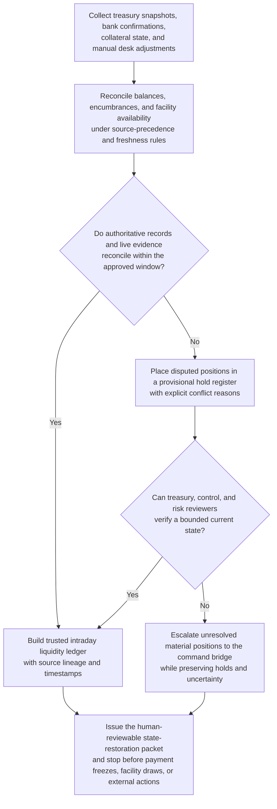

# Intraday liquidity state truth restoration

## Linked pattern(s)

- `critical-authoritative-state-restoration`

## Domain

Finance.

## Scenario summary

During a severe payment-rail disruption, a treasury command bridge sees contradictory intraday liquidity state across the treasury management system, bank confirmations, collateral tooling, and manually entered desk adjustments. Some balances appear settled in one source but still encumbered or pending in another, while emergency funding facilities show different availability timestamps across two control views. Before executives, controllers, and risk leaders decide whether to freeze outbound payments, draw facilities, or escalate externally, the workflow must determine the trusted current state of cash, encumbrances, and near-term obligations with explicit provisional holds where evidence does not yet reconcile.

## Target systems / source systems

- Treasury management system cash-position snapshots, entity-level funding ledgers, and bridge workspace records
- Bank balance confirmations, payment-rail settlement acknowledgements, and central-bank facility status feeds
- Collateral and margin systems tracking pledged assets, intraday calls, and reuse constraints
- Manual treasury adjustment logs, desk attestations, and command-bridge reviewer notes
- Audit and hold-register tooling used to preserve provisional positions and authoritative-state acceptance

## Why this instance matters

This grounds the pattern in a finance workflow where the hard problem is not diagnosing why the disruption happened or recommending a funding strategy, but restoring one trusted picture of the firm's current liquidity state under severe time pressure. Treasury bridges become dangerous when different teams act from different ledgers, especially when some records are provisional or restricted. The instance keeps the family boundary clear by centering authoritative state restoration, explicit holds, and inspectable uncertainty before any payment freeze, facility draw, or external communication is approved.

## Likely architecture choices

```mermaid
flowchart LR
    treasury["Treasury management system cash snapshots,<br>entity funding ledgers, and<br>bridge workspace records"] -->|"cash positions and bridge context"| compare["Treasury-ledger comparison"]
    bank["Bank confirmations, payment-rail settlement<br>acknowledgements, and<br>facility status feeds"] -->|"bank and facility evidence"| retrieve["Bank and facility retrieval"]
    collateral["Collateral and margin systems"] -->|"encumbrance and margin state"| compare
    manual["Manual adjustment logs and<br>desk attestations"] -->|"manual changes and attestations"| compare
    retrieve -->|"confirmed balances, settlement state,<br>and availability timestamps"| compare

    subgraph restore["Truth-restoration workflow family boundary"]
        compare -->|"reconciled positions and detected conflicts"| holds["Provisional hold classification"]
        compare -->|"trusted positions and cited source lineage"| record["Shared truth-restoration record:<br>authoritative liquidity ledger +<br>hold register + superseded views +<br>reviewer rationale"]
        holds -->|"held items and conflict reasons"| record
        record -->|"human-reviewable state package"| packet["Bridge handoff packet assembly"]
    end

    subgraph review["Human review boundary"]
        reviewers["Treasury, control, and<br>risk reviewers"]
    end

    record -->|"source precedence and ledger acceptance"| reviewers
    packet -->|"trusted-state handoff packet"| reviewers
    reviewers -->|"acceptance decisions and rationale"| record
    reviewers -->|"keeps the workflow at the trusted-state ledger,<br>unresolved hold register, and<br>handoff packet"| stop["Stop boundary:<br>No autonomous liquidity action<br>or transfer initiation"]
```

- An orchestrated multi-agent design can separate bank and facility retrieval, treasury-ledger comparison, hold classification, and handoff-packet assembly while preserving one shared truth-restoration record.
- Human reviewers should remain in the normal loop to confirm source precedence, accept the authoritative liquidity ledger, and decide whether provisional items are safe to treat as binding.
- The workflow should stop at the trusted-state ledger, unresolved hold register, and bridge handoff packet rather than recommending liquidity actions or initiating transfers automatically.
- Shared case memory should preserve superseded balance views, stale confirmations, and reviewer rationale so later bridge decisions remain auditable.

## Governance notes

- Every settled-cash, encumbered-balance, facility-availability, and provisional-adjustment field should retain lineage to the exact source snapshot or manual attestation that supports it.
- The workflow should mark positions as held whenever bank and treasury records disagree materially or when a manual adjustment lacks source verification inside the approved freshness window.
- Human treasury, control, and risk owners must approve use of the reconciled state for payment restrictions, facility draws, disclosures, or other consequential downstream steps.
- Sensitive account, counterparty, and facility detail should stay inside restricted evidence views whenever the main bridge packet can rely on generalized references.

## Evaluation considerations

- Time to first human-reviewable trusted liquidity ledger with explicit hold status and source lineage
- Agreement between the workflow's reconciled liquidity picture and the final treasury-accepted current-state view for the bridge window
- Percentage of materially unresolved positions surfaced in the hold register rather than flattened into a single balance
- Reliability of the workflow when source timestamps drift, manual adjustments arrive late, or facility state changes during repeated bridge updates
