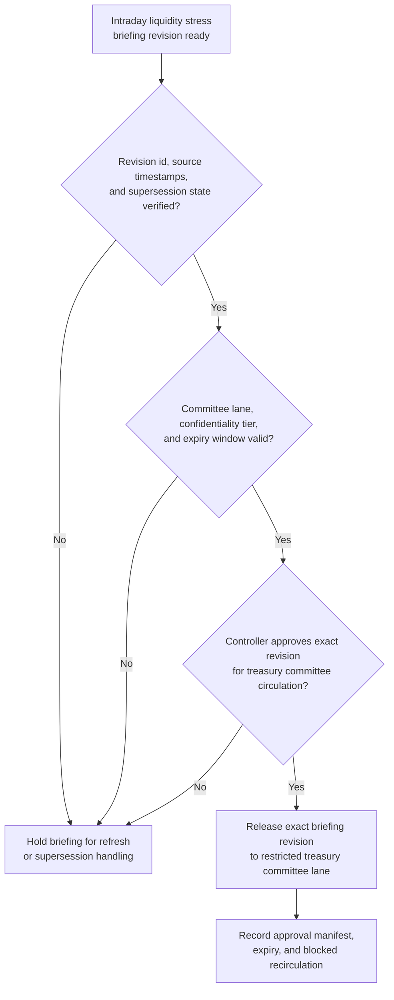

# Intraday liquidity stress briefing revision approved for treasury committee circulation

## Linked pattern(s)

- `approval-gated-briefing-release`

## Domain

Finance.

## Scenario summary

A treasury analytics workflow has already synthesized one revision of an intraday liquidity stress briefing that summarizes current cash-position pressure, facility headroom, concentration exposure, covenant watchpoints, market-funding caveats, and unresolved data-latency questions for the current funding day. Before that exact revision is circulated into the restricted treasury committee lane, a controller must approve the confidentiality scope, freshness window, and supersession state so committee readers receive the reviewed context package instead of a stale or broadened copy. The workflow stops at governed release of that briefing revision; it does not recommend a facility draw, decide funding strategy, schedule market actions, or execute treasury transactions.

## Target systems / source systems

- Treasury briefing workspace storing the synthesized stress summary, revision history, caveat register, and source-timestamp trace
- Cash-position, facility, exposure, and covenant-monitoring systems already cited by the prepared briefing revision
- Committee circulation tooling enforcing named treasury recipients, confidentiality banners, and expiry or reuse restrictions on released briefings
- Approval manifest service recording the controller approver, exact revision id, lane scope, and blocked recirculation attempts
- Audit and retention systems preserving release lineage when newer exposure numbers or caveats supersede a pending briefing

## Why this instance matters

This grounds the pattern in finance where visibility of a synthesized context artifact is itself a governed act. Liquidity committees often need a concise but inspectable stress brief, yet slight changes in exposure timing, facility capacity, or covenant caveats can make one near-final draft materially different from another. The example makes the family boundary concrete by focusing on approval-bound circulation of one exact briefing revision rather than on funding recommendations, controller adjudication, or live treasury execution.

## Likely architecture choices

```mermaid
flowchart LR
    sources["Cash-position, facility, exposure,<br>and covenant-monitoring systems"] -->|"Provide cited liquidity,<br>headroom, and caveat inputs"| workspace["Treasury briefing workspace<br>storing the synthesized stress summary,<br>revision history, caveat register,<br>and source-timestamp trace"]
    workspace -->|"Exact briefing revision,<br>lineage, and timestamp trace"| agent["Governed agent"]
    agent -->|"Prepare release manifest,<br>compare revision lineage,<br>and check supersession state"| manifest["Approval manifest service<br>recording the controller approver,<br>exact revision id, lane scope,<br>and blocked recirculation attempts"]
    controller["Controller reviewer"] -->|"Approve confidentiality scope,<br>freshness window, and<br>supersession state"| manifest
    manifest -->|"Approved lane scope,<br>expiry, and release controls"| circulation["Committee circulation tooling<br>enforcing named treasury recipients,<br>confidentiality banners,<br>and expiry or reuse restrictions"]
    workspace -->|"Reviewed briefing revision<br>for bounded circulation"| circulation
    subgraph committee["Restricted treasury committee lane"]
        readers["Named treasury committee recipients"]
    end
    circulation -->|"Release exact approved revision<br>for committee visibility only"| readers
    workspace -->|"Revision history and<br>source-timestamp lineage"| audit["Audit and retention systems<br>preserving release lineage when newer<br>exposure numbers or caveats supersede<br>a pending briefing"]
    manifest -->|"Approver, revision id,<br>lane scope, and blocked attempts"| audit
    circulation -->|"Release trace, expiry events,<br>and blocked reuse activity"| audit
    audit -->|"Supersession state and<br>retention lineage"| circulation
```

- Approval-gated execution fits because the briefing remains in a held state until the controller approves one exact revision for the restricted treasury committee lane.
- Human-in-the-loop review is necessary because only accountable finance leadership should authorize confidentiality scope, accept residual caveats, and approve expiry for a market-sensitive context brief.
- A governed agent can prepare the release manifest, compare revision lineage, and prevent stale recirculation, but it should not convert the briefing into a funding recommendation or trigger downstream transactions.

## Governance notes

- Approval must bind to one immutable briefing revision, one committee lane, one confidentiality tier, and one bounded freshness window so a later exposure update cannot inherit permission implicitly.
- Material caveats about facility availability, data-latency gaps, and covenant-watchpoint uncertainty should remain visible in the released brief rather than being compressed into a false all-clear narrative.
- If a new cash-position refresh, facility usage change, or confidentiality concern appears before circulation, the pending revision should be held and superseded rather than released under the older manifest.
- Audit records should preserve the exact released revision, controller approver, committee audience, expiry timing, and any blocked forwarding or reuse outside the approved lane.

## Evaluation considerations

- Percentage of committee circulations where the released liquidity briefing revision, confidentiality scope, and manifest metadata align exactly without later correction
- Rate at which expired or superseded stress briefings are blocked before treasury committee visibility
- Time needed to move from reviewed briefing-ready status to approved bounded committee circulation during the funding day
- Reviewer correction rate for missing caveats, wrong audience scope, or stale-state handling after the committee receives the released briefing
