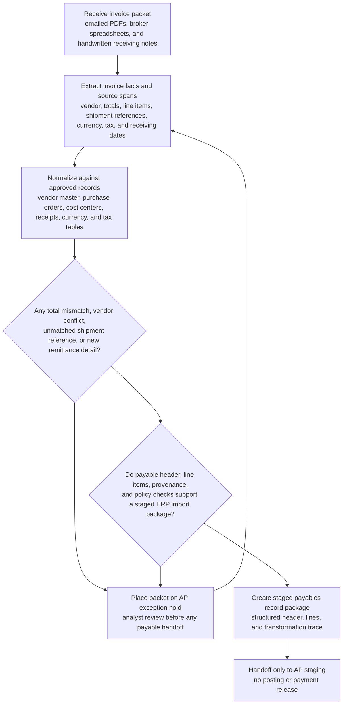
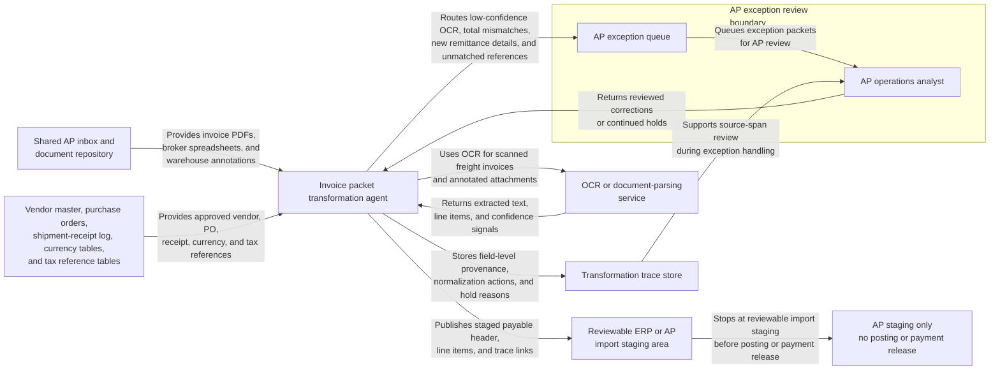

# Invoice packet to payables record handoff

## Linked pattern(s)

- `document-to-structured-data-handoff`

## Domain

Finance.

## Scenario summary

An accounts payable operations analyst receives a weekly packet of emailed invoices from an international freight forwarder covering fuel surcharges, customs brokerage, and port handling fees for multiple inbound shipments. The downstream ERP import process expects a structured payable header plus line-item records tied to purchase orders, cost centers, tax treatment, currency codes, and receiving dates, but the source packet mixes scanned PDFs, broker spreadsheets, and handwritten annotations from warehouse receiving. The transformation workflow must extract the billable facts into a staging record package, preserve field-level source references, and route exceptions whenever totals, vendor identifiers, or shipment references cannot be matched cleanly within policy.

## Target systems / source systems

- ERP or AP staging system for payable header and line-item imports
- Shared AP inbox and document repository holding invoice PDFs, brokerage statements, and supporting spreadsheets
- OCR or document-parsing service for scanned freight invoices and annotated attachments
- Vendor master, purchase-order records, shipment-receipt log, and approved currency or tax reference tables
- Exception queue for AP review before downstream posting

## Why this instance matters

This grounds the transform pattern in a finance workflow where the real value is trustworthy structured handoff, not generic document extraction. The downstream ERP can only consume standardized records, but a brittle parser that hides ambiguity would create duplicate payables, wrong tax treatment, or misapplied freight costs. The instance shows why provenance, schema fidelity, and explicit exception routing matter before any posting or payment step occurs.

## Likely architecture choices

- A tool-using single agent can orchestrate document parsing, line-item normalization, purchase-order matching, and packaging of the structured payable record plus transformation trace.
- The workflow should stage output in a reviewable AP import area rather than writing directly into posted voucher tables.
- Approved reference data from the vendor master, currency tables, and purchase-order system should support normalization, but unsupported inference about missing vendor ids or shipment links should force exception routing.
- Human review remains necessary for low-confidence OCR fields, line splits that do not reconcile to the invoice total, unexpected bank-detail changes, or tax codes that do not align with policy.

## Governance notes

- Every consequential field, especially vendor identity, invoice total, tax amount, currency, and shipment reference, should retain a source span or document pointer in the transformation trace.
- The workflow should block handoff when the packet appears to contain a new remittance account or conflicting vendor identity data, because those signals may indicate fraud or master-data drift rather than a routine parsing problem.
- Lossy normalization, such as collapsing annotated surcharge descriptions into a generic freight code, should be visible to AP reviewers instead of hidden behind schema-valid output.
- Sensitive invoice data and attachments should remain inside approved AP storage and trace systems, with copied excerpts minimized to what reviewers need to resolve exceptions.

## Evaluation considerations

- Percentage of staged payable records accepted by ERP import without manual remapping of header or line-item fields
- Rate of invoice packets correctly diverted to AP review before duplicate payment, tax-code, or vendor-match errors reach downstream posting
- Completeness of field-level provenance for high-consequence financial fields during internal audit or payment-dispute review
- Stability of the transformation flow when scan quality drops, supporting spreadsheets are missing, or the ERP import contract changes required fields
