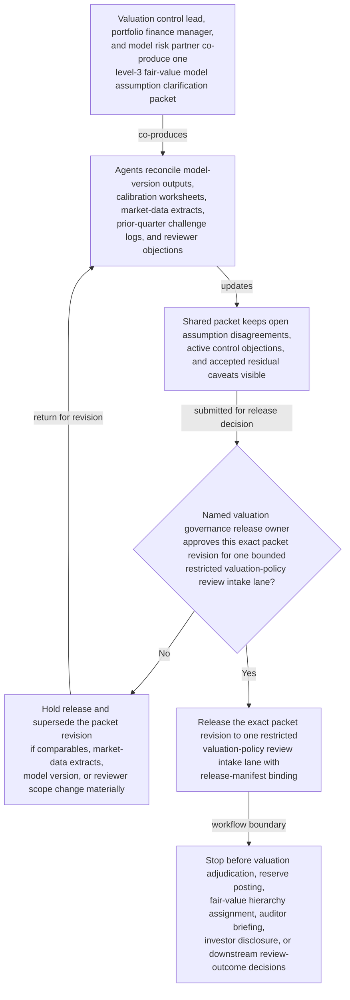

# Level-3 fair-value model assumption clarification packet approved for restricted valuation policy review intake

## Linked pattern(s)

- `approval-gated-collaborative-artifact-release`

## Domain

Finance.

## Scenario summary

A valuation control lead, a portfolio finance manager, and a model risk partner are co-producing one governed level-3 fair-value model assumption clarification packet because a quarterly valuation update for an illiquid structured investment now depends on cash-flow timing assumptions, stale comparable transactions, calibration notes, and observable-versus-unobservable input treatment that remain partially disputed across working teams. Agents help reconcile model-version outputs, calibration worksheets, market-data extracts, prior-quarter challenge logs, and reviewer objections into the shared packet while preserving which assumption disagreements remain open, which control objections are still active, and which residual caveats the human artifact owner accepted explicitly. The workflow ends only when the named valuation governance release owner approves that exact packet revision for one bounded restricted valuation-policy review intake lane, where downstream reviewers may decide whether the packet is sufficient for formal policy review or needs narrower scope and fresher support. It does not adjudicate the valuation conclusion, post reserves, assign the fair-value hierarchy, brief auditors, prepare investor disclosures, or decide the downstream review outcome.

## Target systems / source systems

- Governed finance collaboration workspace holding the level-3 fair-value model assumption clarification packet, revision history, objection ledger, and release-manifest state
- Valuation model platform, model-version registry, and calibration workpapers providing scenario outputs, parameter lineage, back-testing snapshots, and model-drift evidence for the covered position
- Market-data, broker-quote, and comparable-transaction repositories supplying observable inputs, stale transaction references, liquidity adjustments, and challenge evidence about whether cited comparables remain decision-useful
- Valuation policy library, model risk guidance, and prior challenge registers providing assumption-governance criteria, calibration tolerances, and historical objections relevant to the packet's release boundary
- Approval-routing, audit, and retention systems preserving superseded packet revisions, accepted residual objections, blocked-release reasons, and downstream handoff traceability into the restricted valuation-policy review intake lane

## Why this instance matters

This grounds the pattern in finance valuation governance rather than revenue recognition, committee briefing, or ledger-control packaging. The reusable challenge is collaborative stewardship of one assumption clarification artifact whose exact revision must be approved before it can cross into a restricted valuation-policy review lane, while visible disagreement about observable-versus-unobservable inputs, stale comparable transactions, calibration methodology, control objections, and model-version drift remains inspectable rather than polished away. The example stays inside the pattern boundary because valuation adjudication, reserve posting, hierarchy determination, auditor communication, investor disclosure, and downstream policy decisions remain separate workflows.

## Likely architecture choices

```mermaid
flowchart LR
    WS["Governed finance collaboration workspace<br>holding the clarification packet,<br>revision history, and objection ledger"]
    MODEL["Valuation model platform,<br>model-version registry,<br>and calibration workpapers"]
    MARKET["Market-data, broker-quote,<br>and comparable-transaction repositories"]
    POLICY["Valuation policy library,<br>model risk guidance,<br>and prior challenge registers"]
    AGENT["Agent support for model-version deltas,<br>comparable evidence refresh,<br>objection normalization, and release trace"]
    CONTROL["Clarification packet release control<br>for the exact revision,<br>accepted caveats, and lane boundary"]
    MAN["Approval-routing, audit, and retention systems<br>for signer state, blocked-release reasons,<br>and superseded revisions"]
    LANE["Bounded restricted valuation-policy<br>review intake lane"]
    STOP["Stop before valuation adjudication,<br>reserve posting, hierarchy assignment,<br>auditor briefing, or investor disclosure"]

    subgraph APPROVAL["Valuation governance approval boundary"]
        OWNER["Named valuation governance<br>release owner"]
    end

    AGENT -->|"Maintains reconciled packet state<br>and release trace under human control"| WS
    WS -->|"Provides packet revision,<br>open disagreements, and accepted caveats"| CONTROL
    MODEL -->|"Provides scenario outputs,<br>parameter lineage, and calibration evidence"| CONTROL
    MARKET -->|"Provides observable inputs,<br>stale comparables, and challenge evidence"| CONTROL
    POLICY -->|"Provides policy criteria,<br>calibration tolerances, and prior objections"| CONTROL
    CONTROL -->|"Prepares exact revision release state,<br>hold reasons, and intake-lane binding"| MAN
    MAN -->|"Routes one exact packet revision<br>for human release decision"| OWNER
    OWNER -->|"Approves release only into one bounded<br>valuation-policy review intake lane"| LANE
    LANE -->|"Stops at governed intake handoff"| STOP
```

- Approval-gated execution fits because the clarification packet can be collaboration-ready while still blocked from restricted valuation-policy review intake until the human release owner approves the exact revision with its accepted residual caveats.
- Human-in-the-loop control is required because only accountable valuation governance and finance-policy leaders may accept residual assumption uncertainty, confirm audience scope, and authorize the packet's release boundary without that approval being treated as a valuation sign-off.
- Agents may reconcile model-version deltas, refresh comparable-transaction evidence, normalize objection wording across valuation and control reviewers, and maintain the release trace, but they must not resolve assumption disputes, choose the valuation outcome, or trigger downstream accounting or disclosure action.

## Governance notes

- The release manifest should bind one exact packet revision, the named restricted valuation-policy review intake lane, signer identities, the covered instrument scope, and any residual assumption objections the human release owner accepted explicitly.
- Conflicting views about observable versus unobservable input treatment, contested calibration anchors, stale comparable-transaction evidence, model-version drift, and unresolved control objections should remain visible in the packet or boundary ledger rather than being normalized into a single preferred valuation story before release.
- Audience scope should stay limited to the approved restricted valuation-policy review intake lane; reuse of the packet for valuation committee materials, reserve booking support, hierarchy memos, auditor discussions, or investor-reporting inputs should require separate downstream approval.
- If a new comparable transaction appears, market-data extracts are refreshed, a model version changes, or reviewer scope shifts materially during approval review, the workflow should hold release and supersede the prior packet revision rather than carrying stale approval forward.

## Evaluation considerations

- Rate at which restricted valuation-policy intake accepts the released packet without discovering hidden assumption-scope drift, stale calibration evidence, or audience-boundary mistakes
- Time required to keep one collaborative clarification packet synchronized as model outputs, comparable-transaction support, challenge logs, and signer state evolve across valuation-control and portfolio-finance teams
- Reliability of binding between the released artifact revision, accepted residual assumption disagreement, covered instrument scope, and the bounded restricted valuation-policy review intake lane
- Frequency with which humans reject agent-assisted edits because they drifted into valuation adjudication, reserve posting, hierarchy determination, auditor communication, investor disclosure, or downstream policy decisions
