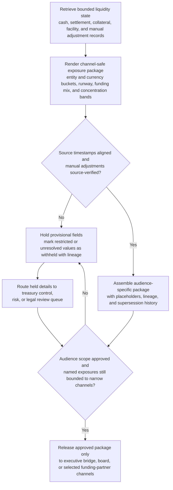

# Liquidity stress bridge channel-safe exposure package

## Linked pattern(s)

- `critical-channel-safe-state-packaging`

## Domain

Finance.

## Scenario summary

A treasury command bridge has been activated after a severe payment-rail disruption and rapidly tightening collateral conditions create concern that the firm could miss time-sensitive settlement obligations if liquidity buffers continue to erode. Authoritative state is spread across cash-position systems, settlement ledgers, collateral management tooling, central-bank facility trackers, and manually verified treasury adjustments that not every bridge participant is allowed to inspect directly. Before executive, board, and selected funding-partner channels can align on one current picture, the workflow must transform that bounded authoritative state into a channel-safe structured exposure package with entity and currency buckets, liquidity-runway fields, secured-versus-unsecured funding indicators, counterparty concentration bands, held-detail placeholders for restricted account or named exposure lines, and explicit lineage showing which values remain provisional or withheld.

## Target systems / source systems

- Treasury liquidity, settlement, and collateral systems holding authoritative cash, obligation, margin, and facility state
- Entity hierarchy, jurisdiction, and funding-bucket reference tables used to normalize exposure rendering across audiences
- Restricted package workspace and lineage store for audience-specific exposure packages, held-detail annexes, and supersession history
- Executive bridge and governance tooling consuming the approved channel-safe package rather than raw treasury systems
- Hold-state review queue for treasury control, legal, or risk review before named counterparties or sensitive account identifiers can move into narrower channels

## Why this instance matters

This grounds the pattern in a finance workflow where the core challenge is not synthesizing a freeform crisis brief or recommending a funding action, but rendering fast-changing authoritative liquidity state into a constrained structured package that different bridge audiences can use safely. Treasury events often mix highly sensitive firm, counterparty, and facility information with time-critical coordination pressure, so teams need an explicit mechanism for holding or generalizing details without losing the meaning of the exposure picture. The instance shows why critical-risk transform work can remain in-family when the value lies in governed packaging, lineage, and hold-state control rather than in forecasting, strategy selection, or execution of market actions.

## Likely architecture choices

- An orchestrated multi-agent workflow can separate authoritative-state retrieval, policy-constrained exposure rendering, held-detail validation, and manifest assembly so each step stays inspectable during the bridge.
- Human reviewers should remain in the normal loop to confirm audience scope, decide whether named counterparties or account identifiers can move into narrower annexes, and approve each package release.
- The workflow should stop at the structured exposure package and release manifest rather than recommending funding moves, initiating transfers, or preparing regulator submissions automatically.
- Approved rendering tables may normalize entities, currencies, and runway buckets, but unsupported inference about likely defaults, funding strategy, or management response should remain out of scope.

## Governance notes

- Every package field, especially liquidity-runway indicators, concentrated exposure bands, facility-availability flags, and held-detail placeholders, should retain lineage to authoritative source records or approved bucket definitions.
- The workflow should hold fields instead of releasing them when manual adjustments are not yet source-verified, when account-level detail would exceed audience permissions, or when multiple ledgers disagree about intraday state.
- Supersession history should show which package version each bridge audience received and exactly which held items or provisional values changed between releases.
- Treasury control, risk, and legal reviewers must approve any package that widens audience scope or relaxes hold rules; the transform workflow stops before action selection or market execution.

## Evaluation considerations

- Percentage of bridge package versions accepted by executive or funding stakeholders without reopening raw treasury systems
- Rate of stale-state, disclosure-boundary, or held-detail findings identified during post-event review
- Completeness of lineage and hold-state explanation for exposure bands, liquidity buckets, and provisional adjustments
- Reliability of the package when settlement positions change quickly, manual adjustments arrive late, or audience scope narrows and widens across the event
