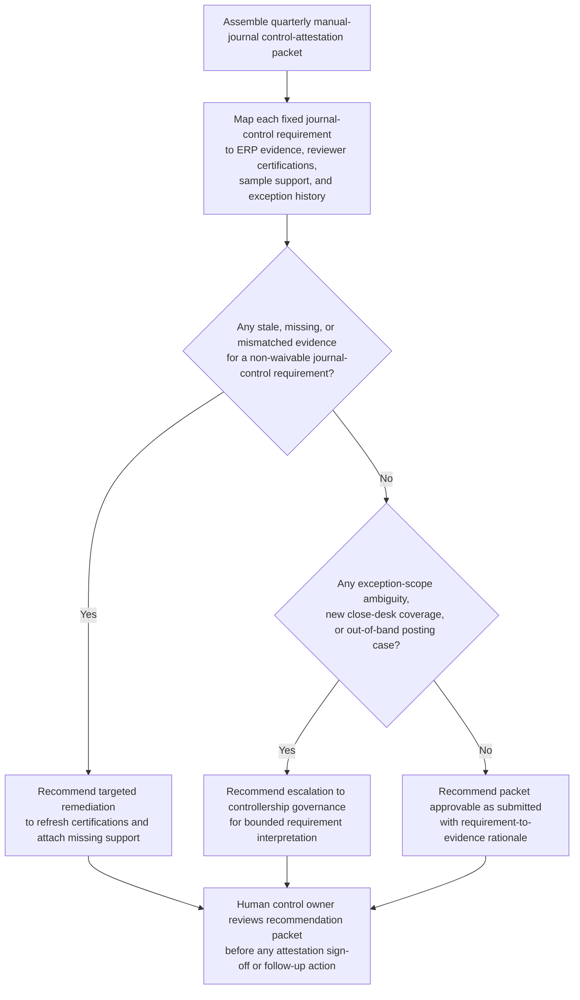

# Manual journal posting-control attestation recommendation

## Linked pattern(s)

- `control-requirement-attestation-recommendation`

## Domain

Finance.

## Scenario summary

A corporate controllership analyst is preparing the quarterly internal attestation for manual journal posting controls covering preparer-and-approver separation, threshold-based support retention, timely controller review of high-risk journals, documented rationale for after-hours postings, and approved exception use for emergency treasury true-up entries. The requirement set is fixed, and most of the evidence packet is current, but one approver-certification export predates a recent close-coverage rotation, one sampled high-value journal lacks a directly linked subledger tie-out after an archive migration, and a standing exception for after-hours treasury true-up journals may not clearly cover a newly centralized regional close desk. The workflow must recommend whether the packet is approvable as submitted, needs targeted remediation, or should escalate to controllership governance because the requirement fit is no longer routine before any human signs the attestation or changes ERP roles, journal workflows, or accounting policy.

## Target systems / source systems

- ERP journal-entry workflow reports showing manual-journal populations, preparer and approver identities, posting timestamps, dollar thresholds, and linked support references
- Close-controls workspace with the quarterly attestation checklist, sampled journal review results, controller sign-off instructions, and prior attestation outcomes
- Identity-governance and finance access-certification exports covering approver-role assignments, coverage rotations, and evidence that preparer-versus-approver separation remains intact
- Subledger and archive repositories containing journal support packages, reconciliations, treasury true-up documentation, and archive-migration trace records for sampled entries
- Policy library and exception register defining manual-journal evidence standards, after-hours posting rules, emergency-entry exception limits, freshness thresholds, and escalation criteria

## Why this instance matters

This grounds the pattern in finance with a scenario materially different from procurement-card segregation-of-duties review while staying inside the same bounded attestation family. The useful work is deciding whether a known manual-journal control packet actually satisfies explicit attestation requirements, with visible evidence gaps and a reviewable rationale packet, rather than redesigning close controls, planning remediation, approving journal entries, or changing ERP access. It also highlights a common finance governance pressure point: period-end journals often look routine until stale certifications, missing support lineage, or exception stretch make the requirement fit ambiguous enough that a human reviewer needs the uncertainty surfaced clearly.

## Likely architecture choices

- A tool-using single agent can retrieve the fixed attestation checklist, reconcile sampled journals with support packages and certification exports, compare exception scope against current close-desk coverage, and assemble one reviewable rationale packet.
- Human-in-the-loop review is required because a controller or delegated finance owner must decide whether partial evidence is acceptable, whether the exception still fits policy, or whether the packet should escalate.
- Read-only integration with ERP, close-controls, archive, and access-governance systems is preferable so the workflow cannot approve journals, alter role assignments, refresh evidence, or record the attestation automatically.

## Governance notes

- The packet should preserve requirement-by-requirement status as satisfied, partial, stale, missing, or exception-backed, with direct links to the exact journal sample, certification export, support package, reconciliation artifact, or exception record used.
- Stale approver certifications, archive-linked support gaps, or an emergency-posting exception stretched onto a newly centralized close desk should trigger explicit remediation or escalation instead of being normalized into a clean summary.
- Journal descriptions, treasury true-up details, preparer identities, and supporting workpapers should remain visible only to authorized controllership, internal audit, and finance-controls reviewers under normal least-privilege and retention controls.
- The boundary between recommendation and action must stay explicit: signing the attestation, accepting an exception, reposting a journal, changing ERP roles, or updating control design remains outside this workflow.

## Evaluation considerations

- Reviewer agreement with the recommended approve, remediate, or escalate posture without major requirement-mapping corrections
- Rate at which stale certifications, missing journal-support lineage, or unsupported after-hours exceptions are surfaced before quarterly attestation sign-off
- Quality of traceability from each manual-journal control requirement to current ERP, archive, access-governance, and close-review evidence
- Stability of recommendations when approver coverage, archive references, or exception posture changes during the review window
