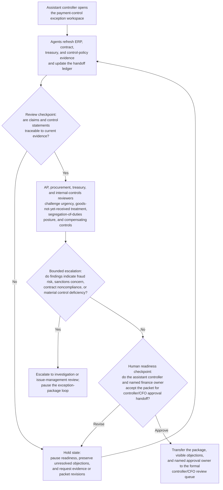
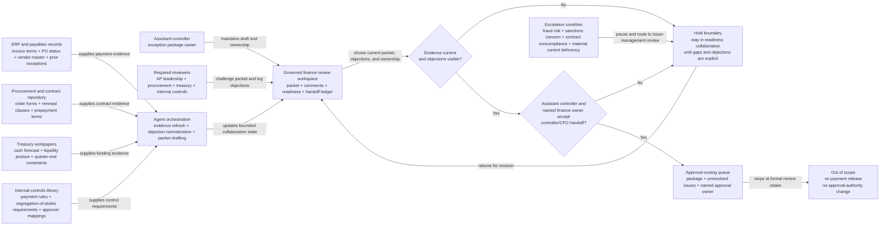

# Material vendor payment-control exception package readiness loop

## Linked pattern(s)

- `approval-centered-collaboration`

## Domain

Finance.

## Scenario summary

An assistant controller is preparing a formal exception package because a critical software vendor is demanding a large prepayment before quarter end, but the request cannot satisfy the company's normal payment-control stack without an explicit controller and CFO review. Inside a governed finance collaboration workspace, the assistant controller and agent support iterate on the exception packet as accounts-payable leadership, procurement, treasury, and internal-controls reviewers challenge the business urgency narrative, segregation-of-duties posture, evidence for goods-not-yet-received treatment, and the proposed compensating controls. The agents help reconcile reviewer comments, refresh the source support, rewrite the packet to reflect accepted edits and unresolved objections, and maintain a handoff ledger showing which human owns the next approval-ready checkpoint. The human finance owners remain responsible for deciding whether the evidence is strong enough to move the packet into formal approval, whether any objection should stop progression, and whether the request needs escalation for additional control review rather than downstream payment execution.

## Target systems / source systems

- Controlled finance review workspace with the draft exception package, reviewer comments, readiness status, and approval-handoff ledger
- ERP and payables records containing invoice terms, purchase-order status, vendor master data, and prior exception history
- Procurement and contract repository with executed order forms, renewal clauses, service-dependency terms, and prepayment conditions
- Treasury cash-forecast and liquidity workpapers showing timing sensitivity, funding posture, and quarter-end constraints
- Internal-controls library with payment-authorization rules, segregation-of-duties requirements, exception thresholds, and required approver mappings
- Approval-routing or issue-management queue where the final human-approved package and named approval owner are transferred for controller/CFO review

## Why this instance matters

This grounds the pattern in a finance workflow where the governed artifact is an approval-readiness package for a sensitive payment-control exception rather than a recommendation ranking, investigation, or submission into a payment system. The hard part is preserving disagreement and evidence quality across repeated review turns so a polished packet does not make the control posture look cleaner than it is or imply that finance leadership has already accepted the exception. The scenario highlights how approval-centered collaboration can keep ownership and objections explicit while agents accelerate packet refinement and evidence negotiation.

## Likely architecture choices

- Human-in-the-loop collaboration should remain primary because control exceptions, quarter-end liquidity posture, and compensating-control acceptance require accountable finance leadership judgment.
- An orchestrated multi-agent setup is useful when separate agent roles refresh payment evidence, normalize reviewer objections, verify policy requirements, and maintain the approval-handoff ledger across multiple review rounds.
- Agents may update the packet draft, source-response matrix, and readiness summary, but releasing funds, changing approval authority, or marking the exception approved should remain outside the workflow and explicitly human-gated.

## Governance notes

- The packet should clearly separate raw payment facts, quoted control-policy requirements, reviewer objections, agent-authored revision language, and human-approved claims so reviewers can inspect what is supported versus still contested.
- Every material claim about urgency, invoice status, contract requirement, compensating control, or segregation-of-duties impact should link to inspectable evidence such as ERP records, contract clauses, cash-forecast tabs, or policy references; stale evidence should block readiness.
- Open objections from controllership, AP, procurement, treasury, or internal-controls reviewers should remain visible in the packet and ledger unless a named human reviewer explicitly accepts the residual risk of moving forward.
- The handoff ledger should record the current approval owner, required reviewers, unresolved issues, and the exact boundary that separates approval-readiness collaboration from the downstream controller/CFO approval decision and any eventual payment action.
- If review evidence suggests fraud risk, sanctions concern, contract noncompliance, or a material control deficiency, the workflow should pause and escalate into the appropriate investigation or issue-management path instead of continuing to polish the approval packet.

## Evaluation considerations

- Time to produce an internal-review-ready payment-control exception package that preserves evidence traceability, reviewer dissent, and explicit ownership of the next approval checkpoint
- Reviewer correction rate for sections where agent-assisted edits understated control weakness, overstated contractual necessity, or implied the package was ready before mandatory objections were addressed
- Completeness and freshness of the handoff ledger, including whether approval owner, required reviewers, unresolved blockers, and accepted residual risks match the latest packet version
- Bounce rate from formal controller or CFO intake caused by hidden objections, unclear ownership, or evidence gaps that should have been surfaced during the collaboration loop
