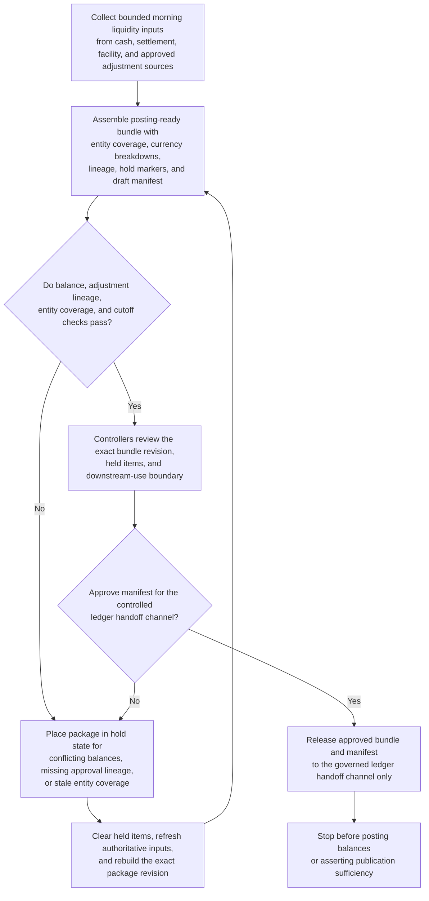

# Morning liquidity posting bundle approved for ledger handoff

## Linked pattern(s)

- `approval-gated-transformation-release`

## Domain

Finance.

## Scenario summary

Treasury controllers prepare a morning liquidity publication that depends on cash balances, settlement obligations, central-bank facility usage, and a small set of controller-approved manual adjustments spread across multiple authoritative systems. The downstream posting workflow expects a structured posting bundle with entity coverage, currency breakdowns, approved adjustments, hold-state markers, and a manifest authorizing handoff into the controlled ledger publication channel. The transformation workflow must reshape that bounded source state into the posting-ready package, preserve lineage for every consequential field, and stop after the manifest is approved for downstream handoff rather than posting the balances or declaring the package evidentially sufficient for publication.

## Target systems / source systems

- Treasury cash-position, settlement, collateral, and facility systems holding the authoritative morning state
- Manual-adjustment approvals, entity hierarchy, and posting-code tables used to normalize package fields
- Governed staging store and manifest service for the posting-ready transformed bundle
- Controller approval tooling that records signer identity, downstream-use boundary, and held items for each package version
- Hold and exception queue for unresolved adjustment lineage, stale entity coverage, or conflicting source balances before any ledger-facing workflow receives the package

## Why this instance matters

This grounds the pattern in finance work where downstream reliance depends on one governed transformed package rather than ad hoc spreadsheets and controller notes. Treasury teams often need to approve a structured handoff package for later posting or publication workflows without letting the transformation step become the posting event itself. The instance shows why approval-gated transformation release is distinct from evidence-backed verification and from the actual ledger publication or funds movement that may follow.

## Likely architecture choices

- Approval-gated execution fits because the package is assembled for one specific ledger handoff boundary but remains blocked until controller approval is attached to the manifest.
- Human-in-the-loop governance is required because controllers must adjudicate held adjustments, downstream boundary scope, and any entity-coverage exceptions before release.
- The workflow should produce the posting-ready bundle, lineage trace, hold register, and manifest only; it should not post balances, recommend funding actions, or certify that broader treasury decisions should proceed.
- Approved reference tables may normalize entities, currencies, and posting classifications, but unsupported netting logic or inferred balance replacements should force a hold rather than a silent package completion.

## Governance notes

- Every balance, adjustment, entity, and cutoff field should remain traceable to authoritative systems, approved manual inputs, and the specific package version approved for handoff.
- The manifest should record exactly which downstream posting channel, cutoff window, and signer set were authorized so later publication steps cannot reuse the package out of scope.
- The workflow should hold the package when balances disagree across authoritative feeds, one manual adjustment lacks controller lineage, or entity coverage changed after package assembly began.
- Treasury control owners must approve changes to package schemas, rendering rules, and hold-release criteria; the workflow remains bounded to package release rather than posting or execution.

## Evaluation considerations

- Percentage of approved posting bundles accepted by downstream ledger-publication workflows without manual restructuring
- Rate of hidden adjustment, scope-drift, or stale-balance issues discovered after manifest approval
- Completeness of field-level lineage and approval binding for balances, adjustments, and entity coverage
- Stability of supersession behavior when new balance snapshots arrive or one held adjustment is cleared during the approval cycle
