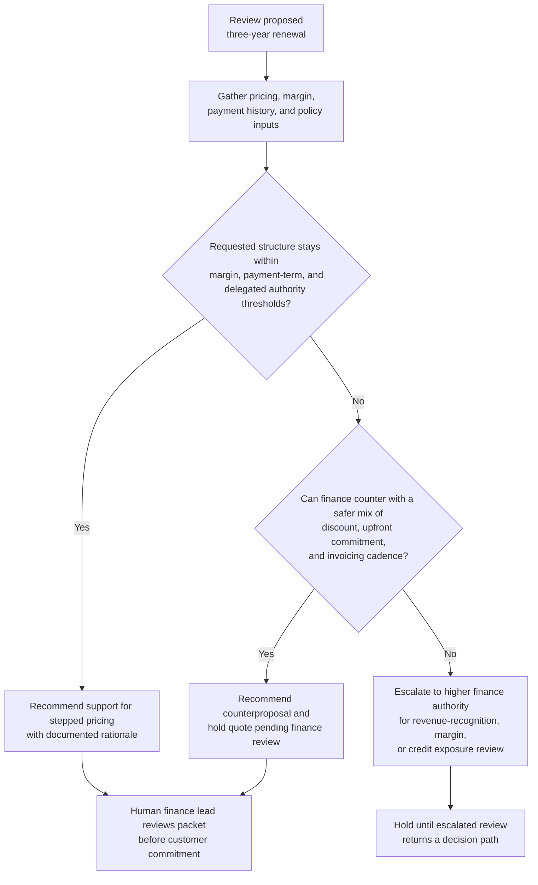

# Multi-year renewal pricing and payment structure recommendation

## Linked pattern(s)

- `deal-desk-recommendation-support`

## Domain

Finance.

## Scenario summary

A finance deal desk team is reviewing a proposed three-year software renewal for a hospital network that wants stepped pricing, an increased first-year discount to absorb migration costs, and nonstandard net-120 payment terms tied to its annual budgeting cycle. The workflow must recommend whether finance should support the requested structure, counter with a safer mix of discount and upfront commitment, or escalate because margin floors, revenue-recognition treatment, and customer credit exposure move outside delegated approval thresholds.

## Target systems / source systems

- CRM opportunity record, renewal quote drafts, and customer negotiation notes
- CPQ pricing guardrails, delegated authority matrix, and historical renewal precedents
- Margin model, revenue-planning workbook, and commission-impact analysis
- Billing, collections, and customer credit-risk records for prior payment behavior
- Contracting guidance for multi-year commitments, invoicing cadence, and fallback terms

## Why this instance matters

This instance grounds the recommendation pattern in finance without collapsing it into generic sales support. The hard part is not summarizing deal terms; it is producing a defensible recommendation that balances win probability against margin protection, cash-flow timing, and accounting constraints while keeping final approval authority with human finance leaders.

## Likely architecture choices

- A recommendation-only workflow can retrieve current pricing policy, renewal history, credit exposure, and revenue-treatment guidance into one ranked option set for finance review.
- Human-in-the-loop review remains mandatory because the workflow should advise on acceptable structures and escalation triggers, not approve the concession or modify the live quote.
- Read-only integration with CRM, CPQ, collections, and planning systems is preferable so the agent cannot silently alter commercial records while preparing its recommendation packet.

## Governance notes

- The output should distinguish approved-in-band options, negotiable fallback options, and blocked structures that would breach margin, payment-term, or accounting policy.
- Any recommendation that leans on precedent should show whether the comparison deal had similar contract term, customer payment history, and implementation-cost profile.
- Requests that would change revenue-recognition assumptions, exceed discount authority, or materially increase bad-debt exposure should trigger explicit escalation rather than weighted scoring alone.
- Customer-specific pricing, forecast assumptions, and collections history should remain visible only to authorized finance and commercial reviewers under normal confidentiality controls.

## Evaluation considerations

- Reviewer agreement with the recommended structure and escalation route before quote approval
- Rate at which margin, cash-collection, or accounting blockers are surfaced before customer commitments are made
- Quality of evidence tying payment behavior, precedent deals, and policy thresholds to the recommendation
- Stability of recommendations when late-stage changes alter term length, discount mix, or invoicing cadence
