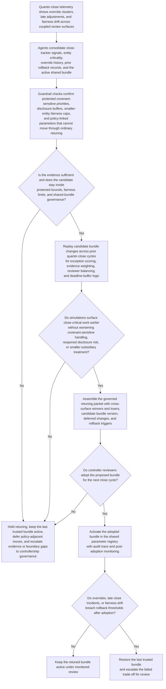
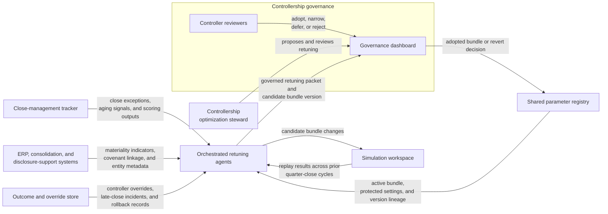

# Quarter-close control bundle retuning

## Linked pattern(s)

- `governed-optimization-bundle-retuning`

## Domain

Finance.

## Scenario summary

A controllership optimization steward is responsible for a shared quarter-close tuning bundle that influences several coupled review surfaces: exception scoring in the close tracker, evidence-sufficiency weighting for entity packages, reviewer-load balancing in the controller queue, and deadline-buffer logic used by covenant and disclosure support teams. Recent outcome data shows that the active bundle has reduced average queue age for routine exceptions, but controller overrides and late close adjustments are clustering around covenant-sensitive entities, repeatedly reopened disclosure packages, and smaller subsidiaries whose documentation arrives later in the cycle. The workflow must propose a governed retuning package that adjusts the shared bundle across those coupled surfaces so close-critical work is surfaced earlier and fairness drift is reduced, without letting the system decide accounting treatment, reschedule the close calendar, or push configuration changes live without controller adoption.

## Target systems / source systems

- Close-management tracker with open exceptions, aging signals, entity criticality, and current scoring outputs across review surfaces
- ERP, consolidation, and disclosure-support systems with materiality indicators, covenant linkage, journal-adjustment history, and entity metadata
- Outcome and override store with controller overrides, reopened packages, late-close incidents, post-close adjustments, and prior rollback records
- Shared parameter registry holding the active close-review bundle, protected-priority settings, fairness caps, and prior version lineage
- Simulation workspace used to replay proposed bundle changes against prior quarter-close cycles before human adoption
- Governance dashboard used by controllership leaders to compare candidate bundles, approve one version, or revert to the last trusted bundle

## Why this instance matters

This grounds the pattern in a finance workflow where the main adaptation problem is not direct queue ranking by itself but coordinated retuning of a shared optimization bundle that influences several close-control surfaces at once. A naive tuning loop could keep improving average review speed while allowing covenant-sensitive entities, slower-documenting subsidiaries, or disclosure-relevant issues to degrade on adjacent surfaces that share the same weights and buffers. The instance stays inside optimize/adapt territory because the workflow ends at a controller-adopted retuning package and candidate bundle version rather than accounting judgments, approval adjudication, scheduling changes, or journal execution.

## Likely architecture choices

- Orchestrated multi-agent coordination fits because separate roles can analyze cross-surface telemetry, test fairness and protected-priority guardrails, simulate candidate bundles, and assemble one retuning package over shared close-state history.
- Human-in-the-loop operation should remain normal because the controller or close lead must explicitly adopt, narrow, defer, or reject the proposed bundle before it becomes active shared state.
- Recommendation-only autonomy keeps the ontology boundary clean: the workflow can compare bundle versions and recommend the safest retuning path, but it should not activate parameters or reinterpret close policy on its own.
- Finance leaders should remain able to freeze retuning, keep a prior trusted bundle in force, and escalate any policy-adjacent parameter changes to controllership governance rather than treating them as ordinary optimization.

## Governance notes

- Parameters tied to covenant sensitivity, filing-deadline protection, segregation-of-duties handling, and smaller-entity fairness caps should remain protected bundle components that cannot be shifted through ordinary retuning.
- Every proposed bundle should show cross-surface winners and losers explicitly so close speed improvements cannot hide degradation in disclosure readiness, reopened-package risk, or smaller-entity treatment.
- Auditability should preserve the current and proposed bundle versions, replay windows, controller overrides consulted, deferred changes, adoption decisions, and any rollback that follows a bad retuning cycle.
- Retuning packets should minimize unnecessary financial detail and expose only the entity, control, and exception information needed for authorized governance review.
- Reversibility should stay explicit: if late-close incidents rise, protected-priority exceptions age longer, or controller overrides spike after adoption, the workflow should restore the last trusted bundle and flag the failed trade-off for review.
- The workflow must not redefine close policy, decide accounting treatment, or alter the formal close calendar; it only governs shared optimization-state updates for existing review surfaces.

## Evaluation considerations

- Reduction in controller overrides, late close-critical exception aging, and post-close adjustment volume after a new bundle is adopted
- Change in treatment of covenant-sensitive entities, disclosure-relevant packages, and smaller subsidiaries across the coupled surfaces that share the bundle
- Frequency of deferred parameter moves that correctly surfaced policy-adjacent changes instead of laundering them through optimization
- Speed and clarity of rollback when a retuned bundle improves average throughput but harms protected-priority handling or fairness
