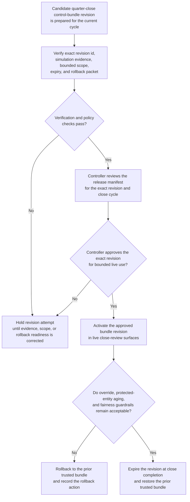
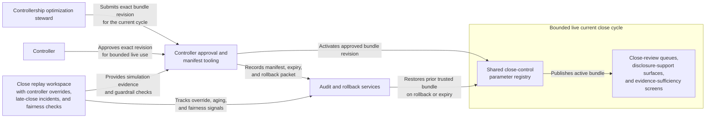

# Quarter-close control-bundle revision approved for live use

## Linked pattern(s)

- `approval-gated-optimization-state-release`

## Domain

Finance.

## Scenario summary

A controllership optimization steward has prepared one exact quarter-close control-bundle revision covering exception-materiality weighting, entity-aging buffers, and reviewer-balance parameters used across the close-review surfaces. Simulation against the prior two closes suggests the revision reduces controller overrides and protects covenant-sensitive entities more consistently, but the bundle should not become live until a controller approves the exact revision id, bounded cycle scope, expiry at close completion, and rollback packet. The workflow therefore centers on governed release of one exact optimization-state revision into live close use, without deciding accounting treatment, rescheduling the close calendar, or executing journal postings.

## Target systems / source systems

- Shared close-control parameter registry with active and candidate bundle versions plus supersession lineage
- Close replay workspace with controller overrides, late-close incidents, reopened packages, and fairness checks for slower-documenting entities
- Controller approval and manifest tooling used to authorize one bundle revision for the current close cycle
- Audit and rollback services that can restore the last trusted bundle if override frequency or protected-entity aging worsens
- Close-review queues, disclosure-support surfaces, and evidence-sufficiency screens that consume the active bundle

## Why this instance matters

This instance shows a finance case where the approval-gated step is not a recommendation to adopt a better bundle and not an operational execution workflow. The central reusable artifact is one exact optimization bundle revision entering live use under controller approval, with explicit validity and restore controls. That cleanly captures the optimize/adapt slice where live governance attaches to a versioned tuning artifact rather than to an accounting decision or execution step.

## Likely architecture choices

- Approval-gated execution fits because the bundle revision can be activated through the shared registry only after the controller signs the release manifest for that exact cycle-bound version.
- Human-in-the-loop review is necessary because the controller must explicitly accept the trade-offs among throughput, protected-entity handling, and fairness posture before the revision becomes live.
- A governed release agent can verify the revision id, compare it with simulation evidence, record the prior trusted bundle, and arm expiry and rollback controls, but it should not reinterpret accounting policy or broaden the live scope to other close cycles.

## Governance notes

- Approval should be tied to one exact bundle revision, one current close cycle, and one controller signer so a later parameter tweak or a future quarter cannot inherit authority implicitly.
- Expiry discipline matters because close-specific tuning should restore the prior trusted bundle automatically when the cycle ends unless controller leadership explicitly extends it.
- Rollback criteria should include controller-override spikes, worsening aging on covenant-sensitive entities, and hidden fairness regression across smaller subsidiaries.
- Audit lineage should preserve the prior and released bundle ids, simulation windows, blocked revision attempts, approval timing, expiry behavior, and any manual extension or rollback action.
- The workflow must not decide accounting treatment, route exceptions to a committee, or post journals; it only governs live release of the shared close optimization-state revision.

## Evaluation considerations

- Reduction in controller overrides, late close-critical aging, and hidden fairness regressions after the approved bundle revision becomes live
- Percentage of live bundle releases whose manifest, cycle scope, and expiry metadata match the exact approved revision without later correction
- Speed and clarity of rollback when a live revision improves throughput but harms protected entity handling or controller trust
- Frequency of automatic expiry and safe restoration to the prior trusted bundle at cycle end
