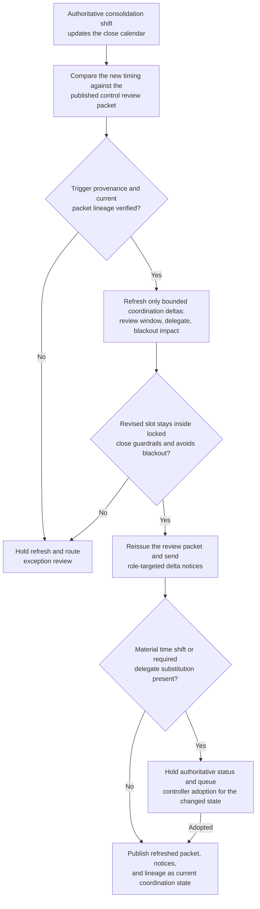
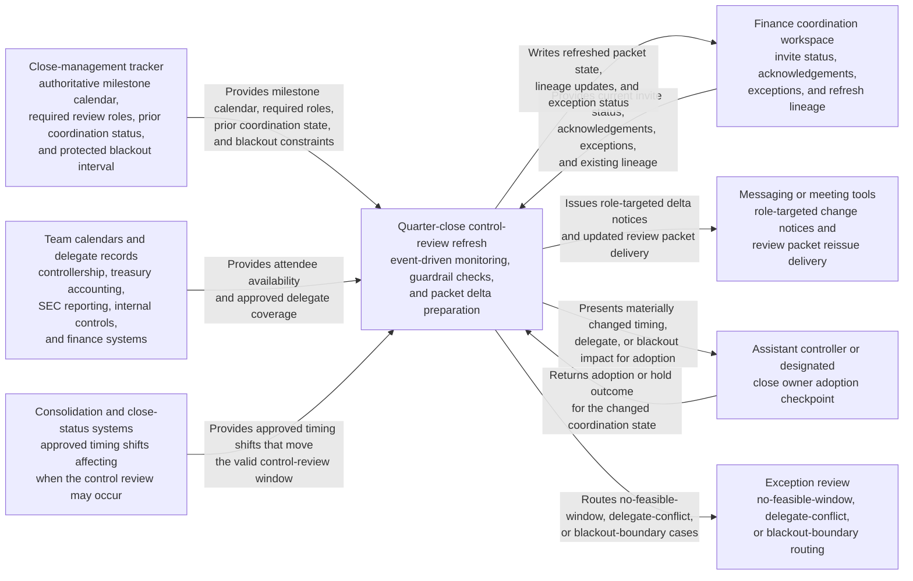

# Quarter-close control review coordination refresh after consolidation shift

## Linked pattern(s)

- `authoritative-change-coordination-refresh`

## Domain

Finance.

## Scenario summary

A quarter-close control review already has a published coordination packet tying together the locked close calendar, required attendees, tentative meeting hold, and handoff expectations for controllership, treasury accounting, SEC reporting, internal controls, and finance systems. Then an authoritative consolidation timing shift lands late in the cycle: a final entity true-up moves the earliest valid review window, one required attendee changes to an approved delegate because of board-material review overlap, and the close calendar adds a protected blackout interval for lender materials. The workflow should refresh the existing review packet, reissue targeted delta notices, and queue controller adoption for the materially changed state rather than recomputing the full close plan, recommending accounting treatment, or advancing downstream certification work.

## Target systems / source systems

- Close-management tracker with the authoritative milestone calendar, required review roles, and prior coordination status
- Team calendars and delegate records for controllership, treasury accounting, SEC reporting, internal controls, and finance systems
- Consolidation and close-status systems publishing approved timing shifts that affect when the control review may occur
- Finance coordination workspace where invite status, acknowledgements, exceptions, and refresh lineage are maintained
- Messaging or meeting tools capable of sending role-targeted change notices without exposing broader close commentary

## Why this instance matters

This grounds the pattern in a finance workflow where participants depend on one current review packet during a compressed close window and cannot afford ambiguous schedule drift. The coordination refresh needs to preserve the link between authoritative close-state changes and the revised review checkpoint, while keeping human ownership over any consequential timing or authority shift. The instance remains in planning scope because it refreshes coordination state only; it does not decide the close outcome, reinterpret accounting policy, or file anything externally.

## Likely architecture choices

- Event-driven monitoring should subscribe to approved close-calendar updates, posted consolidation timing shifts, and controlled delegate-state changes that affect the issued review packet.
- Exception-gated autonomy fits because routine packet refresh, targeted notice issuance, and lineage updates can happen automatically when changes remain inside approved close guardrails.
- The assistant controller or designated close owner should adopt any materially changed meeting time, protected-window impact, or required-attendee substitution before the refreshed packet becomes authoritative.
- Exception handling should route no-feasible-window cases, delegate conflicts, or blackout-boundary violations instead of publishing a misleading current state.

## Governance notes

- Required roles and approved delegates should remain explicit and auditable for assistant controller, treasury accounting, SEC reporting, internal controls, and finance systems ownership.
- Refreshed notices should include only role-relevant timing, attendee, and checkpoint deltas rather than detailed ledger commentary or sensitive close narrative.
- The workflow should preserve prior and current schedule versions, recipient lists, and adoption actions so close leadership can reconstruct how the packet changed.
- Automatic refresh should be blocked when the trigger comes from a draft workbook, unofficial calendar note, or unapproved attendee substitution.
- Repeated late-cycle refreshes should be monitored for churn so the workflow does not overwhelm reviewers with conflicting versions near sign-off.

## Evaluation considerations

- Percentage of approved close-state changes reflected in one current control-review packet with complete lineage and clear controller adoption status
- Rate of blackout-boundary conflicts, unsupported delegate substitutions, or ambiguous timing shifts correctly routed to exception review
- Reviewer ability to identify the latest authoritative review packet and understand what changed since the prior version
- Notification-deduplication performance when multiple close updates land within the same narrow review window
