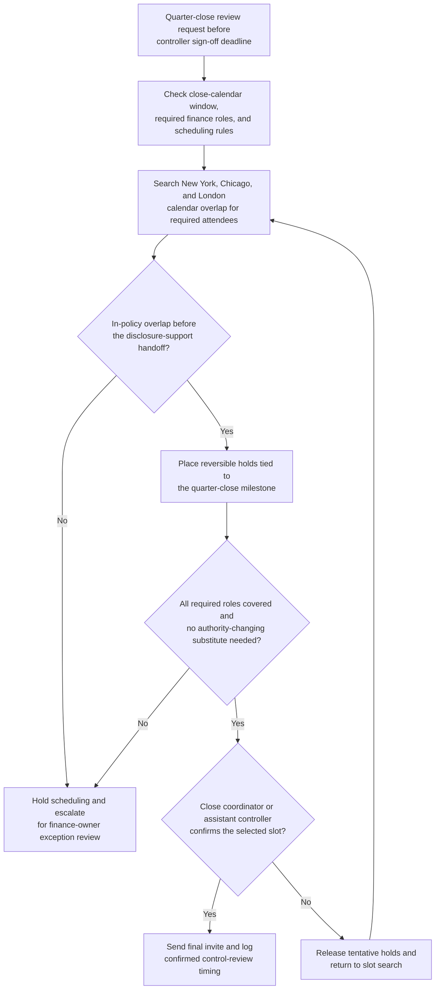

# Quarter-close control review scheduling

## Linked pattern(s)

- `calendar-conflict-coordination`

## Domain

Finance.

## Scenario summary

A finance close coordinator needs to schedule a quarter-close control review before the controller signs off on the close package for a revolving-credit and liquidity reporting cycle. The meeting must include the assistant controller, the treasury accounting lead, the SEC reporting manager, the internal controls manager, and the finance systems owner because the review sits between the final consolidation refresh and the disclosure-support handoff. The workflow is about finding a viable slot inside the close calendar, placing reversible holds across New York, Chicago, and London calendars, and escalating quickly when no in-policy overlap exists rather than guessing at attendee substitutions or making the final meeting commitment without human confirmation.

## Target systems / source systems

- Close-management tracker with the quarter-close milestone calendar, required review roles, and sign-off deadlines
- Team calendars for controllership, treasury accounting, SEC reporting, internal controls, and finance systems
- Finance close calendar showing blackout periods for board-material preparation, disclosure reviews, and locked close checkpoints
- Calendar and meeting tools that support tentative holds, delegate-aware invites, and reversible drafts
- Finance coordination channel or close workspace where attendee exceptions, rationale, and final confirmation status are tracked

## Why this instance matters

This grounds the scheduling pattern in a finance workflow where the main value is coordinating the right reviewers inside a narrow close window before downstream certification work begins. It is distinct from recommendation, investigation, or execution because the workflow is not deciding accounting treatment, resolving covenant interpretation, or submitting anything externally. Instead, it handles bounded-delegation schedule construction so finance leaders can spend their attention on the review itself once the required people are aligned at the right time.

## Likely architecture choices

- A tool-using single agent gathers free-busy availability, close-calendar milestones, timezone metadata, and required-attendee rules from approved finance systems.
- Bounded delegation fits because the agent can rank feasible slots, place short-lived tentative holds, and draft a meeting packet linked to the close checklist, but it should not move a sign-off deadline, replace a required control owner silently, or confirm the final review invite without the finance owner's approval.
- Human checkpoints remain necessary when no compliant overlap exists before the close deadline, when only after-hours options remain for a required participant, or when a proposed delegate would change review authority.

## Governance notes

- Required attendees should be explicit and role-based before any hold is placed: assistant controller, treasury accounting lead, SEC reporting manager, internal controls manager, and finance systems owner.
- Calendar access should stay limited to free-busy, timezone, delegate, and policy metadata rather than exposing private event titles, compensation topics, or sensitive close commentary.
- Tentative holds should be reversible, time-bounded, and tied to the specific quarter-close milestone so stale placeholders do not block other close work.
- The workflow should minimize copied context in invites and coordination messages, sharing only the meeting purpose, timing window, and role requirements needed for scheduling.
- The workflow should escalate instead of improvising when no in-policy slot exists inside the approved close window, when the only slot crosses protected after-hours boundaries, or when a substitute attendee would alter who owns the final control review.
- Final commitment should stay human-owned: the close coordinator or assistant controller confirms the selected slot and any approved attendee substitution before the invite becomes authoritative.

## Evaluation considerations

- Median time from scheduling request to a viable control-review slot covering all required finance roles inside the approved close window
- Percentage of quarter-close review meetings confirmed without manual back-and-forth beyond defined finance-owner checkpoints
- Frequency of rescheduling caused by stale free-busy data, expired tentative holds, or missed required-attendee constraints
- Audit usefulness of the coordination log for showing which slots were rejected, which reversible holds were placed, and why a human had to approve the final commitment or attendee exception
