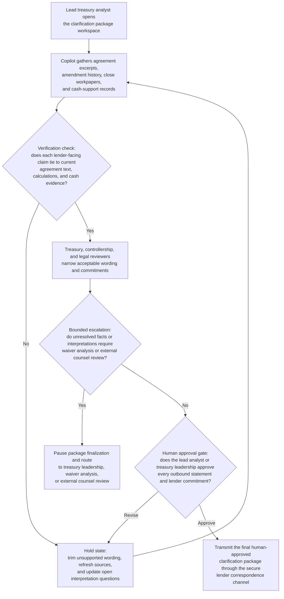
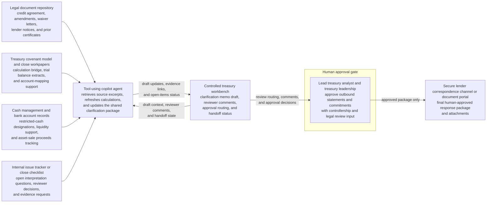

# Quarter-close covenant clarification package copilot loop

## Linked pattern(s)

- `analyst-copilot-loop`

## Domain

Finance.

## Scenario summary

Late in quarter close, the lead treasury analyst receives follow-up questions from the administrative agent on the company's revolving credit facility before the lender group will accept the draft compliance certificate. The lender wants clearer support for a restructuring add-back in EBITDA, confirmation that a recent asset sale did not trigger a mandatory prepayment, and a tighter explanation of why minimum-liquidity calculations exclude a ring-fenced foreign account. The analyst uses a copilot inside a controlled finance workspace to iteratively assemble the lender-response package, pull the governing agreement excerpts and amendment history, reconcile the calculation bridge to close workpapers, rewrite the narrative as controllership, legal, and treasury reviewers narrow acceptable wording, and maintain an open-items log for unresolved interpretation questions. The human analyst and treasury leadership remain responsible for deciding which interpretations are supportable, whether any waiver or external counsel review is required, what commitments the company will make to the lender group, and approving every outbound statement before anything is transmitted.

## Target systems / source systems

- Controlled treasury workbench with the draft clarification memo, reviewer comments, approval routing, and handoff status
- Executed credit agreement, amendments, waiver letters, lender notices, and prior compliance certificates in the legal document repository
- Treasury covenant model, quarter-close calculation bridge, supporting trial balance extracts, and account-mapping workpapers
- Cash management and bank account reference records for restricted-cash designations, liquidity support, and recent asset-sale proceeds tracking
- Internal issue tracker or close checklist capturing open interpretation questions, reviewer decisions, and evidence requests
- Secure lender correspondence channel or document portal where the final human-approved response package and attachments are delivered

## Why this instance matters

This grounds the collaboration pattern in a finance workflow where the governed artifact is a lender-response package rather than a recommendation, investigation, or automated submission. The hard part is sustained mixed-initiative drafting across legal language, quarter-close calculations, and reviewer edits without letting a polished copilot draft blur what the agreements actually permit or imply covenant interpretations and lender commitments the human owners never approved. The instance highlights why provenance, explicit ownership, and approval boundaries matter when a copilot helps produce a package that can affect financing relationships, waiver posture, and quarter-close certification confidence.

## Likely architecture choices

- Human-in-the-loop collaboration should remain primary because covenant interpretation, disclosure posture, and any lender-facing commitment require accountable treasury, controllership, and legal ownership.
- A tool-using single agent can retrieve agreement excerpts, refresh the calculation bridge, maintain a claim-to-source matrix, and propose successive rewrites for the shared clarification package inside one governed workspace.
- The copilot may update drafts, evidence checklists, and unresolved-issues logs, but sending anything to lenders, certifying covenant compliance, or recording a final interpretation in a system of record should remain explicitly human-gated.

## Governance notes

- The shared artifact should distinguish binding agreement text, internal calculation support, agent-drafted paraphrases, and human-approved conclusions so reviewers can see where interpretation entered the package.
- Every material statement should link to inspectable evidence such as section references, amendment dates, compliance certificate versions, calculation tabs, or cash-account support; unsupported narrative should not survive into the outbound packet.
- The human owner must approve any statement about EBITDA add-back eligibility, mandatory prepayment treatment, restricted-cash inclusion or exclusion, waiver need, or future reporting commitments because those assertions can create legal and financing consequences beyond mechanical drafting help.
- Sensitive lender correspondence, financing terms, account-level balances, and legal analysis should be minimized in the copilot context unless necessary for the work item and retained only in approved repositories with role-based access and audit history.
- If reviewers conclude the current facts do not support the planned interpretation, the workflow should branch into formal escalation for waiver analysis, amended disclosure drafting, or external counsel review rather than letting the copilot finalize a defensive clarification memo.

## Evaluation considerations

- Time to produce an internal-review-ready lender clarification package that preserves source lineage, calculation traceability, and explicit human ownership of final interpretations
- Reviewer correction rate for package sections where the copilot misstated amendment precedence, calculation support, restricted-cash treatment, or implied unapproved lender commitments
- Completeness of the evidence bundle, including whether each lender-facing claim can be traced back to governing agreements, close workpapers, prior certificates, and cash-support records
- Reliability of governance checkpoints that prevent agent-authored drafts from being transmitted externally or treated as final covenant interpretation without human approval and visible audit history
