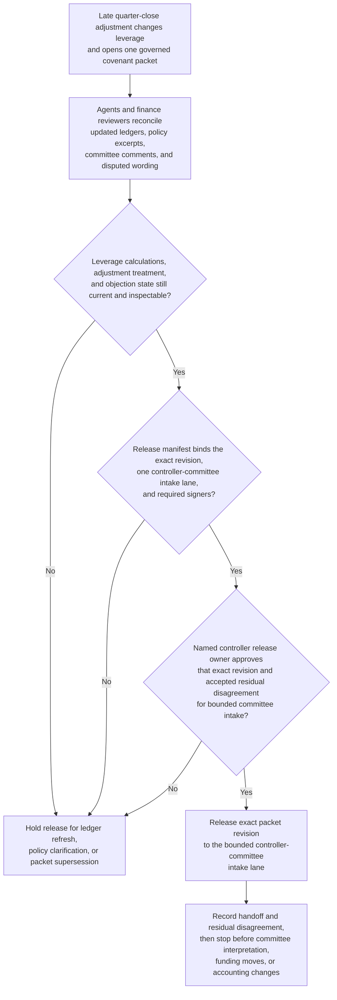

# Quarter-close covenant position packet approved for controller committee intake

## Linked pattern(s)

- `approval-gated-collaborative-artifact-release`

## Domain

Finance.

## Scenario summary

Treasury, controllership, and finance-policy reviewers are jointly maintaining one covenant position packet because a late quarter-close adjustment changed leverage calculations and could alter how one lending covenant exception is framed for committee review. Agents help merge updated ledgers, policy excerpts, committee comments, and disputed wording about adjustment treatment into the shared artifact while keeping objections and release scope explicit. The workflow stops when the named controller release owner approves that exact packet revision for one bounded controller-committee intake lane, where the downstream committee can decide how to interpret or act on the position. It does not decide the committee outcome, initiate funding moves, or post any accounting change.

## Target systems / source systems

- Governed finance collaboration workspace with the covenant position packet, comment history, objection ledger, and release-manifest state
- Ledger, consolidation, and covenant-calculation systems providing authoritative balances, late adjustments, and threshold calculations
- Treasury-policy, debt-agreement, and committee-intake repositories defining wording constraints, release criteria, and approved audience scope
- Approval tooling that records the controller release owner, required signers, and the exact committee intake boundary for each packet revision
- Audit and retention systems preserving superseded packet versions, accepted residual disagreement, and held-release reasons

## Why this instance matters

This shows a finance workflow where the core value is collaborative ownership of one review artifact plus explicit approval to release that artifact itself. The pattern is not just a readiness memo and not a transformed posting package: the packet is jointly authored, objections remain visible, and one human owner must approve its handoff into a bounded committee lane. The example keeps downstream interpretation, waiver choice, and accounting action outside the instance's main workflow shape.

## Likely architecture choices

- Approval-gated execution fits because the packet can be fully prepared inside collaboration while still blocked from committee intake until the release owner approves the exact revision.
- Human-in-the-loop control is required because only accountable finance leaders may accept residual disagreement, confirm audience scope, and authorize the release boundary.
- Agents may reconcile ledger evidence, compare wording alternatives, and maintain release-state traceability, but they must not decide the covenant position or trigger downstream accounting or funding steps.

## Governance notes

- The release manifest should name the exact packet revision, committee lane, signer set, and any accepted residual disagreement about adjustment treatment or covenant interpretation.
- Every consequential claim about leverage, threshold headroom, adjustment status, or policy treatment should remain linked to inspectable finance evidence or stay marked as contested.
- The packet should remain bounded to the approved committee audience; reuse for lender outreach, board materials, or accounting execution should require separate downstream control.
- If a new close adjustment or policy interpretation changes the packet materially during approval review, the workflow should supersede the draft and block release of the older revision.

## Evaluation considerations

- Rate at which controller-committee intake accepts the released packet without discovering hidden objections, stale calculations, or wrong audience scope
- Time required to keep one collaborative packet synchronized as adjustments, policy comments, and signer state evolve near close
- Quality of revision binding between the released artifact, accepted residual disagreement, and the bounded committee intake lane
- Frequency with which humans reject agent-proposed edits because they drifted into recommendation, committee adjudication, or downstream accounting action
