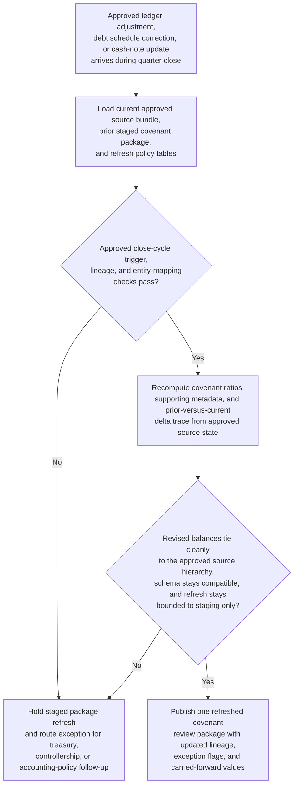

# Quarter-close covenant review package refresh after ledger adjustment

## Linked pattern(s)

- `change-triggered-representation-refresh`

## Domain

Finance.

## Scenario summary

During quarter close, treasury and controllership teams maintain a structured covenant review package that downstream reviewers use to assess leverage, liquidity, and reporting completeness before any lender communication or board material is prepared. The first staged package may be built days before the books stabilize, and then authoritative source state changes continue to arrive through approved journal adjustments, intercompany true-ups, late debt schedule corrections, and updated cash restriction notes. Each such change should trigger refresh of the staged covenant package so ratio fields, supporting metadata, and exception flags remain current, while the workflow preserves a delta-and-lineage trace and routes conflicts whenever the revised balances cannot be tied cleanly to the approved source hierarchy.

## Target systems / source systems

- Quarter-close covenant review staging store used by treasury and controller reviewers
- General ledger, consolidation, treasury-workbook, and debt-schedule systems publishing approved adjustments and versioned support files
- Controlled covenant-definition tables, entity hierarchies, and close-calendar metadata used for field mapping and validation
- Lineage and audit store tracking prior staged package versions, refreshed ratio calculations, and overwrite decisions
- Exception queue for controller, treasury, or accounting-policy follow-up before any external reporting or recommendation work begins

## Why this instance matters

This grounds the pattern in finance work where downstream users depend on a current structured package, not a fresh narrative memo each time balances move. A stale or ambiguously refreshed covenant package can send reviewers down the wrong path even before any formal recommendation or disclosure occurs. The instance shows why event-triggered rematerialization, overwrite discipline, and field-level lineage are valuable for moderate-risk close processes that remain reversible while still requiring careful governance.

## Likely architecture choices

- Event-driven monitoring should listen only to approved close-cycle source changes such as posted journal entries, refreshed debt schedules, and finalized treasury support workbooks.
- A tool-using single agent can re-read the changed source bundle, recompute staged covenant fields, compare old and new ratios, and publish an updated package plus delta trace.
- Automatic refresh should remain bounded to approved recalculation logic; unsupported manual workbook edits, missing adjustment lineage, or conflicting entity mappings should escalate.
- The workflow should stop at refreshed review staging and exception handling rather than generating lender-facing output, covenant recommendations, or filing actions.

## Governance notes

- Ratio fields, covenant thresholds, adjustment provenance, and supporting-note links should retain clear prior-versus-current lineage for every refresh.
- Refresh should not overwrite staged values when an upstream workbook is unofficial, an entity rollup changed without governance approval, or a close exception remains unresolved.
- Reviewers should be able to inspect exactly which approved entries changed the structured package and which values were carried forward unchanged.
- Treasury and controllership owners should approve any expansion of auto-refresh rules that would cover new close sources or schema-breaking adjustments.

## Evaluation considerations

- Percentage of approved close-source changes reflected in one current covenant review package with complete delta trace
- Rate of ambiguous balance movements, entity-mapping conflicts, or unsupported workbook revisions correctly routed to exceptions before review use
- Reviewer ability to reconcile refreshed leverage or liquidity fields back to approved source changes without reconstructing the full close workbook manually
- Reliability of the refresh loop during late close churn, out-of-order postings, or target-schema changes for covenant support metadata
