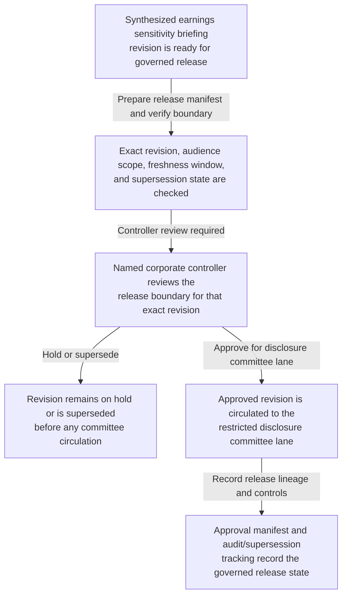

# Quarter-close earnings sensitivity briefing revision approved for disclosure committee circulation

## Linked pattern(s)

- `approval-gated-briefing-release`

## Domain

Finance.

## Scenario summary

A controllership and disclosure-preparation workflow has already synthesized one revision of a quarter-close earnings sensitivity briefing that summarizes exposure drivers, segment-level variance sensitivity, covenant watchpoints, unresolved post-close adjustments, and disclosure-readiness caveats for the current reporting cycle. Before that exact revision is circulated into the restricted disclosure committee lane, a named corporate controller must approve the audience scope, freshness window, and supersession state so committee readers receive the reviewed context package instead of a stale draft, an overly broad copy, or a forwarding-prone version. The workflow stops at governed release of that briefing revision; it does not decide disclosure wording, set earnings guidance, approve a filing position, schedule investor communications, or execute any downstream finance action.

## Target systems / source systems

- Restricted finance briefing workspace storing the synthesized earnings sensitivity briefing revision, prior revisions, caveat register, and provenance ledger
- Consolidation, close-adjustment, covenant-monitoring, and segment-reporting systems already cited by the prepared briefing revision
- Disclosure committee circulation tooling enforcing named committee recipients, internal-use banners, expiry controls, and blocked forwarding outside the approved lane
- Approval manifest service recording the corporate controller approver, exact revision id, approved disclosure committee lane, freshness deadline, and explicit hold or release state
- Audit and supersession tracker preserving release lineage, expiry events, and blocked reuse or forwarding attempts when a newer revision or material adjustment appears before circulation

## Why this instance matters

This grounds the pattern in finance where the governed step is releasing one exact synthesized briefing revision into a sensitive internal disclosure-readiness lane, not deciding what the company will disclose. Quarter-close sensitivity work often produces several near-final drafts that differ in adjustment treatment, segment commentary, or covenant caveats, so release authority must stay bound to one reviewed version rather than a general permission to brief senior finance leaders. The example keeps the family boundary clean by ending at bounded circulation of context rather than drifting into disclosure adjudication, earnings recommendation, filing preparation, or execution.

## Likely architecture choices

- Approval-gated execution fits because the briefing remains held until the corporate controller approves one exact revision for the restricted disclosure committee lane.
- Human-in-the-loop review is necessary because only accountable finance leadership should accept residual adjustment uncertainty, confirm audience scope, and authorize circulation of market-sensitive internal context.
- A governed agent can assemble the release manifest, compare revision lineage, and block stale reuse or forwarding, but it should not decide disclosure language, approve external messaging, or trigger downstream filing or investor-relations work.

## Governance notes

- Approval should bind to one immutable briefing revision, one named disclosure committee lane, one freshness deadline, and one explicit internal-use profile so later edits or copied versions cannot inherit permission silently.
- The released brief should preserve unresolved post-close adjustments, segment-sensitivity caveats, and covenant-watch uncertainty rather than compressing them into a false disclosure-ready narrative.
- If a new ledger adjustment, counsel note, or sensitivity refresh appears during approval review, the pending revision should remain on hold and be superseded rather than circulated under stale approval.
- Audit records should preserve the released or held revision id, approver identity, committee-recipient scope, expiry timing, supersession lineage, and any blocked forwarding attempts to investor relations, business-unit finance leaders, or other non-approved recipients.

## Evaluation considerations

- Percentage of disclosure committee circulations where the released briefing revision id, hold or release state, and manifest metadata align exactly without later correction
- Rate at which stale, superseded, expired, or out-of-scope earnings sensitivity briefings are blocked before disclosure committee visibility
- Time required to move from briefing-ready status to approved bounded circulation when provenance, caveats, and adjustment freshness are already complete
- Reviewer correction rate for missing caveats, wrong audience scope, or blocked-forwarding failures after the committee receives the released briefing
