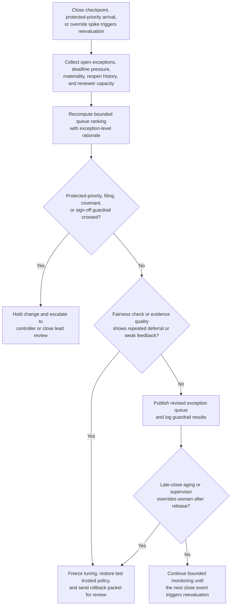
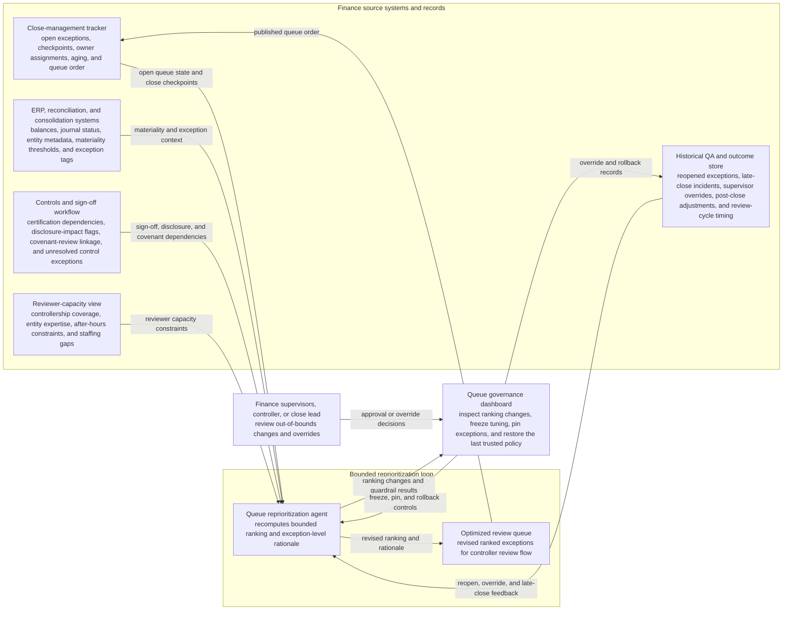

# Quarter-close exception review queue reprioritization

## Linked pattern(s)

- `queue-prioritization-optimization`

## Domain

Finance.

## Scenario summary

A finance close operations manager is overseeing an existing queue of quarter-close exceptions that need controller review before consolidation, disclosure drafting, and lender-covenant certification can proceed. The backlog mixes unreconciled intercompany breaks, revenue cutoff questions, lease-accounting adjustments, late accrual packages, inventory reserve exceptions, and subsidiary submissions returned for incomplete support. Recent handling data shows that reviewers have been pulling forward straightforward low-documentation exceptions while harder items with filing-deadline proximity, covenant sensitivity, or repeated reopen history are aging until they disrupt downstream sign-off windows. The optimization workflow must reprioritize the review queue within bounded limits so imminent close deadlines, materiality risk, and protected-priority exception classes rise appropriately without letting smaller entities, lower-visibility business units, or slower-documenting regions be systematically pushed to the back.

## Target systems / source systems

- Close-management tracker with open exceptions, close-calendar checkpoints, owner assignments, aging, and current queue order
- ERP, reconciliation, and consolidation systems with account balances, journal status, entity metadata, materiality thresholds, and exception-type tags
- Controls and sign-off workflow showing certification dependencies, disclosure-impact flags, covenant-review linkage, and unresolved control exceptions
- Historical QA and outcome store with reopened exceptions, late-close incidents, supervisor overrides, post-close adjustment volume, and review-cycle timing
- Reviewer-capacity view showing controllership coverage, entity expertise, after-hours constraints, and temporary staffing gaps during the close window
- Queue governance dashboard used by finance leadership to inspect ranking changes, freeze tuning, and restore the last trusted prioritization policy

## Why this instance matters

This grounds the optimization pattern in a finance workflow where queue order affects close timeliness, control quality, and reporting governance rather than only throughput. A naive reprioritization loop could keep favoring exceptions that are easy to clear, leaving covenant-sensitive, disclosure-relevant, or repeatedly reopened items to age until reversibility weakens and close pressure rises. The example keeps the work squarely in optimize/adapt territory: the system is tuning the order of an existing review backlog using feedback and operating context, not investigating root cause, deciding accounting treatment, scheduling meetings, or posting adjustments.

## Likely architecture choices

- Event-driven monitoring should trigger queue reevaluation when close checkpoints approach, protected-priority exceptions enter the backlog, reopen rates climb, or supervisors repeatedly override the current order.
- A tool-using single agent can recompute bounded prioritization weights, simulate the effect on close-critical aging and reviewer load, and publish a revised ranked queue with exception-level rationale for supervisory inspection.
- Exception-gated autonomy fits because in-policy tuning can adjust ordering automatically within preapproved ranges, but changes that materially alter deadline buffers, materiality thresholds, fairness balancing, or protected-priority handling should require controller or close-lead review before activation.
- Finance supervisors should remain able to freeze optimization updates, pin specific exceptions, and revert to the last trusted ranking policy when feedback quality drops or a late policy change makes recent outcome history unreliable.

## Governance notes

- Exceptions tied to external filing deadlines, lender-covenant calculations, payroll or tax remittance impacts, suspected control failures, and items already escalated by the controller should remain protected classes that cannot be demoted for cycle-time reasons.
- Fairness checks should test for repeated deferral of smaller subsidiaries, lower-revenue business units, cross-border entities, or historically slower-documenting teams instead of letting ease-of-clearance become a proxy for importance.
- Auditability should be durable: every reprioritization should log the deadline pressure, materiality signals, reopen history, reviewer-capacity assumptions, override behavior, and guardrail checks that justified the ranking change.
- Optimization features and dashboards should minimize sensitive financial detail to the least information needed for prioritization quality and supervisory review while preserving enough context for internal-audit replay.
- Reversibility should be explicit: if late-close exceptions increase, override rates spike, or reviewers report that protected-priority items are aging longer, the workflow should restore the prior trusted policy and escalate the tuning packet for review.
- Bounded autonomy should stay visible so the optimizer can tune queue order only inside approved guardrails and cannot redefine close policy, waive sign-off requirements, or authorize accounting entries.

## Evaluation considerations

- Reduction in close-critical exceptions aging past review checkpoints, post-close adjustment volume, and last-minute controller escalations after tuned queue ordering is applied
- Change in aging distribution for protected-priority exceptions versus routine close items, including whether fairness guardrails prevent systematic delay for smaller or lower-visibility entities
- Frequency and pattern of supervisor overrides that indicate the optimized ranking conflicted with close policy, fairness, materiality, or reviewer-capacity expectations
- Speed and clarity of rollback when updated tuning degrades close stability, weakens auditability, or conflicts with new quarter-close guidance
