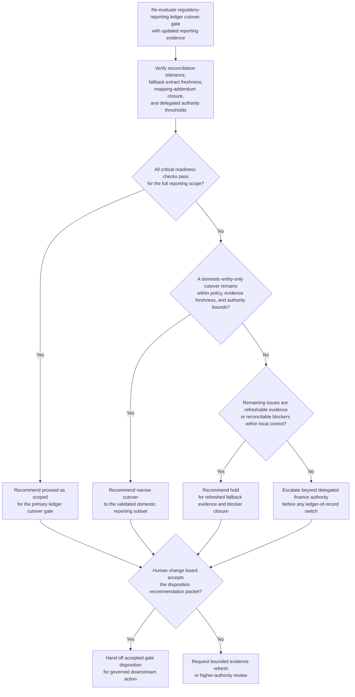
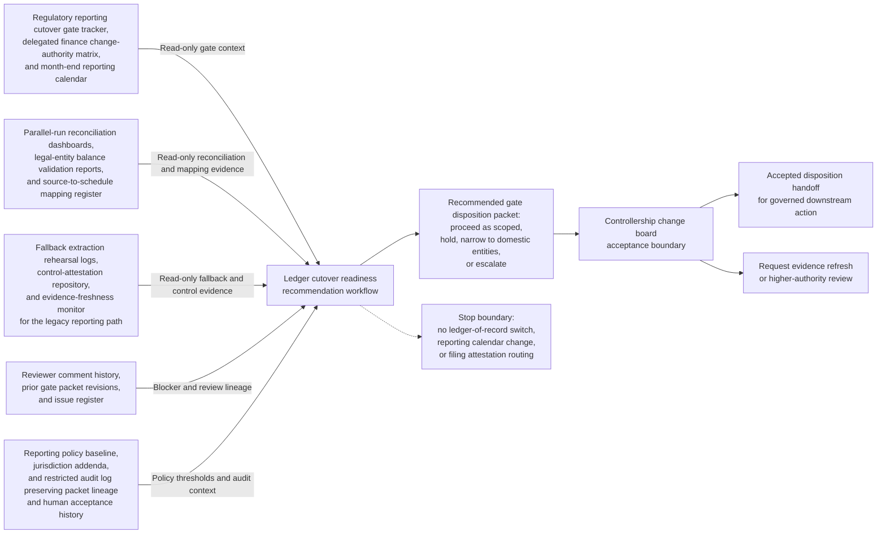

# Regulatory reporting ledger cutover readiness gate disposition recommendation

## Linked pattern(s)

- `readiness-gate-disposition-recommendation`

## Domain

Finance.

## Scenario summary

A controllership change board is re-evaluating whether a new regulatory-reporting ledger can pass its primary cutover gate before month-end liquidity and capital schedule dress rehearsals begin. Since the previous gate packet revision, one secured-funding reconciliation replay for a material legal entity remains outside tolerance, fallback extract evidence for the legacy reporting path has aged past the policy freshness window, and one jurisdiction-specific source-to-schedule mapping addendum still lacks reviewer closure, although a narrower domestic-entity-only cutover appears feasible. The workflow must recommend whether finance should proceed with the ledger cutover as scoped, hold for refreshed evidence and reconciliations, narrow the gate to the validated domestic reporting subset, or escalate because blocker severity, mapping incompleteness, or delegated change-governance thresholds no longer fit local authority before any production ledger-of-record switch, reporting calendar change, or filing attestation routing occurs.

## Target systems / source systems

- Regulatory reporting cutover gate tracker, delegated finance change-authority matrix, and month-end reporting calendar
- Parallel-run reconciliation dashboards, legal-entity balance validation reports, and source-to-schedule mapping register
- Fallback extraction rehearsal logs, control-attestation repository, and evidence-freshness monitor for the legacy reporting path
- Reviewer comment history, prior gate packet revisions, and issue register covering unresolved mapping or tolerance exceptions
- Reporting policy baseline, jurisdiction addenda, and restricted audit log preserving packet lineage and human acceptance history

## Why this instance matters

This instance grounds the pattern in finance with a release-readiness surface distinct from the earlier cash-forecast cutover example. The valuable work is not switching the ledger, approving a filing posture, or coordinating downstream reporting execution; it is refreshing one governed gate disposition packet so controllership and regulatory-reporting reviewers can judge whether the cutover should proceed, hold, narrow, or escalate as evidence, blocker state, and policy thresholds change.

## Likely architecture choices

- Event-driven monitoring fits because reconciliation drift, evidence-freshness expiry, and mapping-addendum status changes should trigger a refreshed readiness recommendation instead of waiting for a manual gate meeting.
- Human-in-the-loop review is mandatory because the workflow should advise on the gate disposition, not approve the ledger-of-record change, update the reporting calendar, or release any regulatory filing artifact.
- Read-only integration with reporting, reconciliation, evidence, and policy systems is preferable so the agent cannot silently convert a recommendation into a reporting production change.

## Governance notes

- The workflow should stay centered on one inspectable regulatory-reporting ledger cutover gate packet owned by Director of Regulatory Reporting Readiness Elena Marquez, with each recommendation revision tied to one exact gate review checkpoint.
- Source precedence should be explicit: the approved reporting policy baseline, signed jurisdiction addenda, and authoritative source-to-schedule mapping register outrank dress-rehearsal notes, informal reconciliation commentary, and reviewer discussion threads; conflicts should remain visible as blockers rather than being normalized away.
- Prerequisite readiness state should remain visible in the packet, including parallel-run completion status, fallback extract rehearsal currency, legal-entity mapping freeze state, and named reviewer sign-off completeness for the in-scope jurisdictions.
- Open blockers and unresolved items should remain explicit, including the out-of-tolerance secured-funding replay, the stale fallback evidence bundle, and the still-open jurisdiction mapping addendum, with any domestic-only narrowing path showing exactly which entities remain out of scope.
- Revision lineage should preserve prior gate packet revisions, reviewer comments, accepted and rejected narrowing proposals, and the evidence delta that changed the recommendation so later reviewers can reconstruct why the packet moved between proceed, hold, narrow, or escalate.
- The boundary must remain clear: the workflow does not choose the filing strategy, approve a reporting attestation, communicate with regulators, switch the production ledger, or execute rollback or cutover steps.

## Evaluation considerations

- Reviewer agreement with the recommended proceed, hold, narrow, or escalate disposition before any ledger-of-record switch or reporting-calendar change is approved
- Rate at which stale fallback evidence, unresolved mapping gaps, or reconciliation tolerance breaches are surfaced before the governed cutover gate meets
- Quality of traceability linking source-precedence rules, prerequisite readiness state, blocker visibility, and reviewer-lineage evidence to the disposition recommendation
- Stability of recommendations when reconciliation status, mapping closure, or fallback rehearsal freshness changes during the final cutover window
