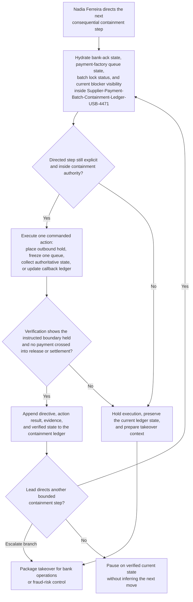
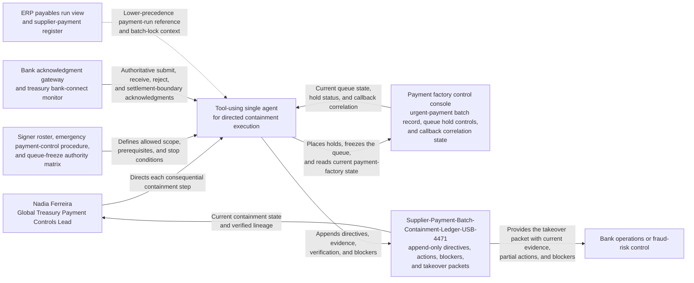

# Suspected duplicate urgent supplier payment batch supervised containment task orchestration

## Linked pattern(s)

- `human-directed-task-orchestration`

## Domain

Finance.

## Scenario summary

A treasury payment-controls lead is directing live containment after operations detect that urgent supplier payment batch `USB-4471` may have been submitted twice through the payment factory during a same-day settlement window. The workflow is anchored on one exact governed artifact, the append-only `Supplier-Payment-Batch-Containment-Ledger-USB-4471`, whose current run continues entry lineage `e01` through `e14`. Under Nadia Ferreira, Global Treasury Payment Controls Lead, the agent may execute only the significant steps she names: place `USB-4471` on outbound hold, freeze queue `PF-URGENT-EU-1`, collect authoritative bank-ack and payment-factory state, update the containment ledger after each directed action, verify whether any instruction crossed the hold boundary, and assemble a takeover packet if bank operations or fraud-risk control must assume the next branch. Source precedence is explicit: bank acknowledgment records and current payment-factory queue state outrank ERP payment-run views, treasury workstation notes, and desk chat. The run starts only after the current signer roster is pinned, the queue is confirmed hold-capable, the payment batch is locked against resubmission edits, and the callback-control session is live. Visible blockers such as delayed bank-ack refresh, queue-freeze confirmation lag, beneficiary exception mismatches, or missing callback correlation IDs stay attached to the ledger. The workflow stays inside supervised execution of containment steps and verified state capture; it does not decide whether to cancel the batch, release funds, contact the bank, declare fraud, or rewrite payment policy.

## Target systems / source systems

- Payment factory control console with the urgent-payment batch record, outbound queue status, hold controls, and callback correlation state
- Bank acknowledgment gateway and treasury bank-connect monitor carrying authoritative submit, receive, reject, and settlement-boundary acknowledgments
- ERP payables run view and supplier-payment register with the originating payment proposal, invoice grouping, and batch-lock status
- Treasury control ledger and audit store preserving append-only directives, executed actions, blocker states, and takeover packets
- Signer roster, emergency payment-control procedure, and queue-freeze authority matrix defining who may direct containment actions and where the workflow must stop

## Why this instance matters

This grounds `human-directed-task-orchestration` in a finance scenario where the value is neither planning the response nor recommending whether the batch is truly duplicate. The hard work is live guided execution of bounded containment steps across payment controls while keeping one authoritative procedural ledger, explicit source precedence, blocker visibility, and safe handoff if the situation crosses into bank-operations or fraud-control authority. It shows how a finance agent can move quickly inside a narrow command loop without drifting into cancellation decisions, settlement action, or broader treasury governance.

## Likely architecture choices

- A tool-using single agent can execute the directed holds and queue-freeze actions, read bank-ack and payment-factory state, update the append-only containment ledger, and package verified takeover context.
- Human-in-the-loop control is mandatory because Nadia Ferreira must direct every consequential next step, confirm whether containment scope still holds, and decide when a branch leaves payment-controls authority.
- The workflow should expose a takeover-safe packet for bank operations or fraud-risk control whenever the evidence shows a payment may have crossed the instructed boundary or external action is required.

## Governance notes

- Every significant action should map to an explicit current instruction from Nadia Ferreira and to a fresh read of authoritative bank-ack and queue state; the workflow should not infer a containment branch from earlier bridge discussion or prior duplicate-payment incidents.
- Source precedence should remain visible in `Supplier-Payment-Batch-Containment-Ledger-USB-4471`: bank acknowledgments and current payment-factory state outrank ERP mirrors, analyst notes, and desk chat for current containment truth.
- Prerequisite control state should remain frozen or live-validated before execution continues, including the pinned signer roster, hold-capable queue confirmation, batch edit lock, and active callback-control session.
- Visible blockers should travel with the ledger, especially delayed acknowledgment refresh, queue-freeze confirmation lag, beneficiary exception mismatches, missing callback IDs, or contradictory release-state signals.
- If verification shows that funds may already have crossed the instructed boundary, if a requested step would require cancellation or bank communication, or if the next move would shift into fraud adjudication or policy change, the workflow should stop and publish a takeover packet rather than improvise.
- Append-only lineage matters: entries `e01` through `e14` should preserve the exact order of human directives, tool actions, verification checks, pauses, and escalation packaging so successor teams can continue without replaying or skipping a containment step.

## Evaluation considerations

- Percentage of duplicate-payment containment runs completed or safely handed off without unauthorized release, duplicated hold actions, or lost execution state
- Rate of stale bank acknowledgments, queue-state conflicts, and boundary-crossing conditions caught before the next directed containment step executes
- Completeness of `Supplier-Payment-Batch-Containment-Ledger-USB-4471` in linking each human directive to one executed action, one verification result, current blocker visibility, and the verified payment-boundary state
- Reliability of takeover packets when bank operations or fraud-risk control assumes the next branch after partial containment work
