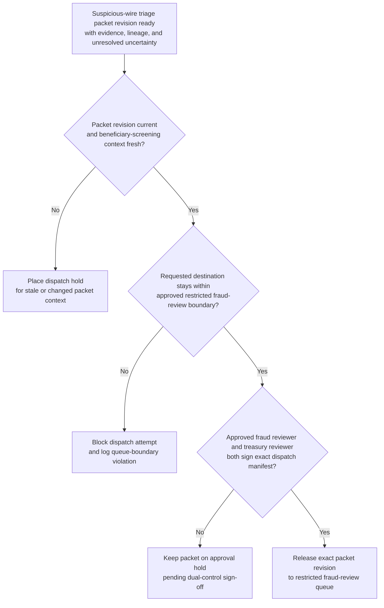
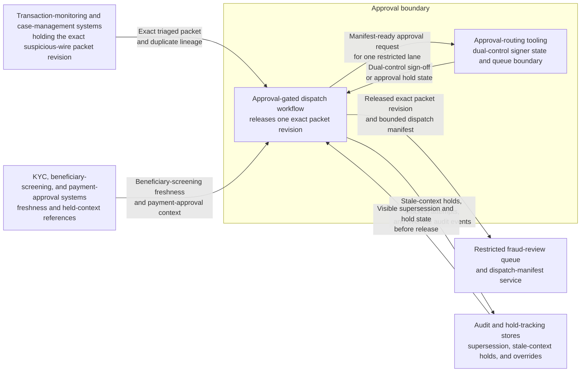

# Suspicious wire triage packet approved for restricted fraud-review dispatch

## Linked pattern(s)

- `approval-gated-triage-dispatch`

## Domain

Finance.

## Scenario summary

A treasury fraud-operations team already has an evidence-backed suspicious wire packet assembled from earlier alert triage, with the payment cluster, beneficiary context, duplicate lineage, and unresolved uncertainty documented. The next step is not to decide whether to freeze funds, contact the customer, or file anything externally; it is to decide whether the exact packet revision may cross into the restricted fraud-review lane that can trigger those downstream human workflows. The dispatch workflow watches packet freshness, dual-control signer state, queue-boundary rules, and held beneficiary-screening updates, then releases the triaged packet only when the approved fraud and treasury reviewers sign the bounded dispatch manifest for that lane.

## Target systems / source systems

- Transaction-monitoring and case-management systems holding the already-triaged suspicious-wire packet, alert lineage, and prior duplicate merges
- KYC, beneficiary-screening, and payment-approval systems that contribute freshness checks and held context references already cited in the packet
- Restricted fraud-review queue and dispatch-manifest service used to release the exact packet revision into the protected downstream lane
- Approval-routing tooling recording dual-control sign-off, queue boundary, signer identity, and blocked dispatch attempts
- Audit and hold-tracking stores preserving superseded packet revisions, stale-context holds, and manual override history

## Why this instance matters

This grounds `approval-gated-triage-dispatch` in finance work where there is a real gap between triaging suspicious payment activity and letting that triaged case enter a downstream lane that may quickly lead to payment holds, customer outreach, or regulatory review. Many organizations can triage suspicious wires continuously, but still require explicit dual-control approval before the case may cross into a restricted fraud-response queue. The instance keeps the family boundary clean because the workflow owns packet release and dispatch lineage only, not the downstream decision about account restriction, filing, or funds movement.

## Likely architecture choices

- Event-driven monitoring fits because packet freshness, beneficiary-screening status, and signer state can change continuously while the case sits at the dispatch gate.
- Approval-gated execution fits because the triaged case is ready for restricted-lane release but remains concretely blocked until the required dual-control approval is attached to the manifest.
- Human-in-the-loop review should remain in the normal path because the dispatch gate can expose a sensitive payment case to a downstream lane with consequential powers even though this workflow still stops short of action.
- The workflow should emit only the released queue entry, dispatch manifest, hold register, and audit trail rather than a freeze recommendation, customer-contact plan, or reporting decision.

## Governance notes

- The manifest should bind approval to one exact suspicious-wire packet revision, one restricted queue identifier, and the signer pair that authorized dispatch.
- Dispatch should remain held when beneficiary-screening freshness expires, the packet is superseded by a newer merge, or the requested downstream lane exceeds the approved fraud-review boundary.
- Broad queue views should minimize customer identifiers, account details, and sensitive narrative content while keeping traceable references in controlled systems.
- Fraud-governance owners must approve changes to signer roles, queue boundaries, freshness rules, and duplicate-handling logic; this workflow ends before any payment restriction, filing, or customer communication begins.

## Evaluation considerations

- Median time from packet readiness to approved restricted-lane dispatch or explicit hold placement
- Rate of wrong-version, wrong-lane, or stale-context corrections discovered after dispatch approval
- Completeness of audit lineage connecting packet revision, dual-control approval, and downstream queue boundary
- Reliability of hold behavior when beneficiary or screening context changes during the approval window
