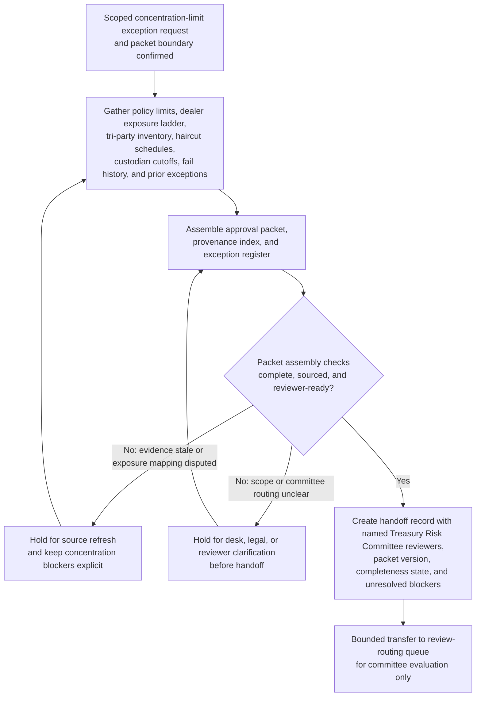
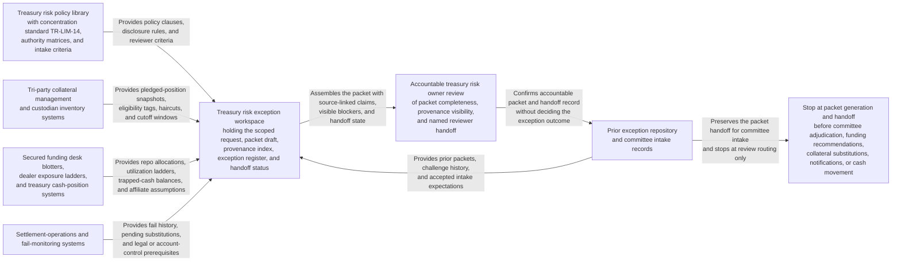

# Temporary secured-funding concentration-limit exception approval packet for Treasury Risk Committee review

## Linked pattern(s)

- `approval-packet-generation`

## Domain

Finance.

## Scenario summary

A treasury risk governance manager must assemble a decision-ready approval packet because the firm's overnight secured-funding book has temporarily exceeded the internal single-counterparty concentration cap after a large tax-payment inflow left excess cash trapped at one tri-party custodian and the next eligible collateral-substitution window does not open until after the morning funding cycle. The workflow gathers the scoped exception request, concentration policy `TR-LIM-14`, dealer exposure ladder, tri-party collateral inventory by CUSIP, custodian haircut and eligibility schedules, settlement-fail history, liquidity contingency notes, prior concentration-exception packets, and the already-defined temporary controls into one governed packet for Treasury Risk Committee review. Agents help map packet claims to source evidence, build a reviewer-visible provenance index, keep unresolved issues such as a stale 07:30 ET custodian inventory snapshot, an affiliate-netting dispute on Dealer Atlas, a missing New York legal-annex acknowledgment, or an incomplete 09:00 ET independent price-verification refresh in an explicit exception register, and prepare the handoff record showing the named committee reviewers and current completeness status. The workflow stops at packet generation and handoff; it does not recommend whether the exception should be granted, re-rank alternative funding paths, change concentration limits, instruct collateral substitutions, notify counterparties, or execute any repo, transfer, or cash movement.

## Target systems / source systems

- Treasury risk exception workspace holding the scoped request, packet draft, completeness checklist, and handoff status for `USD-Secured-Funding-Concentration-Exception-Packet-v4`
- Treasury risk policy library containing concentration standard `TR-LIM-14`, secured-funding authority matrices, temporary exception disclosure rules, and Treasury Risk Committee intake criteria
- Tri-party collateral management and custodian inventory systems storing pledged-position snapshots, CUSIP-level eligibility tags, haircut tables, substitution windows, and cutoff calendars
- Secured funding desk blotters, dealer exposure ladders, and treasury cash-position systems documenting overnight repo allocations, counterparty utilization, trapped-cash balances, and affiliate-netting assumptions
- Settlement-operations and fail-monitoring systems preserving prior-day settlement exceptions, pending substitutions, custodian acknowledgments, and unresolved legal-annex or account-control prerequisites
- Prior exception repository and committee intake records containing earlier concentration-limit packets, reviewer challenge history, and accepted packet-format expectations

## Why this instance matters

This grounds `approval-packet-generation` in a finance workflow where the hard part is assembling a trustworthy approval packet from treasury policy, secured-funding, custody, settlement, and liquidity evidence without letting concentration exposure uncertainty disappear behind a clean narrative. Treasury Risk Committee review depends on one inspectable packet that preserves policy context, source precedence, and unresolved blockers before reviewers decide whether the request is even ready for their lane. The example stays inside the gather-family boundary because the primary outputs are the packet, provenance index, exception register, and handoff record rather than a funding recommendation, limit decision, collateral move, desk instruction, or downstream settlement action.

## Likely architecture choices

- Orchestrated multi-agent retrieval and synthesis fit because concentration-policy clauses, dealer utilization data, custodian inventory snapshots, legal prerequisites, and settlement evidence often live in separate systems and require coordinated packet assembly.
- Human-in-the-loop checkpoints should remain mandatory so an accountable treasury risk owner can confirm the exception scope, required reviewers, and whether unresolved evidence gaps are acceptable to surface in the packet before handoff.
- Agents may reconcile dealer and affiliate identifiers, align cash, collateral, and cutoff timelines, and draft packet sections, but they should not decide whether the concentration breach is tolerable, recommend a substitute funding path, alter authority thresholds, or trigger downstream trading, collateral, legal, or settlement actions.

## Governance notes

- Every consequential claim about the breached concentration threshold, current dealer exposure, trapped-cash balance, collateral eligibility state, legal-document coverage, temporary control posture, or committee routing should link to inspectable source evidence in the provenance index.
- The exception register should keep the stale 07:30 ET custodian inventory snapshot, the unresolved Dealer Atlas affiliate-netting dispute, the missing New York legal-annex acknowledgment, any incomplete independent price-verification refresh, and any unclear secured-funding authority mapping visible so the packet cannot appear cleaner than the underlying control state.
- The handoff record should name the intended Treasury Risk Committee reviewers, packet version, completeness state, unresolved blockers, and the explicit boundary where packet generation ends and human approval review begins.
- Sensitive dealer names, legal-document metadata, intraday liquidity assumptions, and collateral position details should remain access-controlled, minimally excerpted, and fully auditable across packet assembly and handoff.
- If new evidence shows an unauthorized secured-funding trade, an actual settlement failure requiring immediate containment, or a concentration breach outside the scoped temporary request, the workflow should stop and escalate into incident handling or investigation rather than continue packet assembly.

## Evaluation considerations

- Percentage of Treasury Risk Committee intakes accepted without missing mandatory evidence, routing corrections, or hidden concentration-exception blockers
- Reviewer correction rate for packet sections where agent-assisted synthesis overstated legal readiness, understated dealer exposure concentration, or implied review readiness without sufficient support
- Time required for reviewers to trace a challenged packet claim back to the exact policy clause, dealer exposure report, custodian inventory snapshot, settlement-fail record, or legal acknowledgment in the provenance index
- Bounce rate from committee review caused by stale evidence, incomplete exception visibility, or unclear handoff ownership
