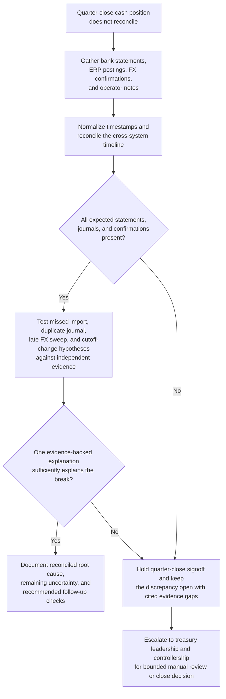

# Treasury cash position discrepancy investigation

## Linked pattern(s)

- `incident-root-cause-analysis`

## Domain

Finance.

## Scenario summary

At quarter close, the corporate treasury team finds that the prior-day ending cash position in the treasury management system does not reconcile to the bank balance summary and the ERP cash ledger for three operating currencies. The discrepancy could stem from a missed bank statement import, a duplicate intercompany funding journal, a late FX sweep confirmation, or a cutoff-time mismatch introduced during a recent connectivity change. The workflow investigates the break by reconciling bank evidence, internal postings, and operator notes into an evidence-backed explanation of what failed and what remains uncertain.

## Target systems / source systems

- Treasury management system cash-position snapshots and reconciliation workspace
- Bank statement feeds, SWIFT acknowledgements, and host-to-host transmission logs
- ERP cash ledger postings, intercompany funding journals, and close-control signoff records
- FX sweep instructions, settlement confirmations, and payment operations notes
- Change tickets for bank-connectivity updates and treasury operations handoff logs

## Why this instance matters

This instance grounds the pattern in a finance workflow where the central task is not detecting the discrepancy but explaining it well enough for controllers and treasury leaders to decide whether close can proceed. It highlights evidence reconciliation across external bank records and internal accounting systems, while keeping cutoff assumptions, missing confirmations, and unresolved hypotheses visible for governed financial reporting.

## Likely architecture choices

- An orchestrated multi-agent flow can separate bank-evidence retrieval, ledger timeline normalization, and hypothesis verification so reconciliation logic stays inspectable.
- Shared case memory should preserve candidate explanations, unmatched transactions, timestamp adjustments, and analyst rationale across treasury and controllership handoffs.
- Human-in-the-loop review remains necessary before declaring the primary cause, booking correcting entries, or certifying that close controls can proceed.

## Governance notes

- Preserve original bank statements, acknowledgements, and ledger extracts as immutable evidence links rather than copying values into informal notes.
- Distinguish observed mismatches from inferred causes, especially when cutoff timing or manual treasury actions could plausibly explain the break.
- Proposed correcting journals, close overrides, or disclosures must remain human-approved and outside the agent's authority.
- Investigation artifacts should support audit replay by retaining rejected hypotheses, unresolved items, and the final rationale for any quarter-close decision.

## Evaluation considerations

- Time to first defensible discrepancy hypothesis with cited bank and ledger evidence
- Percentage of material cash breaks with a complete reconciled event timeline before close signoff
- Agreement between the workflow's ranked explanations and the final controller-accepted root cause
- Whether missing statements, delayed confirmations, or conflicting operator notes produce explicit uncertainty instead of forced reconciliation
