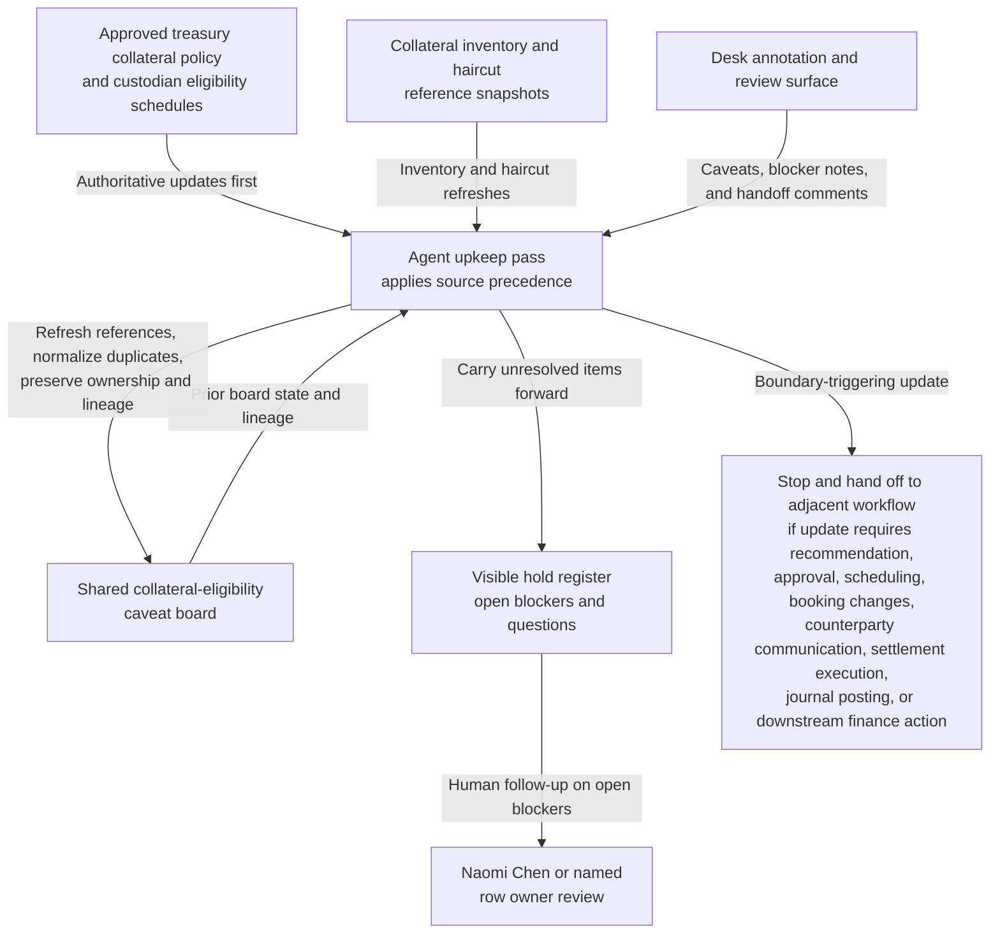
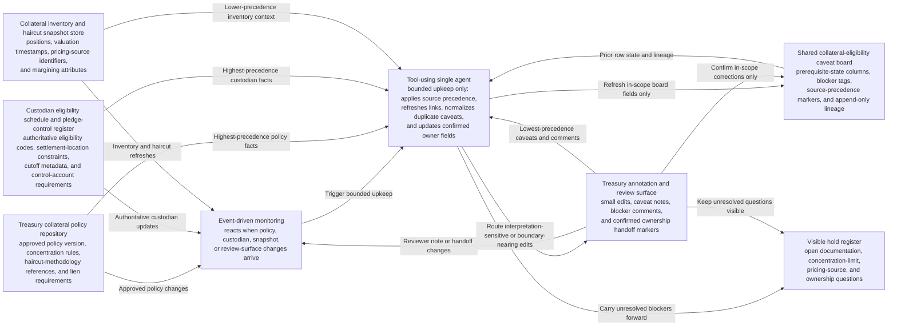

# Treasury collateral-eligibility caveat board shared workbench upkeep

## Linked pattern(s)

- `shared-workbench-orchestration`

## Domain

Finance.

## Scenario summary

A treasury collateral governance team maintains one internal collateral-eligibility caveat board while collateral operations analysts, liquidity risk reviewers, secured funding desk coordinators, and finance systems stewards continuously refine notes attached to pledged-asset pools under review for internal readiness tracking. The board already carries prerequisite state for each row: the current treasury collateral policy version, current custodian eligibility schedule revision, asset-pool or ISIN scope, the latest inventory and haircut snapshot timestamp, any prior manual-review reference, visible blocker fields, unresolved documentation or lien tags, append-only revision lineage, and named human ownership under Treasury Collateral Governance Manager Naomi Chen plus each row's accountable owner. As small updates arrive, the agent keeps that bounded workbench synchronized by applying explicit source precedence from approved treasury collateral policy and custodian eligibility schedules before inventory snapshots, haircut reference tables, desk annotations, and reviewer comments, refreshing source links, normalizing duplicate caveat notes, updating owner assignments after confirmed desk handoffs, and carrying unresolved documentation, concentration-limit, or pricing-source questions forward in a visible hold register. Humans remain responsible for deciding whether an asset is actually eligible, recommending or approving substitutions, changing funding or settlement timing, contacting custodians or counterparties, posting collateral movements, making journal entries, or moving any row into booking, settlement, or other downstream finance action.

## Target systems / source systems

- Shared collateral-eligibility caveat board with asset-pool rows, prerequisite-state columns, blocker tags, source-precedence markers, ownership fields, and append-only revision history
- Treasury collateral policy repository containing the approved eligibility policy version, concentration rules, haircut methodology references, approved lien-documentation requirements, and superseding clarifications
- Custodian eligibility schedule and pledge-control register publishing authoritative asset-eligibility codes, settlement-location constraints, cutoff metadata, and control-account requirements referenced by board rows
- Collateral inventory and haircut snapshot store showing current positions, valuation timestamps, pricing-source identifiers, margining attributes, and the latest internal inventory refresh used to contextualize board updates without outranking policy or custodian schedules
- Treasury annotation and review surface where collateral operations analysts, liquidity risk reviewers, funding desk coordinators, and finance systems stewards add small edits, caveats, blocker notes, and ownership handoff comments

## Why this instance matters

This grounds the pattern in a finance governance surface where the maintained artifact is one internal caveat board for collateral-eligibility upkeep rather than a substitution recommendation, custodian instruction, settlement plan, or ledger-affecting action record. The useful work is keeping prerequisite state, source precedence, blocker visibility, append-only lineage, and named ownership synchronized as many small updates arrive from policy, custody, inventory, and reviewer channels. That keeps the collaboration centered on one inspectable internal workbench and preserves a clean boundary before eligibility decisions, booking changes, counterparty communication, settlement execution, journal posting, or downstream treasury action begins.

## Likely architecture choices

- Event-driven monitoring fits because upkeep should react when approved collateral policy, custodian schedules, inventory snapshots, or reviewer notes change.
- A tool-using single agent can refresh source links, reconcile row metadata, normalize duplicate caveat wording, and keep blocker plus lineage fields synchronized inside one bounded board.
- Human-in-the-loop review remains necessary when an update would reinterpret eligibility criteria, clear a blocker tied to missing documentation, or make a row sound like an approved substitution or settlement instruction.
- Bounded delegation works because Naomi Chen and the collateral governance team can predefine allowable field updates, source-precedence rules, handoff markers, and hold conditions without delegating recommendation, approval, scheduling, booking, communication, settlement, or posting authority.

## Governance notes

- The board should clearly separate authoritative treasury collateral policy and custodian eligibility schedule facts from lower-precedence inventory snapshots, haircut reference context, desk annotations, and reviewer comments so routine upkeep never implies that a non-authoritative note overrides approved eligibility rules.
- Each row should retain inspectable provenance for the policy version, custodian schedule revision, asset scope, latest inventory snapshot, pricing-source identifier, prior manual-review reference, accepted owner assignment, and prior revision references before a blocker is cleared or a caveat is removed.
- Explicit holds should remain visible for missing lien documents, stale pricing-source mappings, concentration-limit questions, unresolved control-account mismatches, and ownership handoff issues rather than being normalized away during board cleanup.
- The agent may normalize structure, merge duplicate caveat notes, refresh links, and update confirmed owner fields, but it should not decide asset eligibility, recommend or approve substitutions, change cutoff or settlement timing, contact a custodian or counterparty, post a collateral movement, create a journal entry, or remove a hold that Naomi Chen or a named row owner still considers open.
- If a requested update would draft booking instructions, initiate settlement activity, notify a custodian, alter accounting treatment, or trigger any downstream finance action, the workflow should stop and hand off to the appropriate adjacent pattern.

## Evaluation considerations

- Percentage of board refreshes that preserve correct policy and custodian-schedule precedence, prerequisite-state fields, named owner assignments, and unresolved-blocker visibility across repeated upkeep cycles
- Reviewer correction rate for normalized caveat text, refreshed pricing or inventory references, ownership handoff updates, or automatically maintained blocker markers
- Rate at which recommendation-like, approval-like, booking-adjacent, communication-adjacent, or settlement-adjacent edits are held for human review instead of being silently folded into the internal caveat board
- Usefulness of the maintained workbench for helping collateral governance, treasury operations, and liquidity risk collaborators resume caveat-board upkeep without reconstructing stale revision lineage, prerequisite state, or blocker context by hand
