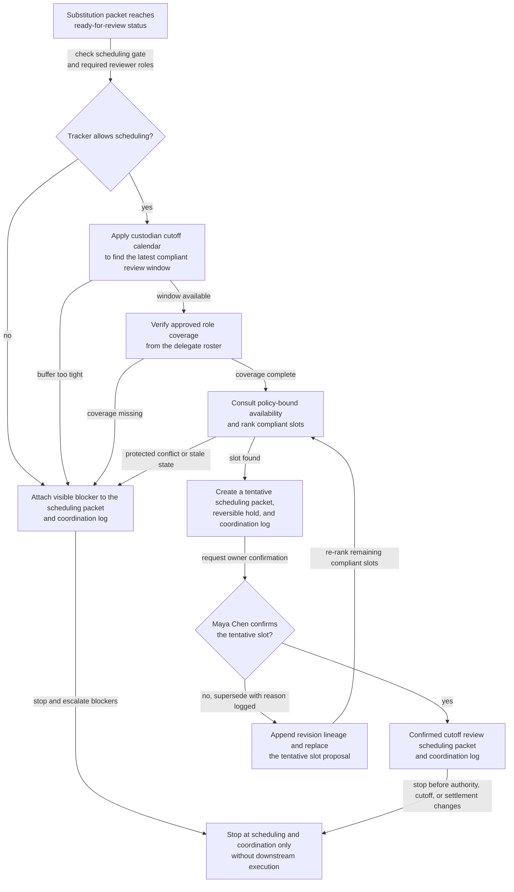

# Treasury collateral substitution cutoff review scheduling

## Linked pattern(s)

- `calendar-conflict-coordination`

## Domain

Finance.

## Scenario summary

A treasury collateral coordinator needs to schedule one same-day collateral substitution cutoff review for a tri-party funding lane after the substitution packet reaches ready-for-review status. The review must include collateral management, treasury operations, liquidity risk, the secured funding desk, and finance systems support because it sits after the prerequisite eligibility refresh and before any downstream settlement-instruction preparation. The workflow stays bounded at one inspectable review-scheduling packet and coordination log for the current custodian cutoff window. Source precedence is explicit: the collateral workflow tracker decides whether scheduling is allowed and names the required reviewer roles; the custodian cutoff calendar sets the latest feasible review boundary and protected buffers; the delegate roster determines which approved backups can satisfy role coverage; and policy-bound availability state is consulted only after the first three sources agree on the packet state and participant set. The packet remains tentative until Maya Chen, Director of Treasury Collateral Management, confirms the slot. Visible blockers stay attached, including unresolved eligibility-refresh lag, funding-window amber state, missing approved delegate coverage, and protected availability conflicts. Revision lineage records superseded slot proposals and the reason each revision was replaced. The workflow stops at scheduling and coordination; it does not select authority, change custodian cutoffs, release settlement instructions, contact counterparties, or execute the substitution.

## Target systems / source systems

- Collateral workflow tracker with substitution packet status, named owner, required reviewer roles, and ready-for-review gating state; this is the first source for whether a scheduling packet can exist at all.
- Custodian cutoff calendar with same-day substitution deadlines, protected review buffers, and funding-window checkpoints; this is the second source for the latest compliant review slot.
- Delegate roster for collateral management, treasury operations, liquidity risk, secured funding, and finance systems support; this is the third source for approved role coverage when a primary reviewer is unavailable.
- Policy-bound availability state from team calendars, working-hour rules, protected focus blocks, and settlement blackout holds; this is the fourth source used to rank candidate slots only after workflow state, cutoff timing, and delegate authority are already fixed.
- Meeting and calendar tools that support reversible holds, timezone-normalized invite drafts, and explicit tentative status.
- Treasury coordination workspace where the scheduling packet, blocker notes, superseded slot revisions, and final owner confirmation are logged.

## Why this instance matters

This grounds the scheduling pattern in treasury collateral operations where a narrow review window must be coordinated before a custodian cutoff without confusing schedule construction with funding authority or settlement execution. The hard part is reconciling cutoff timing, approved delegate coverage, and policy-bound calendar constraints while keeping one inspectable packet current enough for human review. It is distinct from the related coordination-refresh scenario because this instance centers the first workable scheduling packet and coordination log, not a later refresh after an already-issued packet has drifted.

## Likely architecture choices

- A tool-using single agent gathers the ready-for-review state, cutoff window, delegate coverage, and policy-bound availability metadata, then ranks viable slots and drafts one scheduling packet with an attached coordination log.
- Bounded delegation fits because the agent can place short-lived tentative holds, preserve rejected-slot reasoning, and maintain revision lineage, but it should not move the custodian cutoff, approve an unlisted delegate, or turn the packet into a settlement or counterparty instruction.
- Human checkpoints remain necessary when no compliant overlap exists before the protected cutoff buffer, when the eligibility refresh is stale, when the funding window is no longer in an allowed state, or when Maya Chen must approve a material attendee exception.

## Governance notes

- Scheduling should begin only when the eligibility-refresh timestamp satisfies the policy freshness threshold and the funding window is still open or explicitly marked reviewable; otherwise the packet should show a visible blocker instead of pretending the review can proceed.
- The coordination log should preserve the required source precedence order so reviewers can tell whether a rejected slot failed because the workflow tracker was not ready, the custodian cutoff buffer was too tight, the delegate roster lacked approved coverage, or policy-bound availability blocked the time.
- Revision lineage should be append-only, showing each superseded tentative slot, the blocking reason, and the moment the replacement proposal was generated.
- Invite drafts and coordination messages should include only the meeting purpose, cutoff-sensitive timing, required roles, blocker status, and packet revision reference, not collateral composition details or broader funding commentary.
- The workflow should escalate instead of improvising when unresolved blockers remain visible, especially eligibility-refresh lag, funding-window closure, missing approved delegate coverage, or stale free-busy data near the cutoff.
- Final commitment remains human-owned: Maya Chen confirms the selected review slot before any invite becomes authoritative, and the workflow must stop short of authority selection, custodian cutoff changes, settlement instruction release, counterparty communication, or downstream execution.

## Evaluation considerations

- Median time from ready-for-review packet creation to a viable cutoff-review slot that covers all required treasury roles before the protected custodian buffer closes.
- Percentage of scheduling packets resolved without manual back-and-forth beyond the defined Maya Chen checkpoint.
- Frequency of escalations triggered by eligibility-refresh lag, funding-window state changes, delegate-roster gaps, or policy-bound availability conflicts.
- Audit usefulness of the scheduling packet and coordination log for reconstructing source precedence, visible blockers, revision lineage, and why a slot was accepted, superseded, or escalated.
