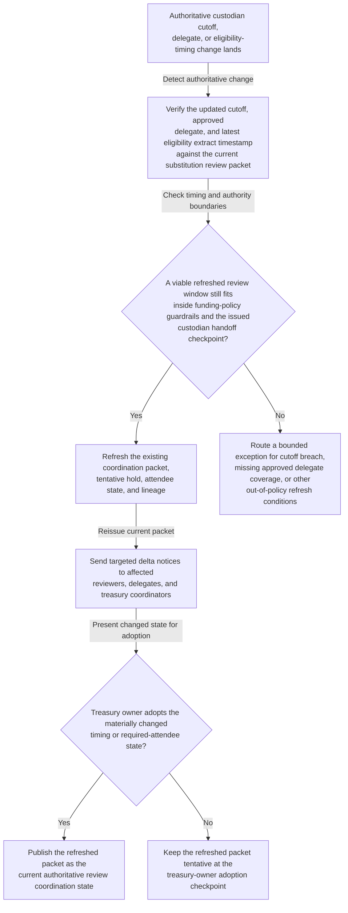

# Treasury collateral substitution review coordination refresh after custodian cutoff shift

## Linked pattern(s)

- `authoritative-change-coordination-refresh`

## Domain

Finance.

## Scenario summary

A secured-funding collateral substitution review already has an issued coordination packet tying together the approved review window, required attendees, tentative meeting hold, and custodian handoff checkpoint for treasury operations, collateral management, liquidity risk, the secured funding desk, and finance systems support. After that packet is issued, authoritative upstream conditions change: the tri-party custodian moves the final same-day substitution cutoff earlier, the collateral operations lead assigns an approved delegate because of a payment-rail incident call, and the refreshed eligibility extract arrives later than the original review start. The workflow should refresh the existing coordination package, send role-targeted delta notices, and hold the changed state at an explicit treasury owner adoption or exception checkpoint rather than rebuilding the funding plan, recommending whether to substitute assets, negotiating with counterparties, or executing the collateral movement itself.

## Target systems / source systems

- Treasury funding workflow record with the approved substitution review window, required participant roles, and current coordination status
- Tri-party custodian and collateral operations systems publishing authoritative same-day cutoff updates, settlement checkpoints, and eligibility extract timing
- Team calendars and approved delegate mappings for treasury operations, collateral management, liquidity risk, the secured funding desk, and finance systems support
- Treasury coordination workspace where packet versions, acknowledgements, exceptions, and refresh lineage are maintained
- Meeting and notification tools capable of reissuing role-targeted updates without silently replacing the authoritative invite history

## Why this instance matters

This grounds the pattern in a treasury workflow where one current coordination packet matters because a stale review slot can leave the wrong people aligned to a funding checkpoint that has already moved. The workflow's value is keeping the issued review packet synchronized with authoritative custodian timing and participant changes while preserving explicit human ownership over consequential shifts. It remains squarely in coordination-refresh scope because it updates review timing, attendee state, and lineage only; it does not decide whether the substitution should proceed, choose assets, or perform the handoff.

## Likely architecture choices

- Event-driven monitoring should react only to approved custodian-cutoff updates, posted eligibility-timing changes, and governed delegate-state changes that affect the issued review packet.
- Exception-gated autonomy fits because packet refresh, tentative-hold revision, targeted notice issuance, and lineage updates can proceed automatically when changes stay inside approved funding and authority guardrails.
- The treasury operations owner or designated secured-funding coordinator should adopt any materially changed meeting time, required-attendee substitution, or cutoff-sensitive shift before the refreshed packet becomes authoritative.
- Exception handling should route no-feasible-window cases, unsupported delegate changes, or custodian-boundary violations instead of publishing a misleading current coordination state.

## Governance notes

- Required roles and approved delegates should be explicit and auditable for treasury operations, collateral management, liquidity risk, secured funding, and finance systems support before automatic refresh is enabled.
- Refreshed notices should include only timing, attendee, and checkpoint deltas needed for coordination rather than position details, asset-level collateral composition, or counterparty commentary.
- The workflow should preserve append-only lineage connecting each authoritative custodian or eligibility-timing change to the resulting packet refresh, targeted notices, and treasury-owner adoption outcome.
- Automatic refresh should stop when the new review window crosses a protected settlement boundary, the trigger comes from an unofficial operations note, or a required role loses approved delegate coverage.
- Churn-heavy refresh periods near the cutoff should be monitored so participants can still identify one current packet without sifting through conflicting updates.

## Evaluation considerations

- Time from authoritative custodian-cutoff or eligibility-timing change to a refreshed substitution-review packet with explicit adoption or exception status
- Rate of cutoff-threatening shifts, unsupported delegate substitutions, or unresolved required-attendee changes correctly escalated before the packet becomes authoritative
- Participant ability to tell what changed between the prior and current review packet without reconstructing the full treasury coordination thread manually
- Notification-deduplication performance when multiple same-day custody or eligibility updates arrive near the protected handoff window
