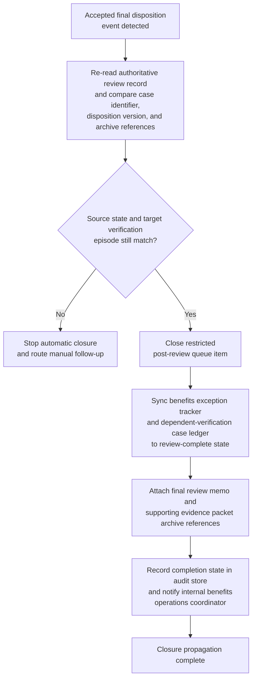
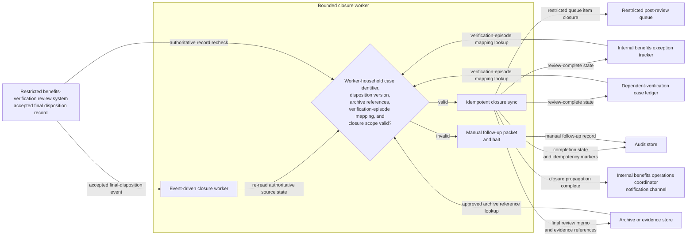

# Accepted dependent-benefits verification review closure and exception-tracker synchronization

## Linked pattern(s)

- `workflow-hand-off-and-completion`

## Domain

HR.

## Scenario summary

A restricted benefits-verification review team has already recorded an accepted final disposition for a dependent-benefits verification exception case in the authoritative review system after the upstream specialists completed their decision-making work. That disposition is final for this workflow and must not be reopened, reinterpreted, or extended into eligibility adjudication, carrier enrollment changes, payroll deduction changes, employee communication, appeal handling, or policy reinterpretation. The remaining execute step is limited to low-risk post-decision closure bookkeeping: detect the accepted-disposition event, recheck that the worker-household case identifier, disposition version, and approved archive references still match the source record, close the restricted post-review queue item, sync the internal benefits exception tracker and dependent-verification case ledger to the recorded review-complete state, attach archive references for the final review memo and supporting evidence packet, record completion state in the audit store, and notify the internal benefits operations coordinator that closure propagation is complete. If the case was reopened, the disposition changed, the archive reference drifted, or the target tracker points to a different verification episode, the workflow should stop and route manual follow-up instead of guessing.

## Target systems / source systems

- Restricted benefits-verification or dependent-eligibility review system that records the accepted final disposition and emits the authoritative state-change event
- Internal benefits exception tracker and dependent-verification case ledger that need the review-complete state reflected
- Restricted post-review queue holding the case until closure bookkeeping finishes
- Archive or evidence store containing the final review memo, supporting evidence packet, and closure note references
- Internal benefits operations coordinator notification channel plus audit store for completion traces, idempotency markers, and manual follow-up records

## Why this instance matters

This grounds the pattern in HR work where the consequential benefits-review judgment is already complete and the remaining need is safe closure propagation across restricted internal systems. Benefits programs can accumulate drift when a finalized dependent-verification or exception disposition is recorded in the authoritative review system but the exception tracker still appears open, the verification ledger lacks archive links, or a restricted closure queue continues to hold the episode. The example shows why execute-automate is useful for authoritative post-decision closure, replay-safe synchronization, privacy-minimizing bookkeeping, and explicit auditability while keeping benefits eligibility decisions, employee outreach, carrier coordination, payroll changes, and renewed review activity outside scope.

## Likely architecture choices

- An event-driven completion worker can subscribe to accepted final-disposition events from the restricted benefits review system and start the closure sequence only for approved post-decision states.
- The worker should re-read the current source record before writing anywhere so a reopened verification case, superseded disposition, or changed archive reference is not propagated from a stale event.
- Durable completion state should track queue closure, exception-tracker synchronization, verification-ledger synchronization, archive linkage, notification delivery, and skipped idempotent actions because duplicate events or partial retries are normal operational conditions.
- Human follow-up should trigger when the verification-episode mapping is missing, the archive reference no longer matches the finalized review packet, or a requested next step would cross into employee communication, carrier coordination, payroll change, appeals handling, or any new benefits review.

## Governance notes

- The workflow should copy only the benefits case identifiers, final closure state, archive references, and timestamps needed for internal record synchronization rather than dependent documentation detail, health-plan information, employee contact data, or reviewer discussion.
- Audit traces should record the source event id, verified disposition version, queue item closed, tracker and ledger records updated, archive references attached, notification target, and whether any step was skipped because it had already completed.
- Every automatic update should be reversible and idempotent so replay does not create duplicate queue cleanup, conflicting closure timestamps, repeated archive attachments, or duplicate coordinator notices.
- The automation must stop for manual follow-up when identifiers do not match, when the final-disposition state is no longer authoritative, or when any requested action would require benefits adjudication, employee communication, carrier file action, payroll change, appeal handling, or initiation of a new review.

## Evaluation considerations

- Percentage of accepted dependent-benefits verification review dispositions that reach queue closure, exception-tracker synchronization, verification-ledger synchronization, archive linkage, audit recording, and coordinator notification without manual bookkeeping repair
- Rate of stale, duplicate, or mismapped final-disposition events detected before incorrect closure state is propagated across restricted HR systems
- Completeness of audit traces linking the authoritative review event to queue, tracker, ledger, archive, and notification updates
- Reliability of replay-safe recovery when one target is already updated or temporarily unavailable while other closure steps remain pending
