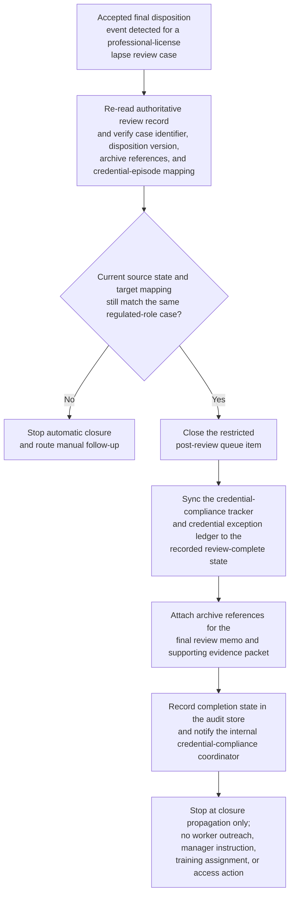

# Accepted professional-license lapse review closure and credential-compliance-tracker synchronization

## Linked pattern(s)

- `workflow-hand-off-and-completion`

## Domain

HR.

## Scenario summary

A restricted credential-compliance review team has already recorded an accepted final disposition for a regulated-role professional-license lapse case in the authoritative review system after the upstream specialists completed their decision-making work. That disposition is final for this workflow and must not be reopened, reinterpreted, or extended into worker outreach, manager instruction, staffing changes, payroll action, regulator filing, training assignment, or access restoration. The remaining execute step is limited to low-risk post-decision closure bookkeeping: detect the accepted-disposition event, recheck that the worker-role case identifier, disposition version, approved archive references, and controlled credential-episode mapping still match the source record, close the restricted post-review queue item, sync the internal credential-compliance tracker and credential exception ledger to the recorded review-complete state, attach archive references for the final review memo and supporting evidence packet, record completion state in the audit store, and notify the internal credential-compliance coordinator that closure propagation is complete. If the case was reopened, the disposition changed, the archive reference drifted, or the target tracker points to a different credential episode, the workflow should stop and route manual follow-up instead of guessing.

## Target systems / source systems

- Restricted credential-compliance or professional-license review system that records the accepted final disposition and emits the authoritative state-change event
- Internal credential-compliance tracker and credential exception ledger that need the review-complete state reflected
- Restricted post-review queue holding the case until closure bookkeeping finishes
- Archive or evidence store containing the final review memo, supporting evidence packet, and closure note references
- Internal credential-compliance coordinator notification channel plus audit store for completion traces, idempotency markers, and manual follow-up records

## Why this instance matters

This grounds the pattern in HR work where the consequential review judgment is already complete and the remaining need is safe closure propagation across restricted internal systems. Credential-compliance programs can accumulate drift when a finalized professional-license lapse disposition is recorded in the authoritative review system but the internal compliance tracker still appears open, the credential exception ledger lacks archive links, or a restricted closure queue continues to hold the episode. The example shows why execute-automate is useful for authoritative post-decision closure, replay-safe synchronization, privacy-minimizing bookkeeping, and explicit auditability while keeping staffing decisions, worker communication, credential remediation, regulator interaction, payroll changes, and renewed review activity outside scope.

## Likely architecture choices

- An event-driven completion worker can subscribe to accepted final-disposition events from the restricted credential review system and start the closure sequence only for approved post-decision states.
- The worker should re-read the current source record before writing anywhere so a reopened credential case, superseded disposition, or changed archive reference is not propagated from a stale event.
- Durable completion state should track queue closure, credential-tracker synchronization, exception-ledger synchronization, archive linkage, notification delivery, and skipped idempotent actions because duplicate events or partial retries are normal operational conditions.
- Human follow-up should trigger when the credential-episode mapping is missing, the archive reference no longer matches the finalized review packet, or a requested next step would cross into worker outreach, manager coordination, training assignment, system access, regulator filing, or any new compliance review.

## Governance notes

- The workflow should copy only the credential case identifiers, final closure state, archive references, and timestamps needed for internal record synchronization rather than license-document images, examination history, worker contact data, or reviewer discussion.
- Audit traces should record the source event id, verified disposition version, queue item closed, tracker and ledger records updated, archive references attached, notification target, and whether any step was skipped because it had already completed.
- Every automatic update should be reversible and idempotent so replay does not create duplicate queue cleanup, conflicting closure timestamps, repeated archive attachments, or duplicate coordinator notices.
- The automation must stop for manual follow-up when identifiers do not match, when the final-disposition state is no longer authoritative, or when any requested action would require worker communication, manager instruction, staffing changes, training enrollment, system-access action, payroll change, regulator filing, or initiation of a new review.

## Evaluation considerations

- Percentage of accepted professional-license lapse review dispositions that reach queue closure, credential-tracker synchronization, exception-ledger synchronization, archive linkage, audit recording, and coordinator notification without manual bookkeeping repair
- Rate of stale, duplicate, or mismapped final-disposition events detected before incorrect closure state is propagated across restricted HR systems
- Completeness of audit traces linking the authoritative review event to queue, tracker, ledger, archive, and notification updates
- Reliability of replay-safe recovery when one target is already updated or temporarily unavailable while other closure steps remain pending
