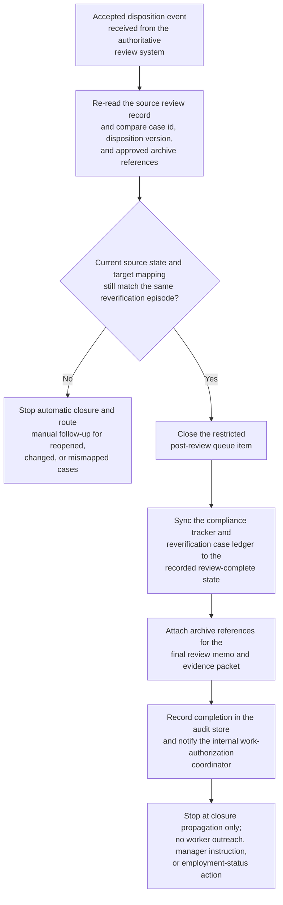

# Accepted work-authorization review closure and compliance-tracker synchronization

## Linked pattern(s)

- `workflow-hand-off-and-completion`

## Domain

HR.

## Scenario summary

A restricted immigration-compliance review team has already recorded an accepted disposition for a work-authorization reverification case in the authoritative review system after the upstream specialists completed their decision-making work. That disposition is final for this workflow and must not be reopened, reinterpreted, or extended into worker outreach, manager instruction, employment-status action, vendor filing, or legal strategy. The remaining execute step is limited to low-risk closure bookkeeping: detect the accepted-disposition event, recheck that the worker-case identifier, disposition version, and approved archive references still match the source record, close the restricted post-review queue item, sync the internal work-authorization compliance tracker and reverification case ledger to the recorded review-complete state, attach archive references for the final review memo and supporting evidence packet, record completion state in the audit store, and notify the internal work-authorization coordinator that closure propagation is complete. If the case was reopened, the disposition changed, or the target tracker points to a different reverification episode, the workflow should stop and route manual follow-up instead of guessing.

## Target systems / source systems

- Restricted immigration-compliance or work-authorization review system that records the accepted disposition and emits the authoritative state-change event
- Internal work-authorization compliance tracker or reverification case ledger that needs the review-complete state reflected
- Restricted post-review queue holding the case until closure bookkeeping finishes
- Archive or evidence store containing the final review memo, supporting evidence packet, and closure note references
- Internal work-authorization coordinator notification channel plus audit store for completion traces, idempotency markers, and manual follow-up records

## Why this instance matters

This grounds the pattern in HR work where the consequential review judgment is already complete and the remaining need is safe closure propagation across internal systems. Work-authorization programs often accumulate drift when a case is definitively closed in the restricted review system but still appears open in the compliance tracker, remains in a protected follow-up queue, or lacks linked archival references for later audit. The example shows why execute-automate is useful for authoritative post-decision closure, replay-safe synchronization, and explicit auditability while keeping worker communication, manager escalation, reverification instruction, payroll action, and external filing outside scope.

## Likely architecture choices

- An event-driven completion worker can subscribe to accepted work-authorization review events from the restricted review system and start the closure sequence only for approved post-decision states.
- The worker should re-read the current source record before writing anywhere so a reopened case, superseded disposition, or changed archive reference is not propagated from a stale event.
- Durable completion state should track queue closure, compliance-tracker synchronization, archive linkage, notification delivery, and skipped idempotent actions because duplicate events or partial retries are normal operational conditions.
- Human follow-up should trigger when the reverification-episode mapping is missing, the archive reference no longer matches the finalized review packet, or a requested next step would cross into worker outreach, manager coordination, vendor filing, or employment action.

## Governance notes

- The workflow should copy only the case identifiers, final closure state, archive references, and timestamps needed for internal record synchronization rather than immigration category detail, document identifiers, personal contact data, or reviewer discussion.
- Audit traces should record the source event id, verified disposition version, queue item closed, tracker records updated, archive references attached, notification target, and whether any step was skipped because it had already completed.
- Every automatic update should be reversible and idempotent so replay does not create duplicate queue cleanup, conflicting closure timestamps, or repeated archive attachments.
- The automation must not contact the worker, instruct the manager, change work eligibility, initiate or submit any filing, update payroll or HRIS employment state, or reinterpret the accepted review decision beyond low-risk closure propagation.

## Evaluation considerations

- Percentage of accepted work-authorization review dispositions that reach queue closure, compliance-tracker synchronization, archive linkage, and coordinator notification without manual bookkeeping repair
- Rate of stale, duplicate, or mismapped accepted-disposition events detected before incorrect closure state is propagated across restricted HR systems
- Completeness of audit traces linking the authoritative review event to queue, tracker, archive, and notification updates
- Reliability of replay-safe recovery when one target is already updated or temporarily unavailable while other closure steps remain pending
