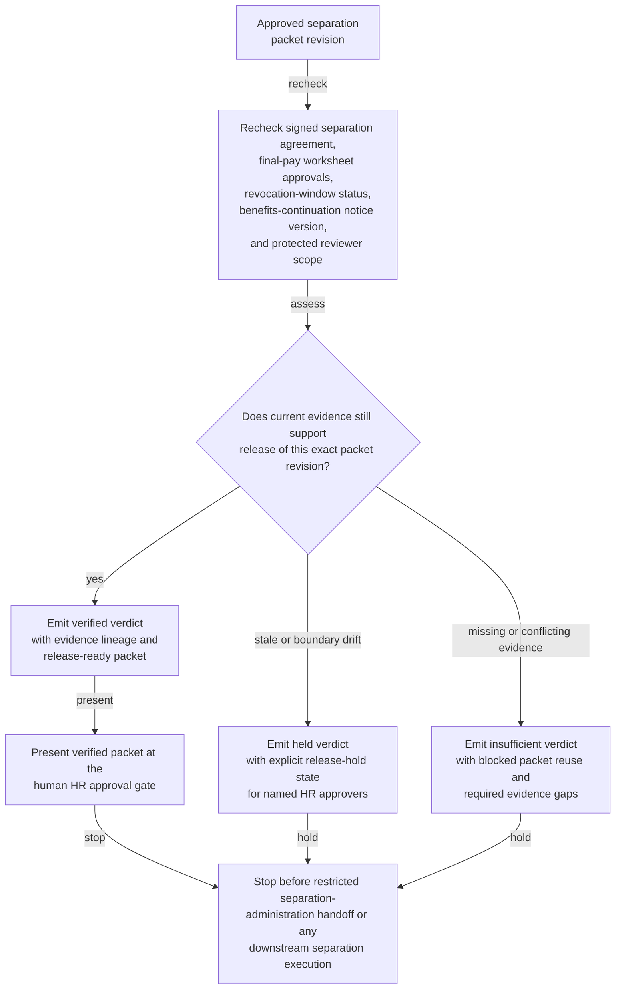

# Approved separation packet evidence gate verification

## Linked pattern(s)

- `evidence-gated-verification-for-release`

## Domain

HR.

## Scenario summary

An HR employee-relations team has one approved separation packet revision for a high-consequence employee departure, but the packet cannot be released into the restricted separation-administration lane until current evidence still supports human reliance on that exact version. The workflow rechecks the signed separation agreement, final-pay worksheet approvals, revocation-window status, benefits-continuation notice version, and protected reviewer scope against the packet, then emits a verified, held, or insufficient verdict with an explicit release-hold state for named HR approvers. It must not renegotiate terms, decide whether the separation should proceed, schedule the employee meeting, change payroll or access state, or execute the downstream separation steps.

## Target systems / source systems

- Restricted employee-relations case workspace holding the approved separation packet revision, superseded drafts, reviewer assignments, and hold history
- E-signature store, legal-review tracker, and policy acknowledgment records used to confirm signature validity, revocation timing, and approved packet terms
- Payroll final-pay worksheet system, severance-calculation controls, and benefits-continuation notice repository referenced by the packet
- Approval manifest service recording which HR leaders may release one exact packet revision into the restricted separation-administration lane
- Audit store preserving evidence timestamps, sufficiency verdicts, release-hold state changes, and blocked reuse of superseded packet revisions

## Why this instance matters

This grounds the pattern in HR where a separation packet may already be approved in principle, yet still cannot be trusted for downstream reliance if one governing fact drifts. A revocation window may reopen the packet, a final-pay approval may age out after a payroll calendar change, or the notice revision attached to the packet may no longer match the approved jurisdictional form. The value is a bounded verification gate that proves whether one exact separation packet revision remains evidence-sufficient for restricted HR intake without drifting into adjudication, scheduling, or live separation execution.

## Likely architecture choices

- Approval-gated execution fits because the verification packet can be assembled automatically while downstream separation administration remains concretely blocked until a named HR approver releases that exact packet revision.
- Human-in-the-loop review should remain mandatory because employee-relations, payroll, and legal owners must interpret held conditions before anyone relies on the packet for a consequential downstream step.
- Durable verification state should preserve superseded verdicts, repeated release holds, and packet-version lineage so later reviewers can distinguish genuine evidence refresh from duplicate review noise.

## Governance notes

- The verification result should show packet revision lineage, agreement-signature status, revocation-window timing, final-pay approval lineage, notice-version checks, and the approved restricted reviewer boundary directly in the approval-ready packet.
- A packet should remain held whenever the signed agreement is superseded, the revocation period is still open, a final-pay worksheet approval falls outside the approved freshness window, or the requested downstream lane exceeds the named separation-administration boundary.
- Human approval is required before the verified packet is handed into restricted separation administration or used to justify downstream payroll, legal, or access-preparation reliance.
- Any recommendation about whether to separate the employee, any packet repair, and any payroll, benefits, access, or manager-facing execution belongs in adjacent recommendation, reconciliation, or execution workflows rather than this verification gate.

## Evaluation considerations

- Percentage of approved separation packets that receive a verdict with complete agreement, payroll, notice, and reviewer-boundary lineage
- Rate at which stale approvals, revocation-window conflicts, or restricted-lane scope drift are caught before downstream HR teams rely on the packet
- Reviewer agreement that verified versus held outcomes reflect the intended sufficiency rules for packet freshness, legal state, and release boundary
- Reliability of repeated verification when packet revisions, signed terms, or payroll-control evidence change near the restricted intake window
